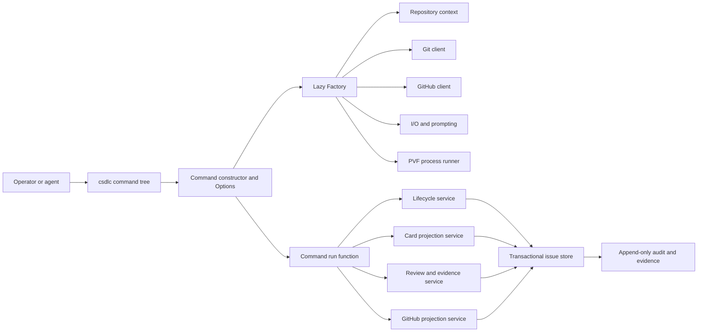

# C-SDLC v3: gh-Inspired Go Architecture

Status: Draft for architecture review

Decision boundary: This document proposes C-SDLC v3. It does not authorize
implementation, change the current v2 selector, migrate records, create issues,
or retire C-SDLC v2.

## Executive Decision

C-SDLC v3 should be a single Go executable named `csdlc`, organized like the
official GitHub CLI:

```text
cmd/csdlc/main.go
  -> internal/csdlccmd.Main()
  -> pkg/cmd/root.NewCmdRoot(factory)
  -> pkg/cmd/<noun>/<verb>.NewCmd(factory, runF)
  -> <verb>Run(options)
  -> internal domain services
```

The design adopts the useful structural ideas from `gh`:

- one executable and one discoverable command tree;
- command-local `Options` structs;
- a shared dependency factory with lazy context resolution;
- constructors that parse and validate command input;
- separately testable run functions containing orchestration;
- interfaces around Git, GitHub, files, clocks, prompts, and process execution;
- consistent human and JSON output from the same command;
- generated help and reference documentation from the command tree;
- table-driven command tests and transport-level HTTP mocks.

The design does not turn C-SDLC into a generic GitHub client. It retains the
C-SDLC lifecycle, generated prompt cards, guarded transitions, exact-revision
review, PVF evidence, GitHub projection ownership, and fail-closed finish and
cleanup semantics.

## Source Baseline

### Official GitHub CLI

The source model is the official `cli/cli` repository at:

```text
repository: https://github.com/cli/cli
revision:   9fc0f70e0ef97446de9166febce546e955675bc3
date:       2026-08-07
```

The most relevant source surfaces are:

| Source | Architectural lesson |
| --- | --- |
| [`cmd/gh/main.go`](https://github.com/cli/cli/blob/9fc0f70e0ef97446de9166febce546e955675bc3/cmd/gh/main.go) | Keep the process entry point trivial. |
| [`internal/ghcmd/cmd.go`](https://github.com/cli/cli/blob/9fc0f70e0ef97446de9166febce546e955675bc3/internal/ghcmd/cmd.go) | Centralize process setup, root execution, error classification, and exit codes. |
| [`pkg/cmd/root/root.go`](https://github.com/cli/cli/blob/9fc0f70e0ef97446de9166febce546e955675bc3/pkg/cmd/root/root.go) | Register one visible command tree and shared pre-run policy. |
| [`pkg/cmdutil/factory.go`](https://github.com/cli/cli/blob/9fc0f70e0ef97446de9166febce546e955675bc3/pkg/cmdutil/factory.go) | Inject shared capabilities through one factory. |
| [`pkg/cmd/factory/default.go`](https://github.com/cli/cli/blob/9fc0f70e0ef97446de9166febce546e955675bc3/pkg/cmd/factory/default.go) | Construct real dependencies once and resolve expensive context lazily. |
| [`pkg/cmd/issue/list/list.go`](https://github.com/cli/cli/blob/9fc0f70e0ef97446de9166febce546e955675bc3/pkg/cmd/issue/list/list.go) | Separate options, CLI construction, and run behavior. |
| [`pkg/iostreams/iostreams.go`](https://github.com/cli/cli/blob/9fc0f70e0ef97446de9166febce546e955675bc3/pkg/iostreams/iostreams.go) | Make stdin, stdout, stderr, TTY state, and prompting testable. |
| [`pkg/cmdutil/errors.go`](https://github.com/cli/cli/blob/9fc0f70e0ef97446de9166febce546e955675bc3/pkg/cmdutil/errors.go) | Map typed outcomes to stable process behavior. |
| [`pkg/httpmock/registry.go`](https://github.com/cli/cli/blob/9fc0f70e0ef97446de9166febce546e955675bc3/pkg/httpmock/registry.go) | Fail tests when expected requests are absent or unexpected requests occur. |
| [`cmd/gen-docs/main.go`](https://github.com/cli/cli/blob/9fc0f70e0ef97446de9166febce546e955675bc3/cmd/gen-docs/main.go) | Generate reference documentation from the actual command graph. |

This proposal models the shape of `gh`, not its size. The reviewed `gh` tree
contains hundreds of command files and many user-convenience features that are
not appropriate for a lifecycle authority.

The architecture study uses the upstream MIT-licensed source as a design
reference. V3 should not vendor or copy `gh` command implementations. C-SDLC
domain code and tests remain independently authored around C-SDLC contracts.

### Current C-SDLC v2

The ADL comparison baseline is canonical `main` at:

```text
revision: f1c01499cb377336d808059af017d63d6b9849bd
```

At that revision, `csdlc-v2` has:

- 21 Rust binary entry points;
- 11 operator skills;
- 48 Rust source files under `csdlc-v2/src`;
- approximately 22,258 Rust source lines and 8,872 Rust test lines;
- routine request-file commands in addition to schemas, skills, selectors,
  installation manifests, and generated card surfaces.

These counts do not prove that v2 is incorrect. V2 established the safety
baseline that v3 must preserve. They show that operators currently encounter
too many names, request shapes, and routing decisions for one lifecycle.

## Problem Statement

C-SDLC v2 is strongly typed but operationally fragmented. A normal issue path
requires an agent or operator to know which installed binary owns a step, which
skill routes to that binary, which request schema applies, where to write the
request file, which repository identity is authoritative, and which observer or
finisher owns the next state.

That fragmentation creates recurring costs:

- commands are hard to discover without consulting skills and manifests;
- similar global concerns are repeated across binary entry points;
- ordinary flag input is often represented as a temporary JSON request file;
- issue, PR, publication, and finish observation have overlapping surfaces;
- installation provenance must account for a large executable set;
- automation can leave request files, watchers, or background jobs that obscure
  the operator's active sessions;
- tests prove individual binaries but do not automatically make the complete
  operator journey understandable.

V3 should reduce those costs without weakening the state machine.

## Goals

1. Make the complete lifecycle discoverable through `csdlc --help`.
2. Use one installed executable and one version/provenance identity.
3. Make the common path work with direct flags and repository context.
4. Retain typed JSON input for batch automation without requiring it for normal
   interactive or agent use.
5. Preserve `SIP -> STP -> SPP -> VPP -> SRP -> SOR` as durable generated truth.
6. Preserve exact-revision review and live GitHub terminal authority.
7. Keep every mutation explicit, local, idempotent, and auditable.
8. Make non-mutating diagnosis cheap and safe.
9. Eliminate hidden resident jobs from the core lifecycle.
10. Make command behavior testable without a real repository or network.

## Non-Goals

- Reimplementing GitHub CLI.
- Making GitHub the sole C-SDLC truth source.
- Allowing direct Markdown card edits.
- Allowing arbitrary plugins to mutate lifecycle state.
- Adding shell aliases for authority-bearing commands.
- Starting background watchers automatically.
- Merging, closing, deleting, or pruning without an explicit command.
- Preserving v2's internal file layout as a permanent public API.
- Combining C-SDLC with the ADL runtime or product build graph.
- Cutting over before behavioral parity and migration proof exist.

## Design Principles

### One command tree

Every supported operation is a subcommand of `csdlc`. There is no generation
selector for a set of sibling executables and no skill-to-binary lookup for
ordinary use.

### Context first, flags override

The command resolves repository, branch, worktree, and issue identity from the
current checkout. Explicit flags override only the fields they name. Ambiguous
or conflicting context fails with a diagnosis and a suggested command.

### Parse, resolve, execute

Each command follows three visible stages:

1. Parse flags into an `Options` struct.
2. Resolve only the context required by that command.
3. Call a domain service and render its typed result.

Command constructors do not perform network requests, Git mutations, card
writes, or expensive repository scans.

### One canonical transaction

Each state-changing invocation performs one transaction. It validates the
expected state, commits canonical state atomically, regenerates repairable
projections, and appends one audit event inside that state. Remote operations
use intent, mutation, readback, and reconciliation as one resumable command
contract.

### Human by default, JSON by choice

TTY output is concise and task-oriented. `--json` emits a stable versioned
result to stdout. Diagnostics and progress go to stderr. JSON mode never mixes
human text into stdout.

### No implicit authority

Detection, prompts, aliases, extensions, retries, and watchers cannot silently
change lifecycle state. Mutating commands name their intended transition and
return the observed result.

## System Architecture



## Proposed Repository Layout

```text
csdlc-v3/
  go.mod
  go.sum
  cmd/
    csdlc/
      main.go
    gen-docs/
      main.go
  internal/
    csdlccmd/          process setup, execution, exit mapping
    lifecycle/         phases, guards, transitions, invariants
    store/             transactions, locking, atomic replacement
    cards/             typed card values and deterministic rendering
    evidence/          receipts, digests, provenance, redaction
    git/               typed Git argv and topology inspection
    github/            REST/GraphQL adapter and reconciliation
    pvf/               lane selection, execution, convergence
    review/            assignment, exact revision, findings
    projection/        local/GitHub ownership and drift rules
    config/            repo and user configuration
  pkg/
    cmd/
      root/
      issue/
      card/
      doctor/
      bind/
      validate/
      review/
      pr/
      finish/
      clean/
      schema/
      completion/
    cmdutil/
      factory.go
      errors.go
      flags.go
      json.go
    iostreams/
    httpmock/
  acceptance/
  test/
    fixtures/
```

`internal` packages own lifecycle behavior. `pkg/cmd` owns CLI adaptation.
Command packages must not write state directly.

## Root Command Model

The initial public command tree should remain small:

```text
csdlc
  issue
    init
    show
    status
  card
    show
    edit
    render
  doctor
  bind
  validate
    plan
    run
    status
  review
    assign
    record
    status
  pr
    publish
    status
    watch
  finish
  clean
  schema
  completion
  version
```

The command count is intentionally smaller than the v2 executable inventory.
Nested verbs express ownership without requiring separate binaries.

## Operator Skill

V3 should expose one thin agent skill named `csdlc`, following the same broad
idea as the official CLI's generated agent skill. The skill explains the
authority boundary, context rules, and safety stops, then routes directly to
the single executable.

The skill must not duplicate the command tree, define private request shapes,
or decide lifecycle transitions itself. Command help, JSON Schema, and generated
reference docs are the executable contract. Removing a command does not leave a
second operational route hidden in a skill.

### Common path

```text
csdlc issue init 123 --title "Bounded outcome"
csdlc doctor
csdlc bind
csdlc card edit spp --set summary="Implement the bounded outcome"
csdlc validate run
csdlc review assign --reviewer codex
csdlc review record --result pass --revision HEAD
csdlc pr publish
csdlc pr status
csdlc finish
csdlc clean
```

Once bound, the issue number, branch, worktree, and repository are normally
derived from the current directory. `--issue`, `--repo`, and `--worktree` are
explicit overrides and must agree with observable Git topology.

### Automation input

Every mutating command supports either direct flags or one typed input object:

```text
csdlc bind --issue 123 --base main --worktree /path/to/worktree
csdlc bind --input bind-request.json
```

The two forms map to the same Go request type and schema. They cannot be mixed.
`--input -` reads JSON from stdin. Temporary request files are not created by
the command.

## Command Construction Pattern

Each leaf command uses the same pattern:

```go
type Options struct {
    IO      *iostreams.IOStreams
    Repo    func() (context.Repository, error)
    Store   func() (store.Store, error)
    Git     git.Client
    GitHub  func() (github.Client, error)

    Issue   int
    JSON    bool
}

func NewCmdStatus(f *cmdutil.Factory, runF func(*Options) error) *cobra.Command {
    opts := &Options{IO: f.IOStreams, Repo: f.Repository, Store: f.Store}
    // Define flags only. Resolve no repository and perform no I/O here.
    // RunE validates arguments, resolves required context, then calls runF.
}

func statusRun(opts *Options) error {
    // Orchestrate domain services and render one typed result.
}
```

The constructor/run split is mandatory because it gives v3 two focused test
surfaces:

- constructor tests prove flags, defaults, conflicts, and option curation;
- run tests prove lifecycle behavior with fake dependencies.

## Factory And Dependency Boundaries

The root constructs one `cmdutil.Factory`:

```go
type Factory struct {
    AppVersion string
    IOStreams  *iostreams.IOStreams
    Clock      clock.Clock
    FileSystem fs.FileSystem
    Git        git.Client
    Runner     runner.Runner
    Prompter   prompter.Prompter

    Config     func() (config.Config, error)
    Repository func() (context.Repository, error)
    Issue      func() (context.Issue, error)
    Store      func() (store.Store, error)
    GitHub     func() (github.Client, error)
}
```

Lazy functions are used for context that may fail or require network access.
This lets `csdlc version`, `csdlc completion`, local `schema`, and selected
doctor checks run without credentials or GitHub availability.

The factory is dependency injection, not a service locator for domain logic.
Leaf commands copy only the capabilities they need into their options.

## Repository And Issue Context

V3 resolves context in a fixed order:

1. Explicit command flag.
2. Bound v3 issue record in the current worktree.
3. Current branch naming contract.
4. Effective Git remote and repository-local configuration.
5. Live GitHub lookup only when the command requires remote truth.

Conflicts fail closed. V3 must never copy `gh` behavior that changes repository
selection depending on whether stdout is a TTY. Interactive prompting may help
select among valid candidates, but the selected identity must be displayed and
persisted before mutation. Non-interactive mode returns the same ambiguity as
interactive mode rather than choosing a different repository silently.

The resolved context is a typed value:

```text
RepositoryContext
  root
  git_common_dir
  branch
  worktree
  code_repository
  issue_repository
  issue_number
  remote_name
```

## Canonical State And Cards

V3 retains the six-card lifecycle while reducing duplicated state.

```text
.csdlc/v3/issues/<issue>/
  state.json
  audit.jsonl          generated audit projection
  cards/
    sip.md
    stp.md
    spp.md
    vpp.md
    srp.md
    sor.md
  evidence/
  intents/
```

`state.json` is the sole machine-writable aggregate for lifecycle and card
values. It contains:

- schema and record version;
- issue and repository identities;
- lifecycle phase and generation;
- branch and worktree binding;
- typed values for all six cards;
- design and diagram references;
- validation plan and dispositions;
- exact review assignment and result;
- publication identity and observed remote state;
- terminal result and cleanup eligibility;
- the append-only typed audit event sequence;
- digests for every generated card and retained evidence object.

The six Markdown cards remain tracked, human-readable generated projections.
`audit.jsonl` is also a generated projection for streaming and human inspection.
There are no separately authoritative per-card values or audit files. `csdlc
card edit` changes typed values in `state.json`, renders the affected cards,
validates all cross-card invariants, and commits one transaction.

Direct Markdown edits remain corruption. `csdlc doctor` reports the exact card
and digest mismatch. An explicit `csdlc card import` compatibility command may
exist during migration, but it is not a permanent editing route.

## Lifecycle Model

The retained phase model is:

```text
initialized
  -> ready
  -> bound
  -> implemented
  -> reviewed
  -> published
  -> merge_ready
  -> merged
  -> closed_out
```

Waiting, blocked, failed, deferred, and operator-required remain outcomes, not
phases. Every mutation supplies or derives an expected generation and digest.
Stale state returns a typed reconciliation error.

Issue ownership is derived from branch and worktree topology. V3 does not
restore v2 claim leases, heartbeat authority, or protected-path leases. Local
file locking protects transaction integrity only; it does not claim issue
ownership.

## Transaction Model

Local mutation uses one issue-scoped transaction:

1. Open the issue store without following symlinks.
2. Acquire a bounded file lock.
3. Read and validate `state.json` and generated-card digests.
4. Compare expected generation, phase, branch, and worktree.
5. Apply one typed domain transition and append its audit event in memory.
6. Render and validate affected card projections.
7. Write new files into an issue-local staging directory.
8. Sync and replace the generated card and audit projections.
9. Atomically replace `state.json` last as the sole commit point, then sync the
   issue directory.
10. Release the lock and return the committed generation.

A crash before step 9 leaves the old state authoritative; a crash after step 9
leaves the new state authoritative. In either case, doctor can deterministically
regenerate cards and `audit.jsonl` from `state.json`. Projection mismatch is a
repairable diagnosis, never a second source of lifecycle truth.

Remote mutation adds intent and reconciliation:

1. Commit a typed local intent with an idempotency key.
2. Perform the Git or GitHub operation.
3. Read back remote state exhaustively.
4. Reconcile the observed result with the intent.
5. Commit the resulting local transition.

A retry resumes the existing intent. It does not create a second issue, PR,
comment, or closure action.

## GitHub Integration

The GitHub adapter should use maintained Go libraries from the GitHub CLI
ecosystem where their contracts fit:

- `github.com/cli/go-gh/v2` for authenticated HTTP and repository helpers;
- explicit REST or GraphQL request types for C-SDLC operations;
- `net/http` middleware for bounded retry, redaction, and request tracing.

V3 must not execute the external `gh` binary for lifecycle authority. It models
`gh`'s architecture and may reuse its maintained libraries, but C-SDLC remains
repo-native and typed.

Projection ownership remains explicit:

| Surface | Authority |
| --- | --- |
| Lifecycle intent, plan, validation claim, review disposition | C-SDLC state |
| Branch and worktree occupancy | Git topology |
| Issue and PR open/closed state | GitHub |
| Checks, reviews, mergeability, head SHA | GitHub |
| Generated card Markdown | Projection of C-SDLC state |
| Terminal completion | Derived from exact local and GitHub predicates |

The adapter keeps the existing split between issue repository and code
repository. Qualified closing references remain mandatory when they differ.

## Initial Dependency Policy

The first implementation should begin with a deliberately small dependency
set:

| Concern | Proposed dependency |
| --- | --- |
| Command tree and flags | Cobra and pflag |
| GitHub authentication and HTTP | `github.com/cli/go-gh/v2` |
| Markdown AST and rendering | Goldmark |
| YAML repository configuration | `go.yaml.in/yaml/v3` |
| JSON Schema validation | One maintained draft-2020-12 implementation selected during design review |
| BLAKE3 compatibility digests | One reviewed pure-Go or portable implementation |
| File locking | One small cross-platform advisory-lock package |

Standard-library `os/exec`, `net/http`, `crypto/sha256`, `encoding/json`, and
filesystem primitives remain the default. Every added dependency requires a
specific owner, purpose, maintenance check, license check, and replacement
boundary. V3 does not inherit the complete `gh` dependency graph.

## gh Patterns Explicitly Rejected

The following `gh` behaviors are useful for a general-purpose user CLI but are
not suitable for C-SDLC authority:

- automatic update checks during unrelated commands;
- detached telemetry or background processes;
- shell aliases and arbitrary external command dispatch;
- extensions that can shadow or replace core commands;
- repository selection that changes with TTY or prompt availability;
- permissive fallback after repository-resolution failure;
- broad configuration that stores credentials inside C-SDLC state;
- command-specific output conventions without one versioned result envelope.

## Validation And PVF

`csdlc validate plan` is pure and deterministic. It reads the VPP, changed
scope, repository policy, and available resources, then emits the smallest
required DAG.

`csdlc validate run` executes only the selected DAG. Each lane declares:

- stable lane identifier;
- proof role and release-gate status;
- executable and argument array;
- dependencies and concurrency group;
- timeout and cancellation policy;
- network and credential posture;
- resource profile;
- selected-test and nonzero-proof requirements;
- retained stdout, stderr, and artifact digest policy.

There is no shell evaluation and no product-specific command embedded in Go.
Repository policy owns lane definitions. The process runner receives typed argv
arrays and a sanitized environment.

## Review

Review remains a first-class exact-revision gate:

- `review assign` records reviewer, scope, and exact revision;
- `review record` records findings, dispositions, residual risk, and result;
- any substantive scoped change invalidates the review;
- `pr publish` refuses publication without current passing review;
- lifecycle-only changes require an explicit non-substantive policy proof.

Review commands do not implement or publish. They only manage review truth.

## Publication, Observation, And Finish

`csdlc pr publish` owns push and PR create/update. It verifies remote identity,
base, head, exact SHA, closing linkage, and current review before mutation.

`csdlc pr status` performs one bounded observation and exits.

`csdlc pr watch` is an explicit foreground command. It:

- creates no recurring job;
- persists no watcher queue entry;
- performs no implementation or lifecycle mutation;
- exits on ready, failed, conflicted, operator-required, cancellation, or
  timeout;
- can emit newline-delimited JSON when requested.

`csdlc finish` is the sole terminal authority. It observes exact-head PR and
issue state, derives the terminal envelope, and commits it locally. Merge is
never implicit unless a future operator-approved command explicitly adds that
authority.

`csdlc clean` is separate from finish. It prints the exact eligible worktree and
artifacts before deletion, rejects dirty or live worktrees, and supports a
non-mutating default preview. Destructive cleanup requires `--confirm` or an
equivalent explicit automation input.

## Output And Exit Contract

V3 defines stable exit classes at the process boundary:

| Code | Class | Meaning |
| --- | --- | --- |
| 0 | success | Requested operation completed or read-only query succeeded. |
| 1 | failure | Validation, mutation, or invariant failure. |
| 2 | usage | Invalid flags, arguments, or mutually exclusive input. |
| 3 | blocked | A declared prerequisite is not satisfied. |
| 4 | authentication | Required credential is missing or rejected. |
| 5 | conflict | State generation, branch, worktree, or remote identity conflicts. |
| 6 | waiting | Operation is healthy but external state is not terminal. |
| 7 | operator_required | Policy requires an explicit human decision. |

Typed errors carry a stable code, summary, details, retry posture, and suggested
next command. Error text is presentation, not automation authority.

All commands support:

```text
--json
--jq <expression>
--template <template>
--no-prompt
--repo <owner/name>
--issue <number>
```

where meaningful. `--json` without a field list emits the command's complete
versioned result. Secret values are never part of result schemas.

## Configuration And Credentials

Configuration has two layers:

```text
user:       $XDG_CONFIG_HOME/csdlc/config.yml
repository: .csdlc/config.yml
```

Repository configuration owns workflow policy and may be tracked. User
configuration owns presentation defaults and approved credential references.
Environment variables override user configuration for one process.

Credential resolution retains the approved external-file boundary. V3 may read
an explicit token environment variable or approved token-file path, but it does
not copy tokens into config, state, evidence, logs, or command history.

## Extensions And Aliases

V3 does not initially support lifecycle extensions or shell aliases.

A future extension API may provide only:

- additional read-only report commands;
- additional repository-declared PVF lane runners;
- output formatters that consume typed results.

Extensions cannot register lifecycle phases, bypass guards, edit cards, publish,
finish, merge, or clean. Core command names always win. Extension execution and
provenance must be visible in evidence.

## Observability

Every invocation has an operation ID. Human diagnostics use stderr; JSON result
uses stdout. Durable events are bounded, redacted, and use stable event names.

V3 does not copy `gh`'s automatic update checker or detached telemetry process.
There is no background network activity in ordinary commands. Version checks,
telemetry, and watches are explicit opt-in commands or foreground modes.

## Testing Architecture

V3 follows the strongest `gh` testing pattern while adding lifecycle-specific
proof.

### Command constructor tests

Each leaf command has table tests for:

- required and optional flags;
- defaults and aliases;
- mutually exclusive flags and input forms;
- `Options` curation;
- no I/O or network activity during construction.

### Run-function tests

Each run function uses fake factory dependencies to prove:

- requested service calls and parameters;
- human and JSON output;
- typed error and exit mapping;
- no undeclared mutation;
- cancellation and timeout behavior.

### Domain tests

The lifecycle and store packages use state-table and failure-injection tests for:

- every valid and invalid transition;
- generation conflicts;
- atomic transaction interruption;
- card digest and cross-card invariant failure;
- review invalidation;
- intent resume and duplicate prevention;
- finish derivation;
- cleanup refusal.

### HTTP tests

An `httpmock.Registry`-style transport requires every expected request to be
consumed and rejects unexpected requests. Tests cover pagination, retries,
rate-limit behavior, split issue/code repositories, PR ambiguity, exact-head
checks, and redaction.

### Acceptance tests

Temporary Git repositories prove complete command journeys without network.
A bounded live canary proves GitHub integration in a designated test repository.
Live proof is never required for ordinary unit tests.

### Documentation tests

Reference Markdown and man pages are generated from the actual root command.
CI fails when generated command documentation differs from the command tree.

## Security Boundaries

- Never evaluate shell command strings.
- Never follow symlinks for canonical state, intent, or evidence files.
- Never infer permission from a branch name alone.
- Never persist credentials or authorization headers.
- Never accept local prose as proof of GitHub state.
- Never treat a check name as sufficient without exact head SHA and conclusion.
- Never allow a plugin or formatter to mutate lifecycle state.
- Never clean a worktree that is dirty, open, live, or not exactly registered.
- Never make interactive mode less strict than non-interactive mode.

## Migration From v2

Migration is one-way, evidence-backed, and does not use dual writes.

### Phase 0: Approve the contract

- Review this architecture and resolve open decisions.
- Freeze the v3 public command tree, state schema, and retained invariants.
- Record the exact v2 compatibility baseline.

### Phase 1: Build the shell

- Create the Go module, root command, factory, I/O, typed errors, version,
  schema, completion, and generated docs.
- Prove command construction performs no mutation or network access.

### Phase 2: Implement local read paths

- Implement repository context, v2 read-only import, `issue show`, card render,
  and doctor.
- Compare normalized v2 and v3 observations on retained fixtures.

### Phase 3: Implement local mutation

- Implement the lifecycle kernel, transactional store, card editing, bind, and
  PVF planning/execution.
- Prove interruption recovery and exact generated-card parity at the semantic
  level.

### Phase 4: Implement remote operations

- Implement GitHub observation, publication, foreground watch, finish, and
  cleanup.
- Prove idempotency and remote readback against a designated canary repository.

### Phase 5: Shadow v2

- Run v3 read-only normalization against representative closed, active,
  conflicted, waiting, and split-repository issues.
- Run opt-in v3 issues end to end without dual writing the same issue.
- Fix v3 defects without changing v2 truth to manufacture parity.

### Phase 6: Cut over

- Require operator approval over exact parity and safety evidence.
- Switch one tracked command authority to v3.
- Keep a time-bounded read-only v2 importer.
- Remove v2 executable authority only in a separate deletion issue after the
  rollback window closes.

## Acceptance Gates

V3 is not ready for cutover until all of these are true:

### Operator simplicity

- One installed `csdlc` executable owns the lifecycle.
- The common issue path requires no manually authored JSON request files.
- `csdlc --help` exposes every normal lifecycle operation.
- A command error suggests one valid next command without requiring skill
  lookup.
- No normal command creates a watcher, sync job, or background task.

### Behavioral safety

- All retained lifecycle transitions and invalid transitions have table tests.
- All six card projections are deterministic and cross-card validated.
- Review is bound to exact scoped content.
- Publication is impossible without current review.
- Finish derives terminal truth from exact local and GitHub predicates.
- Cleanup defaults to preview and rejects live or dirty worktrees.

### Implementation shape

- One Go module and one production executable.
- No command package writes state directly.
- No product-specific validation command is compiled into the binary.
- No shell evaluation exists in the control plane.
- Public result schemas and generated command docs are versioned and tested.

### Performance

- `version`, `schema`, and `completion` perform no repository or network work.
- Local doctor p95 is under one second on a representative issue.
- Command construction tests complete without filesystem or network fixtures.
- Focused package tests complete in under two minutes on the supported local
  development host.

### Migration

- Representative v2 records import read-only with explicit unsupported-field
  diagnostics.
- Normalized parity covers local state, cards, validation, review, publication,
  terminal truth, and cleanup eligibility.
- No issue is writable by v2 and v3 simultaneously.
- Cutover and later deletion require separate reviewed operator decisions.

## Risks And Mitigations

| Risk | Mitigation |
| --- | --- |
| A rewrite loses hard-won v2 safety | Treat v2 behavior and failure fixtures as the parity contract; do not infer parity from happy paths. |
| A single binary becomes a monolith | Keep command adapters thin and domain services package-owned; enforce import boundaries in CI. |
| Factory injection becomes hidden global state | Pass only required factory members into each command's options and prohibit package globals for mutable dependencies. |
| Direct flags weaken typed request contracts | Map flags and JSON input into the same request type and schema before execution. |
| Context detection chooses the wrong repository | Use deterministic precedence, explicit conflict errors, and identical interactive/non-interactive authority. |
| Extensions bypass governance | Keep lifecycle extension points closed; allow only read-only reports and declared PVF runners. |
| Go dependency growth recreates gh's scale | Start with Cobra, go-gh, YAML/JSON, locking, and focused cryptographic dependencies only; require review for every addition. |
| Migration creates two authorities | Use read-only import and issue-level opt-in; never dual write. |

## Decisions Required Before Implementation

1. Approve Go as the v3 implementation language.
2. Approve one executable and the proposed root command tree.
3. Approve `state.json` as the single typed aggregate with six generated
   Markdown card projections.
4. Approve direct flags as the normal path and `--input` as the automation path.
5. Approve branch/worktree topology instead of claims, leases, and heartbeats as
   issue ownership authority.
6. Approve explicit foreground `pr watch` with no persistent watcher jobs.
7. Approve the restricted extension boundary.
8. Decide whether v3 may ever own merge, or whether `finish` must permanently
   remain observation and derived-terminal authority only.

## Recommendation

Proceed to independent architecture review, not implementation.

The proposal is intentionally conservative about lifecycle truth and aggressive
about operator simplification. The central change is not merely Rust-to-Go. It
is the replacement of a many-binary, request-file-driven surface with one
coherent command application whose behavior can be discovered, tested, and
reasoned about the same way as the official GitHub CLI.
