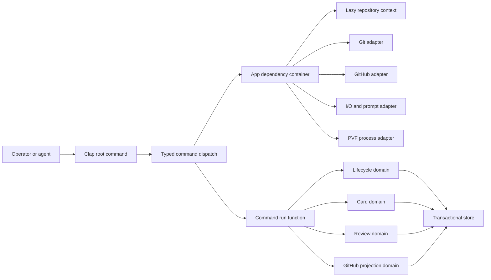
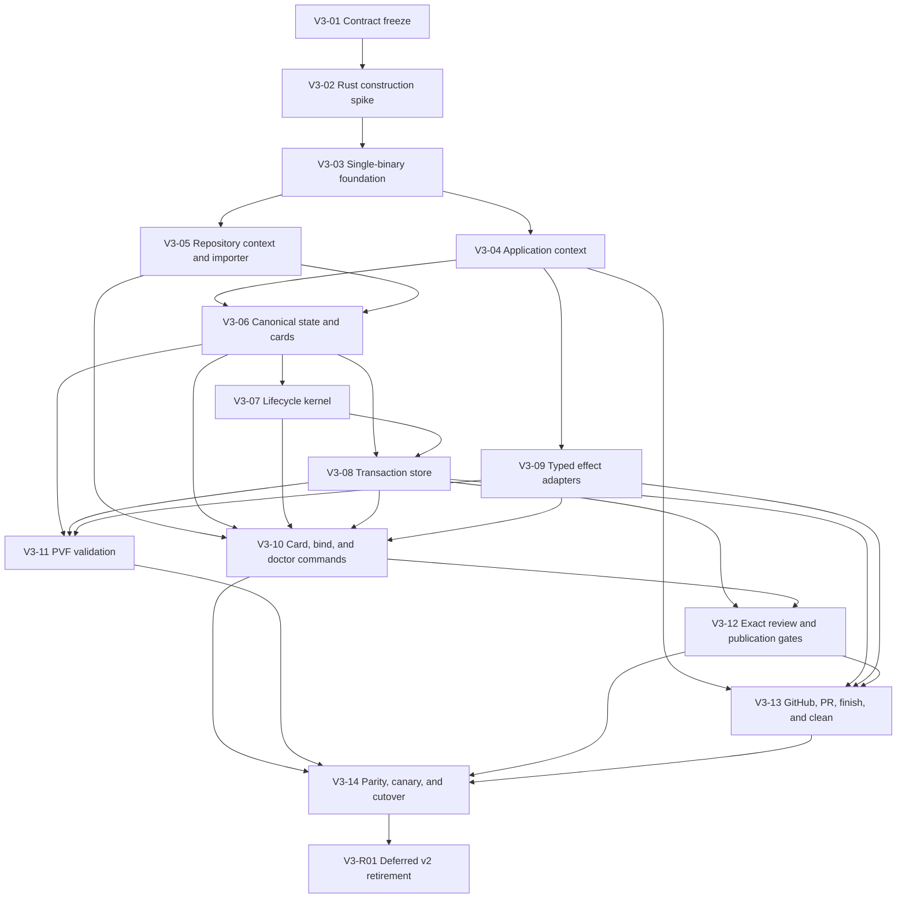

# C-SDLC v3: gh-Inspired Rust Architecture

Status: Issue #73 planning draft for independent architecture review

Decision boundary: This document proposes a Rust implementation of C-SDLC v3.
It does not authorize implementation, change the current v2 selector, migrate
records, create issues, or retire C-SDLC v2.

Comparative source:
[`CSDLC_V3_GH_INSPIRED_ARCHITECTURE.md`](CSDLC_V3_GH_INSPIRED_ARCHITECTURE.md)
defines the equivalent Go architecture considered before the operator selected
Rust on 2026-08-08. Rust is now fixed for C-SDLC v3. The Go document remains a
control for identifying language-independent simplifications; it is not an
active implementation alternative.

## Executive Decision

C-SDLC v3 can retain Rust while adopting the operator architecture of the
official GitHub CLI. It should ship one executable named `csdlc`, with one
discoverable command tree and one shared application context:

```text
src/main.rs
  -> csdlc_v3::run()
  -> cli::Root::parse()
  -> App::production()
  -> commands::<noun>::<verb>::run(app, args)
  -> domain service
  -> typed result renderer
```

The important lesson from `gh` is not that C-SDLC must be written in Go. The
lesson is that a large command-line product can remain understandable when it
has:

- one executable and one command graph;
- command-local argument and option types;
- one dependency factory or application context;
- lazy resolution of repository and network context;
- a strict split between argument parsing and command execution;
- mockable I/O, Git, GitHub, clock, filesystem, and process boundaries;
- consistent errors, exit codes, and output formatting;
- generated documentation from the actual command tree.

Rust can express that shape with Clap, Serde, explicit traits, and one Tokio
runtime while preserving the strong enums, schemas, and fail-closed state
transitions already proven by C-SDLC v2.

## Source Baseline

### Official GitHub CLI

The external architecture model is the official `cli/cli` repository:

```text
repository: https://github.com/cli/cli
revision:   9fc0f70e0ef97446de9166febce546e955675bc3
date:       2026-08-07
```

The most relevant source surfaces are:

| Source | Rust translation |
| --- | --- |
| [`cmd/gh/main.go`](https://github.com/cli/cli/blob/9fc0f70e0ef97446de9166febce546e955675bc3/cmd/gh/main.go) | Keep `main.rs` trivial and return one typed exit code. |
| [`internal/ghcmd/cmd.go`](https://github.com/cli/cli/blob/9fc0f70e0ef97446de9166febce546e955675bc3/internal/ghcmd/cmd.go) | Centralize runtime setup, root execution, diagnostics, and exit mapping. |
| [`pkg/cmd/root/root.go`](https://github.com/cli/cli/blob/9fc0f70e0ef97446de9166febce546e955675bc3/pkg/cmd/root/root.go) | Define one root command and shared policy. |
| [`pkg/cmdutil/factory.go`](https://github.com/cli/cli/blob/9fc0f70e0ef97446de9166febce546e955675bc3/pkg/cmdutil/factory.go) | Use one `App` container with explicit capabilities. |
| [`pkg/cmd/factory/default.go`](https://github.com/cli/cli/blob/9fc0f70e0ef97446de9166febce546e955675bc3/pkg/cmd/factory/default.go) | Construct real adapters once and resolve expensive context lazily. |
| [`pkg/cmd/issue/list/list.go`](https://github.com/cli/cli/blob/9fc0f70e0ef97446de9166febce546e955675bc3/pkg/cmd/issue/list/list.go) | Separate Clap argument types from command run functions. |
| [`pkg/iostreams/iostreams.go`](https://github.com/cli/cli/blob/9fc0f70e0ef97446de9166febce546e955675bc3/pkg/iostreams/iostreams.go) | Inject streams, TTY posture, color, and prompting. |
| [`pkg/cmdutil/errors.go`](https://github.com/cli/cli/blob/9fc0f70e0ef97446de9166febce546e955675bc3/pkg/cmdutil/errors.go) | Map typed domain outcomes to stable exit behavior. |
| [`pkg/httpmock/registry.go`](https://github.com/cli/cli/blob/9fc0f70e0ef97446de9166febce546e955675bc3/pkg/httpmock/registry.go) | Reject unexpected HTTP and unconsumed expectations in tests. |
| [`cmd/gen-docs/main.go`](https://github.com/cli/cli/blob/9fc0f70e0ef97446de9166febce546e955675bc3/cmd/gen-docs/main.go) | Generate reference documentation from Clap's command graph. |

The upstream source is an MIT-licensed design reference. V3 should not vendor or
copy `gh` command implementations. C-SDLC domain code remains independently
authored.

### Current C-SDLC v2

The ADL comparison baseline is canonical `main` at:

```text
revision: f1c01499cb377336d808059af017d63d6b9849bd
```

At that revision, `csdlc-v2` has 21 Rust binary entry points, 11 operator
skills, 48 Rust source files, approximately 22,258 source lines, and 8,872 test
lines. V2 established the behavioral and safety baseline. V3 should simplify
the operator surface and internal composition without pretending those safety
properties are unnecessary.

## Recorded Language Decision

The Go and Rust alternatives share these decisions:

- one `csdlc` executable;
- one public command tree;
- one thin operator skill;
- direct flags for normal use and `--input` for typed automation;
- one canonical issue state aggregate;
- six generated Markdown cards;
- branch/worktree topology as issue ownership authority;
- exact-revision review before publication;
- explicit foreground PR watching;
- separate finish and cleanup commands;
- restricted non-authoritative extensions;
- read-only v2 import and no dual writes.

The operator selected Rust so v3 can retain exhaustive enums, schema-derived
typed contracts, and continuity with proven v2 domain concepts without carrying
over v2's entry-point structure. The construction spike remains required, but
it validates Rust boundaries, dependencies, compile profile, binary size,
startup behavior, test ergonomics, and implementation-size targets rather than
selecting a language.

## Goals

1. Preserve Rust's closed enums, exhaustive matching, and schema-derived
   request and result contracts.
2. Replace 21 installed executables with one `csdlc` executable.
3. Replace binary-routing skills with one operator skill.
4. Make the complete workflow discoverable from `csdlc --help`.
5. Remove routine request-file ceremony without removing typed requests.
6. Keep local commands fast and independent of network initialization.
7. Keep command modules thin and domain behavior testable without Clap.
8. Preserve exact state, card, evidence, Git, and GitHub safety boundaries.
9. Avoid depending on ADL runtime or product crates.
10. Support deterministic Linux, macOS, and Windows builds.

## Non-Goals

- Preserving v2's many-binary layout.
- Reusing v2 entry-point code unchanged.
- Embedding product-specific test commands in the binary.
- Allowing direct Markdown or JSON state edits.
- Using macros to hide lifecycle transitions or side effects.
- Adding a daemon, resident watcher, or background update checker.
- Supporting authority-bearing plugins or shell aliases.
- Making async execution mandatory for purely local domain logic.
- Switching authority before independent parity proof.

## Core Architecture



The architecture has four layers:

1. `cli`: Clap types and root dispatch.
2. `commands`: command-specific orchestration and presentation selection.
3. `domain`: lifecycle rules and pure typed transformations.
4. `adapters`: filesystem, Git, GitHub, clock, process, and terminal effects.

Dependencies point inward. Domain modules cannot import Clap, Reqwest,
Octocrab, Tokio process types, or terminal formatting.

## Proposed Crate Layout

```text
csdlc-v3/
  Cargo.toml
  Cargo.lock
  src/
    main.rs
    lib.rs
    app.rs
    cli/
      mod.rs
      root.rs
      output.rs
    commands/
      mod.rs
      issue/
        mod.rs
        init.rs
        show.rs
        status.rs
      card/
        mod.rs
        show.rs
        edit.rs
        render.rs
      doctor.rs
      bind.rs
      validate/
        mod.rs
        plan.rs
        run.rs
        status.rs
      review/
        mod.rs
        assign.rs
        record.rs
        status.rs
      pr/
        mod.rs
        publish.rs
        status.rs
        watch.rs
      finish.rs
      clean.rs
      schema.rs
      completion.rs
      version.rs
    domain/
      mod.rs
      lifecycle.rs
      issue.rs
      cards.rs
      evidence.rs
      pvf.rs
      review.rs
      publication.rs
      terminal.rs
      projection.rs
    store/
      mod.rs
      transaction.rs
      recovery.rs
    adapters/
      mod.rs
      fs.rs
      git.rs
      github.rs
      http.rs
      process.rs
      clock.rs
      prompt.rs
    error.rs
  tests/
    cli.rs
    lifecycle.rs
    transactions.rs
    github.rs
    journeys.rs
    fixtures/
  benches/
    doctor.rs
```

There is one `[[bin]]` target and one library target. Integration tests call the
library directly or use `assert_cmd` against the one executable.

## Root Command Model

The public command tree is identical to the Go proposal:

```text
csdlc
  issue
    init
    show
    status
  card
    show
    edit
    render
  doctor
  bind
  validate
    plan
    run
    status
  review
    assign
    record
    status
  pr
    publish
    status
    watch
  finish
  clean
  schema
  completion
  version
```

Clap derives the static command graph:

```rust
#[derive(Debug, clap::Parser)]
#[command(name = "csdlc", version, disable_help_subcommand = true)]
pub struct Root {
    #[command(subcommand)]
    pub command: Command,

    #[arg(long, global = true)]
    pub repo: Option<String>,

    #[arg(long, global = true)]
    pub issue: Option<u64>,

    #[arg(long, global = true)]
    pub json: bool,
}

#[derive(Debug, clap::Subcommand)]
pub enum Command {
    Issue(issue::Args),
    Card(card::Args),
    Doctor(doctor::Args),
    Bind(bind::Args),
    Validate(validate::Args),
    Review(review::Args),
    Pr(pr::Args),
    Finish(finish::Args),
    Clean(clean::Args),
    Schema(schema::Args),
    Completion(completion::Args),
    Version,
}
```

The root parser defines syntax only. It does not open the repository, read
credentials, initialize Tokio tasks, or contact GitHub.

## Dispatch And Run Functions

The Rust equivalent of `gh`'s constructor/run pattern is a typed argument type
plus a separately callable run function:

```rust
#[derive(Debug, clap::Args, serde::Deserialize, schemars::JsonSchema)]
pub struct StatusArgs {
    #[arg(long)]
    pub remote: bool,
}

pub async fn run(app: &App, args: StatusArgs) -> Result<StatusResult> {
    let issue = app.issue_context().await?;
    let local = app.store().load(issue.number)?;
    let remote = if args.remote {
        Some(app.github().await?.observe_issue(&issue).await?)
    } else {
        None
    };
    Ok(StatusResult::from_observations(local, remote)?)
}
```

Tests construct `StatusArgs` directly and call `run`. Separate parser tests use
`Root::try_parse_from` to prove flags, defaults, conflicts, and help. Domain
tests never construct Clap commands.

## Application Context

`App` is the Rust translation of the `gh` factory:

```rust
pub struct App {
    pub io: Arc<dyn Io>,
    pub clock: Arc<dyn Clock>,
    pub fs: Arc<dyn FileSystem>,
    pub git: Arc<dyn Git>,
    pub process: Arc<dyn ProcessRunner>,
    pub prompt: Arc<dyn Prompter>,

    config: OnceCell<Arc<Config>>,
    repository: OnceCell<RepositoryContext>,
    issue: OnceCell<IssueContext>,
    github: OnceCell<Arc<dyn GitHub>>,
}
```

Production construction wires real adapters. Test construction injects fakes.
Lazy accessors initialize fallible or expensive dependencies only when a command
asks for them.

Narrow adapter traits that perform asynchronous I/O use `async-trait` so they
remain object-safe behind `Arc<dyn Trait>`. Domain traits remain synchronous
wherever possible. This choice is confined to adapter boundaries; async is not
allowed to spread through the lifecycle kernel merely for interface uniformity.

`App` is not mutable global state. One instance belongs to one invocation. A
command receives `&App` and cannot replace dependencies. Domain functions
receive narrow trait references or plain values, not the whole application
container.

Use `tokio::sync::OnceCell` only for values that may require async
initialization. Use `std::sync::OnceLock` for local synchronous values. Cache
errors only when retrying within the same invocation would be incorrect.

## Async Boundary

The executable creates one Tokio runtime because GitHub calls, bounded watches,
and concurrent PVF lanes are asynchronous. The root run function is async:

```rust
#[tokio::main(flavor = "multi_thread")]
async fn main() -> std::process::ExitCode {
    csdlc_v3::run(std::env::args_os()).await.into()
}
```

Pure lifecycle, card, state, schema, and planning functions remain synchronous.
They do not accept a Tokio handle and can run in ordinary unit tests. Blocking
Git and filesystem operations use narrow adapters and move to `spawn_blocking`
only when their duration warrants it.

No task is detached. Every spawned task belongs to an invocation-scoped
`JoinSet` or cancellation token and is joined or cancelled before exit.

## Repository And Issue Context

Context resolution is deterministic:

1. Explicit `--repo`, `--issue`, or command argument.
2. Bound v3 state in the current worktree.
3. Current branch naming contract.
4. Effective Git remote and repository configuration.
5. Live GitHub observation only when required.

Conflicting identities return `ErrorCode::ContextConflict`. Rust types retain
both issue repository and code repository. Interactive prompting can select
among already validated candidates but cannot change the precedence rules or
silently produce a different answer than `--no-prompt` mode.

The resolved value is independent of Git implementation details:

```rust
pub struct RepositoryContext {
    pub root: PathBuf,
    pub git_common_dir: PathBuf,
    pub branch: String,
    pub worktree: PathBuf,
    pub code_repository: RepositoryId,
    pub issue_repository: RepositoryId,
    pub issue_number: Option<u64>,
    pub remote_name: String,
}
```

## Canonical State And Cards

The persisted layout matches the Go proposal:

```text
.csdlc/v3/issues/<issue>/
  state.json
  audit.jsonl          generated audit projection
  cards/
    sip.md
    stp.md
    spp.md
    vpp.md
    srp.md
    sor.md
  evidence/
  intents/
```

`state.json` is the sole machine authority. It contains identity, lifecycle,
typed values for all cards, branch/worktree binding, design and diagram
references, validation, exact review, publication, terminal state, audit events,
and digests.

Serde enums define every closed vocabulary. `#[serde(deny_unknown_fields)]` is
used on authoritative request, state, intent, evidence, and result types.
Schemars derives versioned public schemas from those same types.

The six Markdown cards and `audit.jsonl` are deterministic projections. The
card renderer uses `markdown.rs` AST parsing and validation. Direct projection
edits cause digest mismatch and never change lifecycle truth.

## Lifecycle Kernel

The phase sequence remains:

```text
initialized
  -> ready
  -> bound
  -> implemented
  -> reviewed
  -> published
  -> merge_ready
  -> merged
  -> closed_out
```

The transition function is pure:

```rust
pub fn transition(
    state: &IssueState,
    operation: Operation,
    context: &TransitionContext,
) -> Result<IssueState>;
```

It performs no filesystem, Git, GitHub, clock, prompt, or process work. The
command gathers observations, builds `TransitionContext`, asks the kernel for a
new state, and commits it through the store.

Waiting, blocked, failed, deferred, and operator-required are operation
outcomes, not phases. Branch and worktree topology provide issue ownership.
File locks protect transaction integrity only; they are not claims, leases, or
heartbeats.

## Transaction Store

The store owns the only canonical write path:

1. Open the issue directory without following symlinks.
2. Acquire a bounded issue-local advisory lock.
3. Load and validate state plus projection digests.
4. Compare expected generation, phase, branch, and worktree.
5. Apply the pure transition and append its typed audit event in memory.
6. Render and validate cards and audit projection.
7. Write and sync projection staging files.
8. Replace generated projections.
9. Atomically replace and sync `state.json` last as the commit point.
10. Sync the issue directory and release the lock.

A crash before the state replacement leaves the old state authoritative. A
crash after replacement leaves the new state authoritative. `doctor` can
regenerate projections from either committed state.

Remote mutations use a typed intent committed before the network mutation.
Retries load and resume that intent, perform exhaustive readback, and reconcile
one result. Operation keys and exact markers prevent duplicate issues, PRs,
comments, and closure actions.

## Card Editing

`csdlc card edit` accepts semantic operations, not file patches:

```text
csdlc card edit spp --set summary="Implement the bounded outcome"
csdlc card edit vpp --append-lane lane.json
csdlc card edit srp --record-finding finding.json
```

Flags and `--input` deserialize into the same `CardOperation` enum. The card
service validates phase, field ownership, expected generation, schema, AST
shape, and cross-card invariants before returning a new issue state.

The permanent route never imports arbitrary Markdown. A time-bounded v2
compatibility importer may parse retained cards during migration and must report
every unsupported node or field.

## Git And Process Adapters

Git remains a typed subprocess boundary. The adapter accepts executable and argv
arrays, uses no shell, captures bounded output, and classifies exit status.

The PVF process adapter uses the same rule. Repository policy declares lane
commands; Rust code does not contain product names or test commands. Each child
process receives:

- explicit argv;
- sanitized environment;
- declared working directory;
- timeout and cancellation token;
- output byte limits;
- redaction policy;
- proof-role metadata.

No command is launched through `sh -c`, `bash -c`, PowerShell command strings,
or platform-specific shell interpolation.

## GitHub Adapter

V3 should use one maintained Rust HTTP stack. The starting recommendation is:

- Octocrab for GitHub authentication and typed REST/GraphQL transport;
- Rustls for TLS;
- bounded middleware retry for explicitly retryable reads;
- URL types rather than string concatenation;
- a fake `GitHub` trait and transport-level HTTP fixtures for tests.

The adapter owns:

- token-source resolution without persisting token contents;
- issue create, read, update, comment, and close;
- PR create/update and exhaustive matching-PR reconciliation;
- check, review, mergeability, base, head, and exact-SHA observation;
- split issue/code repository validation;
- idempotency markers and remote readback;
- rate-limit and retry classification;
- redacted request diagnostics.

The external `gh` executable is never lifecycle authority. V3 models its
architecture, not its process boundary.

## Validation And PVF

`validate plan` remains a pure selection function over VPP, changed scope,
repository policy, resource posture, and prior evidence. It returns the smallest
required proof DAG.

`validate run` executes that DAG with structured concurrency. Independent lanes
use a bounded Tokio semaphore. A parent cancellation token reaches every child.
The command cannot exit until every started child is joined, cancelled, or
classified as an explicit cleanup failure.

Evidence records exact revision, argv, selected-test count, timing, runner and
platform identity, result, stdout/stderr digest, artifact digests, redaction,
and deferred CI posture.

## Review

Review remains exact and pre-publication:

- `review assign` records reviewer, scope, and revision;
- `review record` records findings, dispositions, residual risks, and result;
- scoped content digests bind review even when lifecycle projections change;
- substantive scoped change invalidates review;
- lifecycle-only change needs typed non-substantive proof;
- `pr publish` fails without current passing review.

Review modules have no implementation, publication, merge, finish, or cleanup
authority.

## Publication, Watch, Finish, And Clean

`pr publish` verifies repository identity, effective remote URLs, base, branch,
head SHA, closing linkage, current review, and matching PR cardinality before
push or PR mutation.

`pr status` performs one observation and exits.

`pr watch` is an explicit foreground async loop. It creates no queue job,
automation, daemon, or persistent watcher record. It exits on ready, failed,
conflicted, operator-required, timeout, or cancellation. Every sleep is
cancellation-aware and bounded.

`finish` is the sole terminal authority. It derives terminal state from exact
local and GitHub predicates. Merge is not implicit. Whether `finish --merge`
may become an explicitly authorized operation remains an operator decision.

`clean` is separate. Its default output is a preview of the exact eligible
worktree and artifacts. It rejects dirty, open, live, mismatched, or
unregistered worktrees. Deletion requires explicit confirmation and never
includes build or cache directories from other worktrees.

## Output And Error Model

Every command returns a typed result implementing:

```rust
pub trait CommandResult: serde::Serialize + schemars::JsonSchema {
    const SCHEMA: &'static str;
    fn render_human(&self, io: &dyn Io) -> Result<()>;
}
```

Human output is default. `--json` writes one versioned object to stdout. `--jq`
and `--template` operate on the serialized result. Diagnostics and progress use
stderr. JSON stdout never contains human log lines.

Errors use one enum with stable codes:

| Exit | Error class | Meaning |
| --- | --- | --- |
| 0 | success | Operation or read-only query succeeded. |
| 1 | failure | Invariant, validation, or mutation failure. |
| 2 | usage | Invalid argument or incompatible input. |
| 3 | blocked | Declared prerequisite is not satisfied. |
| 4 | authentication | Credential is absent or rejected. |
| 5 | conflict | Generation, topology, or remote identity conflict. |
| 6 | waiting | External state is healthy but not terminal. |
| 7 | operator_required | Policy requires human authority. |

`thiserror` supplies implementation errors, but public JSON errors use a
separate stable envelope containing code, summary, details, retry posture,
operation ID, and suggested next command.

## Operator Skill

V3 exposes one thin `csdlc` skill. It explains the authority boundaries and
calls the single binary. It does not duplicate subcommands, schemas, or routing
logic.

Help, completions, JSON Schema, Markdown reference, and man pages are generated
from Clap's `CommandFactory`. CI fails on generated-doc drift. The executable is
the command authority; the skill is an agent-facing usage guide.

## Extensions

V3 initially has no executable extension system. Repository policy may declare
PVF lane executables because those are bounded evidence producers, not command
authorities.

A later extension interface may support read-only reports and output formatters.
It cannot register lifecycle phases, shadow core commands, edit state or cards,
publish, merge, finish, or clean.

## Observability

Each invocation has one operation ID and one bounded tracing span tree.
Machine-readable output stays on stdout; human diagnostics and tracing use
stderr by default. Durable evidence includes only declared redacted fields.

V3 does not start detached telemetry, automatic update checks, or background
network tasks. `pr watch` remains foreground. Any future telemetry is opt-in,
non-authoritative, bounded, and separately reviewed.

## Initial Dependency Policy

The initial dependency set should be smaller than v2's complete installed
binary surface and must not depend on ADL product crates.

| Concern | Proposed crate |
| --- | --- |
| Command graph | `clap` with derive |
| Completion | `clap_complete` |
| Serialization | `serde`, `serde_json` |
| YAML repository configuration | One maintained Serde-compatible YAML crate selected and pinned during dependency review; do not adopt the archived [`serde_yaml`](https://github.com/dtolnay/serde-yaml) crate |
| Public schemas | `schemars` plus one reviewed JSON Schema validator |
| Closed vocabularies | `strum` |
| Markdown AST | `markdown` (`markdown.rs`) |
| Errors | `thiserror` |
| Async runtime | `tokio`, `tokio-util` |
| Object-safe async adapter traits | `async-trait` |
| GitHub | `octocrab` with Rustls |
| HTTP middleware | One maintained bounded retry/middleware stack |
| Digests | `blake3`, `sha2` |
| Time | `time` |
| URL handling | `url` |
| File locking | A maintained cross-platform advisory-lock crate |
| Temporary test repositories | `tempfile` as a development dependency |

`adl-resilience`, `adl`, `adl-runtime`, and `adl-runtime-kernel` are not v3
dependencies. Product behavior enters only through repository-declared PVF
manifests.

Every dependency requires maintenance, advisory, license, feature, platform,
and replacement review. Default features are disabled when they add unused TLS,
native, or runtime stacks.

## Testing Architecture

### Parser tests

Use `Root::try_parse_from` for table-driven tests of:

- command and subcommand discovery;
- flags, defaults, and aliases;
- direct flags versus `--input` exclusion;
- invalid enum values;
- help and examples;
- proof that parsing performs no I/O.

### Command tests

Construct `App::test()` with fake traits and call command run functions directly.
Verify requested adapter calls, typed result, human output, JSON output, error
class, cancellation, and absence of undeclared mutations.

### Domain tests

Use exhaustive phase/operation tables and property tests where they improve
coverage without obscuring contracts. Prove:

- every valid and invalid transition;
- generation conflict handling;
- card and cross-card invariants;
- review invalidation;
- PVF DAG selection and convergence;
- finish derivation;
- cleanup eligibility.

### Transaction tests

Inject failure before and after each transaction step. Prove state commit-point
semantics, projection recovery, lock timeout, stale generation refusal, symlink
denial, and intent resume.

### HTTP tests

Use a transport registry or mock server that rejects unexpected requests and
fails on unconsumed expectations. Cover pagination, retries, rate limits,
ambiguous PRs, split repositories, exact head, malformed responses, and
redaction.

### Acceptance tests

Use temporary Git repositories for complete local journeys and a designated
GitHub canary for bounded live proof. The normal test suite has no network or
credential requirement.

### Compile-time boundary tests

CI checks package imports or feature graphs so domain modules cannot acquire
Clap, Octocrab, terminal, or Tokio process authority. `cargo deny` or an
equivalent reviewed policy checks licenses, advisories, bans, and duplicate
dependency families.

## Security Boundaries

- No shell command evaluation.
- No symlink traversal for state, intents, evidence, or projections.
- No credential persistence in config, state, evidence, logs, or argv.
- No branch-name-only authorization.
- No local prose substituted for GitHub observation.
- No check accepted without exact head SHA and conclusion.
- No detached tasks at command exit.
- No extension mutation authority.
- No cleanup outside the exact registered worktree.
- No interactive-mode authority unavailable in non-interactive mode.
- No unsafe Rust without a separately reviewed and proven necessity.

## Expected Effect And Measurement

V3's primary benefit is control-plane simplification, not faster lifecycle
semantics. The following values are planning targets until the construction
spike and canary measure them.

| Surface | V2 baseline | V3 target | Expected effect | Confidence |
| --- | ---: | ---: | ---: | --- |
| Installed executables | 21 | 1 | 95 percent reduction | High |
| Operator skills | 11 | 1 | 91 percent reduction | High |
| Release binary artifacts | 21 | 1 | Approximately 95 percent reduction | High |
| Rust source lines | 22,258 | 12,000-16,000 | 28-46 percent reduction | Medium-low |
| Routine request-file use | Common | Exceptional automation path | 60-80 percent reduction | Medium |
| Routine operator interactions | Current measured baseline required | 30-50 percent fewer | To be measured | Medium-low |
| Routing and stale-context incidents | Current measured baseline required | 40-60 percent fewer | To be measured | Low |

Test code is not expected to shrink proportionally. A planning range of
7,000-10,000 test lines is acceptable because parity, interruption recovery,
exact review, publication, and cleanup need retained proof. V3 fails its
simplification goal if source reduction comes from removing safety tests.

The construction spike records:

- clean and warm build time;
- binary size and dependency count;
- process startup for `version`, `schema`, and `completion`;
- local `issue show` and `doctor` latency;
- parser, run-function, fake-adapter, and HTTP-fixture ergonomics;
- source and test lines for the vertical slice;
- compiler and error clarity for a representative contributor task.

The shadow and canary phases record:

- commands and elapsed time per issue lifecycle;
- request files and manual context transfers per lifecycle;
- typed failures grouped by routing, stale state, validation, review, GitHub,
  finish, and cleanup;
- operator interventions and retries;
- normalized parity mismatches;
- time to diagnose and resolve failures.

The estimated complete delivery cost is 12-20 engineer-weeks plus 2-4 weeks of
shadow and canary observation. Parallel work may reduce calendar time, but it
does not remove dependency gates or independent review. The expected practical
payback is 6-12 months at ADL's issue volume, driven mainly by reliability and
maintenance reduction rather than saved keystrokes.

## Migration From v2

Migration is one-way and does not dual write.

### Phase 0: Contract approval

- Record Rust as the selected implementation language and retain the Go proposal
  only as comparative architecture evidence.
- Review the Rust product contract and command tree without changing v2
  authority.
- Freeze retained v2 invariants and normalized parity fields.

### Phase 1: Single-binary shell

- Create the crate, root parser, `App`, streams, typed errors, version, schema,
  completion, and generated docs.
- Prove parser construction performs no repository or network work.

### Phase 2: Read-only core

- Implement context, state model, v2 importer, card renderer, issue show, and
  doctor.
- Compare normalized observations against v2 fixtures.

### Phase 3: Local mutation

- Implement lifecycle transitions, transaction store, card editing, bind, PVF
  planning, and PVF execution.
- Prove interruption recovery and deterministic projections.

### Phase 4: Remote operations

- Implement GitHub observation, publication, foreground watch, finish, and
  cleanup.
- Prove idempotency and readback in a canary repository.

### Phase 5: Shadow and canary

- Run v3 read-only normalization across representative v2 issues.
- Execute opt-in v3-only issues end to end.
- Compare exact safety outcomes, not byte-identical internal layouts.

### Phase 6: Cutover and later deletion

- Require independent review and operator approval.
- Switch one command authority to the single v3 binary.
- Retain a time-bounded read-only v2 importer.
- Delete v2 authority only through a later reviewed issue after rollback expiry.

## Implementation Issue Plan

This section defines future issue specifications. Issue #73 does not authorize
creating or executing them. Identifiers `V3-01` through `V3-14` and `V3-R01`
are planning references, not GitHub issue numbers.

### Dependency Graph



`V3-04` and `V3-05` may run in parallel after `V3-03`. `V3-09` may proceed in
parallel with domain work after the application contracts stabilize. Every
other edge is a hard gate. Stacked PRs may express these dependencies, but a
child cannot claim integrated proof from an unmerged parent.

### V3-01: Freeze Product Contract And Retained Invariants

**Objective:** Establish the immutable product, command, state, output, safety,
and parity contracts that every later issue implements.

**Scope:** The public command tree, versioned requests/results, exit taxonomy,
canonical state fields, card projections, topology ownership, review,
publication, finish, cleanup, migration, and supported-platform matrix.

**Non-goals:** Rust implementation, dependency selection beyond constraints,
live state mutation, child command implementation, or v2 behavior changes.

**Dependencies:** Approved issue #73 architecture and independent review
dispositions.

**Deliverables:** A versioned contract manifest, retained-v2 invariant register,
normalized parity schema, command/help golden packet, and explicit unsupported
behavior register.

**Acceptance criteria:**

- Every public command and output mode has a versioned contract.
- Every retained v2 invariant maps to one owner issue and proof lane.
- Exact review, GitHub truth, topology ownership, atomic state, and cleanup
  boundaries cannot be weakened by later implementation choices.
- Unknown or intentionally changed v2 behavior is explicit and reviewed.

**Validation proof:** Schema validation, golden command-tree comparison,
invariant-to-issue coverage, duplicate/omission checks, and independent contract
review.

**Stop conditions:** An invariant lacks an owner, a command requires unresolved
product policy, or contract approval would silently change v2 authority.

### V3-02: Prove The Rust Construction Slice

**Objective:** Validate the Rust architecture and quantitative targets before
the main build wave.

**Scope:** One throwaway or explicitly promoted vertical slice containing
`version`, `schema`, repository discovery, read-only `issue show`, fake GitHub
observation, human/JSON output, parser tests, and run-function tests.

**Non-goals:** Production mutation, live issue writes, complete lifecycle logic,
language selection, or undeclared reuse of v2 entry points.

**Dependencies:** `V3-01`.

**Deliverables:** Spike source, dependency inventory, build/startup/test
measurements, implementation-size report, trait/object-safety decision, YAML
parser decision, and promote-or-discard disposition.

**Acceptance criteria:**

- The slice uses one binary and one library with the proposed four layers.
- Parsing initializes no repository, credentials, network, or child task.
- Fake adapters reject unexpected operations and support deterministic tests.
- Measurements either satisfy approved thresholds or trigger architecture
  revision before `V3-03`.

**Validation proof:** Clean and warm builds, binary inspection, startup timing,
offline tests, dependency policy scan, layer-boundary check, and review of all
unsafe/default-feature use.

**Stop conditions:** The slice requires ADL product crates, cannot isolate the
domain from async/adapters, exceeds approved thresholds without disposition, or
mutates real C-SDLC state.

### V3-03: Build The Single-Binary Foundation

**Objective:** Establish the production crate, root parser, dispatch, schemas,
completion, generated help, and release artifact.

**Scope:** `main`, library `run`, Clap root/subcommands, global flags, output
mode selection, typed top-level errors, version provenance, schema export,
completion generation, and documentation generation.

**Non-goals:** Repository discovery, lifecycle semantics, GitHub access, state
mutation, validation execution, or v2 installation changes.

**Dependencies:** `V3-02` passes with a promote-or-reimplement decision.

**Deliverables:** One crate, one binary target, one library target, complete
placeholder command graph, generated help/docs, completion artifacts, and
reproducible release metadata.

**Acceptance criteria:**

- Every approved command is discoverable from `csdlc --help`.
- Constructor and parser tests invoke no repository, network, or process
  adapter.
- Human and JSON output never mix machine payloads with diagnostics.
- The release build emits one provenance-bound executable.

**Validation proof:** Parser golden tests, help/docs drift check, schema smoke
tests, completion tests, stdout/stderr tests, reproducible-build check, and
cross-platform compile matrix.

**Stop conditions:** A command requires hidden global state, generated docs
diverge from Clap, or more than one operational binary becomes necessary.

### V3-04: Implement Application Context And Shared Services

**Objective:** Implement the invocation-scoped dependency container and common
I/O, configuration, error, cancellation, and observability services.

**Scope:** `App`, lazy sync/async initialization, streams, TTY and prompting,
configuration precedence, credential references, cancellation token, tracing,
redaction, operation IDs, error-to-exit mapping, and test constructors.

**Non-goals:** Domain lifecycle behavior, concrete GitHub endpoints, state
transactions, detached telemetry, update checks, or background services.

**Dependencies:** `V3-03`.

**Deliverables:** Narrow traits, production and fake constructors, typed config
schema, error taxonomy, cancellation policy, tracing contract, and redaction
fixtures.

**Acceptance criteria:**

- One `App` exists per invocation and no mutable global service locator exists.
- Expensive or credential-bearing services initialize only on demand.
- Async adapter traits remain object-safe without infecting pure domain APIs.
- Machine output is stdout-only and diagnostics/tracing are stderr-only by
  default.
- Secrets and machine-local paths are absent from durable output.

**Validation proof:** Constructor call-count tests, config precedence tables,
TTY/non-TTY tests, cancellation tests, error/exit snapshots, tracing channel
tests, and redaction corpus tests.

**Stop conditions:** A service requires global mutation, credentials enter
state/config output, a detached task survives command completion, or local
commands initialize network clients.

### V3-05: Implement Repository Context And Read-Only V2 Import

**Objective:** Resolve repository and issue context deterministically and import
v2 records without granting v3 mutation authority.

**Scope:** Root discovery, canonical repository identity, remote resolution,
branch/worktree observation, issue selection precedence, symlink-safe paths,
v2 record/card parsing, unsupported-field reporting, and normalized read-only
projections.

**Non-goals:** V3 state writes, binding, lifecycle transitions, GitHub mutation,
or automatic conversion of v2 records.

**Dependencies:** `V3-03`; shared service interfaces from `V3-04` may be consumed
through a stable contract while implementation proceeds in parallel.

**Deliverables:** Repository and issue context types, discovery adapter,
read-only importer, compatibility report, representative v2 fixture corpus,
and normalized parity output.

**Acceptance criteria:**

- Resolution precedence is explicit and produces one canonical identity.
- Symlink, path escape, ambiguous remote, and ambiguous issue cases fail closed.
- Every unsupported v2 field is reported with record and field identity.
- Import never writes v2 or v3 state and does not infer missing authority.

**Validation proof:** Temporary-repository matrix, malicious path fixtures,
remote/branch/worktree ambiguity tests, full representative importer corpus,
and no-write filesystem assertions.

**Stop conditions:** Context depends on process-global current directory,
unsupported fields are dropped silently, or importer execution can mutate
either generation.

### V3-06: Implement Canonical State And Card Projections

**Objective:** Define the versioned v3 aggregate and deterministically render
all six lifecycle cards and declared evidence projections.

**Scope:** `state.json`, schema evolution, closed enums, canonical serialization,
card AST values, SIP-STP-SPP-VPP-SRP-SOR rendering, digest rules, projection
manifests, and drift detection.

**Non-goals:** Lifecycle transition authorization, transaction recovery,
GitHub observation, direct Markdown authority, or compatibility dual writes.

**Dependencies:** `V3-04` and `V3-05`.

**Deliverables:** State/schema module, projection engine, card templates or AST
builders, digest profile, fixture corpus, and state/card compatibility report.

**Acceptance criteria:**

- `state.json` is the sole machine authority and every projection is
  reproducible from it plus declared immutable inputs.
- Unknown schema versions and enum values fail explicitly.
- All six cards preserve their distinct lifecycle semantics.
- Projection drift is diagnosable and repair never treats Markdown as authority.

**Validation proof:** Schema round trips, canonical-byte golden tests,
all-card structure/schema validation, randomized closed-enum tests, drift and
repair fixtures, and v2 normalized parity comparisons.

**Stop conditions:** A card requires undeclared authority, rendering is
nondeterministic, or state evolution can silently discard unknown fields.

### V3-07: Implement The Pure Lifecycle Kernel

**Objective:** Encode lifecycle transitions and authorization predicates as a
pure, exhaustive, side-effect-free state machine.

**Scope:** Phases, transition commands, preconditions, topology ownership,
design/readiness/review/publication/terminal predicates, idempotent outcomes,
and stable domain errors.

**Non-goals:** File writes, Git commands, GitHub calls, clock reads, prompting,
process execution, or retry policy.

**Dependencies:** `V3-06`.

**Deliverables:** Pure transition API, transition table, invariant/property
tests, negative transition corpus, idempotency model, and v2 behavior mapping.

**Acceptance criteria:**

- Every state/command pair has an explicit allowed or rejected outcome.
- The compiler enforces exhaustive closed-state handling.
- Branch/worktree topology is the only local ownership authority.
- Review staleness, publication gates, terminal truth, and cleanup eligibility
  remain fail-closed.

**Validation proof:** Complete transition table tests, property tests for
invariants and idempotency, mutation testing of rejection predicates, and
normalized v2 parity cases.

**Stop conditions:** A transition needs ambient I/O, an unknown state falls
through, or claims, leases, heartbeats, or protected-path ledgers reappear as
authority.

### V3-08: Implement Transaction Storage And Recovery

**Objective:** Make state mutation crash-consistent with one explicit commit
point and recoverable projections.

**Scope:** Advisory locking, compare-and-swap generation/digest checks, intent
records, temporary writes, fsync policy, atomic `state.json` replacement,
projection regeneration, recovery classification, fault injection, and
concurrent writer behavior.

**Non-goals:** Distributed transactions, remote rollback, lock-as-ownership,
multi-file atomicity claims, GitHub mutation, or cleanup of unrelated paths.

**Dependencies:** `V3-06` and `V3-07`.

**Deliverables:** Transaction store, recovery engine, intent schema,
interruption matrix, filesystem capability policy, and concurrency fixtures.

**Acceptance criteria:**

- Only atomic replacement of `state.json` commits authority.
- Cards, evidence indexes, and audit views are repairable projections.
- Stale generation/digest writers fail before commit.
- Every injected interruption converges to the prior or new valid state.
- Locks protect transaction integrity without becoming lifecycle authority.

**Validation proof:** Fault injection at every write/sync/rename boundary,
parallel writer stress, repeated recovery idempotency, disk-full/read-only
fixtures, and supported-filesystem tests.

**Stop conditions:** Recovery requires guessing, a partial projection becomes
authority, remote mutation enters a local transaction, or platform semantics
cannot satisfy the declared commit guarantee.

### V3-09: Implement Typed Git, Process, And Credential Adapters

**Objective:** Provide narrow, mockable effect boundaries without shell
evaluation or credential leakage.

**Scope:** Git repository/branch/worktree/status/diff operations, bounded process
execution for declared PVF commands, environment construction, credential
resolution, timeout/cancellation, output caps, and structured observations.

**Non-goals:** Shell scripts as internal control flow, arbitrary command
evaluation, GitHub API behavior, lifecycle decisions, or secret persistence.

**Dependencies:** `V3-04`; contract fields from `V3-01`.

**Deliverables:** Git and process traits, production adapters, fakes, command
allowance policy, credential resolver, cancellation integration, and redaction
tests.

**Acceptance criteria:**

- Every Git/process invocation is argv-based and typed.
- Exit status, stdout, stderr, timeout, cancellation, and truncation remain
  distinguishable.
- Credentials exist only in the child/provider process scope that needs them.
- Branch-name observation alone never authorizes lifecycle work.

**Validation proof:** Temporary Git repository journeys, hostile argv/path
fixtures, timeout/cancellation tests, environment leakage tests, output-cap
tests, and fake-adapter unexpected-call rejection.

**Stop conditions:** Any adapter invokes a shell, logs secrets, accepts ambiguous
topology as authority, or cannot terminate and join a child process.

### V3-10: Implement Card, Bind, Doctor, And Local Issue Commands

**Objective:** Deliver the complete local operator journey over the kernel and
transaction store.

**Scope:** `issue init/show/status`, `card show/edit/render`, `doctor`, `bind`,
local schema-aware repairs, topology checks, and human/JSON presentation.

**Non-goals:** PVF execution, formal review, PR publication, live GitHub
mutation, finish, cleanup removal, or v2 cutover.

**Dependencies:** `V3-05`, `V3-06`, `V3-07`, `V3-08`, and `V3-09`.

**Deliverables:** Local command modules, typed request/result schemas, edit
operations, doctor finding taxonomy, bind topology proof, and end-to-end local
fixtures.

**Acceptance criteria:**

- Common paths use direct flags while `--input` provides typed automation.
- Card edits mutate semantic values and regenerate all affected projections.
- Bind verifies actual branch/worktree topology and rejects collisions.
- Doctor is read-only, specific, and identifies the next valid operation.
- Repeated successful commands are idempotent.

**Validation proof:** Parser/run tests, temporary-repository journeys, card
schema/structure checks, topology collision matrix, no-write doctor assertions,
human/JSON snapshots, and v2 normalized parity.

**Stop conditions:** Commands hand-edit rendered files, doctor mutates state,
binding trusts requested rather than observed topology, or common use still
requires request files.

### V3-11: Implement PVF Planning And Validation Execution

**Objective:** Implement governed, classifiable validation planning, execution,
status, and evidence recording.

**Scope:** `validate plan/run/status`, lane manifests, PVF classification,
resource profiles, budgets, deterministic/deferred/live distinctions, bounded
parallel groups, process cancellation, evidence digests, and result projection.

**Non-goals:** Embedding product test logic, hidden CI routing, cloud runners,
background queues, authority from passing tests, or review publication.

**Dependencies:** `V3-06`, `V3-08`, and `V3-09`.

**Deliverables:** Validation domain, manifest schema, scheduler, evidence model,
process integration, result renderer, and representative lane fixtures.

**Acceptance criteria:**

- Every lane declares proof role, determinism, resource profile, gate posture,
  command, timeout, and evidence destination.
- Pending, deferred, blocked, failed, skipped, and passed remain distinct.
- Parallel tasks are bounded, joined, and cancelled as a structured scope.
- Passing validation cannot authorize review, publication, or merge.

**Validation proof:** Classification tables, scheduler determinism tests,
timeout/cancellation stress, output/redaction tests, evidence tamper tests,
deferred-lane negative cases, and representative local PVF journeys.

**Stop conditions:** Ordinary tests acquire routing policy, detached jobs remain,
live/cloud work becomes implicit, or incomplete evidence can appear passed.

### V3-12: Implement Exact Review And Publication Gates

**Objective:** Implement independent exact-revision review assignment, result
recording, staleness, finding disposition, and publication authorization.

**Scope:** `review assign/record/status`, reviewer independence policy, exact
scope/revision identity, findings and dispositions, non-substantive change
proof, publication intent, and fail-closed review guard.

**Non-goals:** Hosting model providers, merging PRs, watching checks, terminal
finish, cleanup, or treating review prose as state authority.

**Dependencies:** `V3-08` and `V3-10`.

**Deliverables:** Review schemas, independence policy, staleness classifier,
finding model, publication guard, typed intents, and review fixture corpus.

**Acceptance criteria:**

- Review names exact revision, scope, reviewer, findings, and dispositions.
- Substantive head changes stale review; non-substantive exceptions require
  deterministic proof.
- Publication fails closed on missing, stale, blocked, or actionable review.
- Model/provider output is evidence input, never direct lifecycle authority.

**Validation proof:** Exact-head/staleness matrix, independence-policy tests,
finding lifecycle tests, non-substantive proof negatives, publication guard
tests, and tampered-review fixtures.

**Stop conditions:** Review can approve an unknown revision, actionable findings
can be hidden, publication can bypass review, or provider identity is overstated.

### V3-13: Implement GitHub, PR, Finish, And Cleanup Operations

**Objective:** Complete remote publication and terminal operations with typed
GitHub readback, foreground watching, truthful finish, and separately authorized
cleanup.

**Scope:** GitHub adapter, issue/PR read and mutation, idempotency markers,
`pr publish/status/watch`, exact checks and mergeability, optional explicitly
authorized merge policy, `finish`, cleanup classify/preview/remove, and terminal
receipts.

**Non-goals:** Background watchers, polling daemons, implicit merge, remote
rollback, broad worktree deletion, or deriving terminal truth from local prose.

**Dependencies:** `V3-04`, `V3-08`, `V3-09`, and `V3-12`.

**Deliverables:** Typed Octocrab adapter, fake transport registry, publication
and watch commands, finish reconciler, cleanup classifier/remover, receipts,
and canary scripts expressed as governed PVF lanes.

**Acceptance criteria:**

- Every mutation is idempotent and verified by exact remote readback.
- `pr watch` is foreground, cancellable, bounded, and creates no persistent job.
- Required checks bind to exact head SHA and terminal conclusions.
- Finish derives closure/merge truth from GitHub and never invents a second PR.
- Cleanup shows the exact target, rejects live/dirty/drifted worktrees, and runs
  separately after finish.

**Validation proof:** Unexpected/unconsumed HTTP fixture checks, API pagination
and retry tests, idempotent mutation tests, watch cancellation tests, finish
truth table, cleanup safety matrix, and bounded live canary readback.

**Stop conditions:** GitHub behavior requires raw shell/`gh`, merge occurs
without explicit policy, watch detaches, finish trusts local state over GitHub,
or cleanup can escape the registered worktree.

### V3-14: Prove Parity, Run Canary Migration, And Cut Over Authority

**Objective:** Prove complete safety parity, execute bounded v3-only canaries,
migrate authority without dual writes, and perform the separately approved
selector cutover.

**Scope:** Representative v2 corpus, normalized parity runner, unsupported-field
register, read-only shadow, opt-in v3 issue canaries, performance/effect
measurement, migration tooling, operator runbook, rollback window, installation,
one operator skill, selector switch, and post-cutover audit.

**Non-goals:** Immediate v2 deletion, rewriting remote history, transactional
remote rollback, migration without freeze/delta reconciliation, or forcing all
open v2 issues to v3.

**Dependencies:** `V3-10`, `V3-11`, `V3-12`, and `V3-13`; all prior findings
closed or explicitly accepted by the operator.

**Deliverables:** Parity matrix, shadow reports, canary receipts, measured effect
report, migration map, freeze/delta/cutover runbook, rollback criteria, stable
binary installation, operator skill, selector change, and post-cutover audit.

**Acceptance criteria:**

- Normalized parity covers cards, lifecycle, validation, review, publication,
  finish, and cleanup with no unexplained mismatch.
- Every imported record reports unsupported fields before mutation.
- At least the approved canary cohort completes end to end on v3-only authority.
- No issue is writable by v2 and v3 simultaneously.
- The final delta precedes authority switch; source archival follows cutover.
- Cutover requires exact independent review and explicit operator approval.
- V2 remains available only as the time-bounded read-only importer/rollback
  surface defined by policy.

**Validation proof:** Full offline suite, cross-platform release matrix,
representative shadow corpus, live canary receipts, exact-head CI, migration
rehearsal, second-run no-op, authority scan, and post-cutover reconciliation.

**Stop conditions:** Any unexplained parity mismatch, unsupported field, dual
writer, stale review, failed canary, missing rollback evidence, or unapproved
selector mutation.

### V3-R01: Retire V2 After The Rollback Window

**Objective:** Remove v2 operational authority only after v3 has satisfied the
approved stability window and every retained record has a terminal disposition.

**Scope:** Eligibility proof, retained importer decision, forbidden-path
inventory, binary/skill/selector removal, historical evidence preservation,
documentation cleanup, and final no-v2-authority verification.

**Non-goals:** V3 feature work, migration repair hidden inside deletion, removal
of immutable historical evidence, or waiver of unresolved stability findings.

**Dependencies:** `V3-14`, expired rollback window, approved stability metrics,
zero dual-writer findings, and separate explicit operator authorization.

**Deliverables:** Deletion manifest, eligibility decision, retained-evidence
inventory, reviewed removal diff, clean installation inventory, and final
authority audit.

**Acceptance criteria:**

- Every deletion target is classified before mutation.
- Historical Gate and migration evidence remains readable and immutable.
- No v2 executable, operator skill, selector route, or writable state authority
  remains after removal.
- V3 can install, validate, review, publish, finish, and clean from a fresh
  checkout without v2 artifacts.

**Validation proof:** Exact deletion list, pre/post authority inventories,
fresh-install journey, forbidden-path scan, full v3 regression, historical
evidence readability check, and independent deletion review.

**Stop conditions:** The rollback window is active, any issue still requires v2
writes, eligibility evidence is stale, deletion touches historical evidence, or
the operator has not explicitly approved removal.

## Acceptance Gates

### Operator simplicity

- One installed executable.
- One operator skill.
- No request file required for the common path.
- Every lifecycle operation is discoverable from root help.
- No ordinary command creates a watcher, sync job, or background task.

### Rust architecture

- One binary target and one library target.
- Domain modules do not import CLI or adapter crates.
- Every closed vocabulary is a Rust enum.
- Every public request and result has one derived versioned schema.
- Every spawned task is joined or cancelled.
- No shell evaluation and no unsafe Rust.

### Safety

- All retained lifecycle transitions and failures have table proof.
- State is the sole atomic commit point.
- Six cards are deterministic generated projections.
- Review is exact and blocks publication when stale.
- Finish derives terminal truth from exact GitHub state.
- Cleanup previews and rejects live or dirty worktrees.

### Performance

- `version`, `schema`, and `completion` initialize no repository, Tokio child
  task, or network client beyond process startup.
- Local doctor p95 is under one second.
- Warm focused validation is under two minutes.
- Complete deterministic non-live validation is under ten minutes.
- The release build produces one provenance-bound artifact.

### Migration

- Read-only import reports every unsupported v2 field.
- Normalized parity covers cards, lifecycle, validation, review, publication,
  finish, and cleanup.
- No issue is writable by v2 and v3 simultaneously.
- Cutover and deletion are separate operator decisions.

## Rust-Specific Risks And Mitigations

| Risk | Mitigation |
| --- | --- |
| The single binary becomes a Rust monolith | Enforce CLI, command, domain, store, and adapter import boundaries. |
| Trait-object injection becomes difficult | Keep traits narrow and effect-oriented; pass plain domain values wherever possible. |
| Async spreads into pure logic | Limit async to adapters and command orchestration. |
| Compile times remain expensive | One binary, controlled features, small dependency graph, focused package tests, and shared build cache. |
| Clap derive hides command behavior | Keep parsing-only types separate from explicit run functions and generated docs. |
| State types become one enormous struct | Split typed subrecords while retaining one serialized aggregate and one transaction generation. |
| Octocrab gaps lead to raw ad hoc requests | Centralize custom endpoints in the GitHub adapter with typed request/response tests. |
| File replacement is overstated as multi-file atomicity | Treat only `state.json` as the commit point and make every other file recoverable. |
| Reusing v2 code preserves accidental complexity | Reuse behavioral contracts and focused domain logic only after explicit review; do not carry entry-point topology forward. |

## Recorded Go Versus Rust Comparison

| Dimension | Go alternative | Rust alternative |
| --- | --- | --- |
| Similarity to official `gh` | Direct | Architectural translation |
| Reuse of v2 domain concepts | Requires port | High, if bounded carefully |
| Closed enum and exhaustive-match strength | Good with conventions | Native compiler support |
| Async and dependency injection simplicity | Simpler | More design discipline required |
| Build speed | Generally faster | Slower without controlled features/cache |
| Single static artifact | Straightforward | Straightforward |
| GitHub ecosystem fit | Official `go-gh` libraries | Octocrab and Reqwest ecosystem |
| Memory safety without GC | No | Yes |
| Risk of preserving v2 implementation complexity | Lower | Higher |
| Team continuity with current v2 | Lower | Higher |

The operator selected Rust after reviewing these tradeoffs. A Rust-only
construction spike must still build this thin vertical slice:

```text
version
schema
local repository context
read-only issue show
one fake GitHub observation
human and JSON output
constructor/parser and run tests
```

Compare implementation size, dependency count, clean and warm build time,
binary size, test speed, error clarity, and contributor comprehension. The
spike must not mutate real C-SDLC state or become an undeclared production path.

## Decisions Required Before Implementation

1. Approve the shared v3 product and command contract.
2. Approve the Rust construction-spike measurements and pass/fail thresholds.
3. Approve one binary and one operator skill.
4. Approve the `App` dependency-container boundary.
5. Approve `state.json` as the sole typed aggregate and commit point.
6. Approve direct flags plus optional typed `--input`.
7. Approve branch/worktree topology rather than claims and heartbeat authority.
8. Approve explicit foreground `pr watch` with structured cancellation.
9. Approve no initial extension system beyond repository-declared PVF runners.
10. Decide whether `finish` can ever own an explicitly authorized merge.

## Recommendation

Review this Rust proposal against the retained Go comparison, then run the
bounded Rust construction spike before authorizing the main implementation
wave.

Rust is viable and can substantially simplify C-SDLC v2 if the team treats the
`gh` command architecture as the primary design constraint. Merely combining 21
Rust binaries behind a new dispatcher would not be v3. The required change is
one coherent command application, one state authority, one testable dependency
container, and one understandable operator journey.
