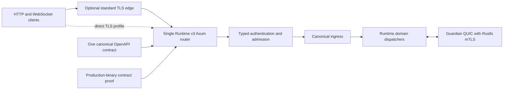

# Runtime TLS and ACIP Simplification Review

Status: Draft for review

Issue context: #92

Pull request context: #98

Source review baseline: `e93603dc13ad7b21def61db9f09120c7d4524f35`

Audience: Runtime maintainers, security reviewers, and release reviewers

## 1. Executive Summary

The Runtime v3 networking surface is more complicated than its deployed shape
requires. The repository currently contains two Axum/Rustls runtime API
implementations that claim the same `/v1/acip/ws` endpoint while enforcing
different wire protocols and different admission policies. It also retains two
OpenAPI descriptions and a native proof lane that exercises the non-production
implementation.

This is not merely harmless code duplication. The duplicated surfaces can both
pass their own tests while disagreeing about what a valid client frame is:

- the production kernel accepts bounded binary Protobuf envelopes and rejects
  text work frames;
- the `adl-runtime` facade accepts negotiated JSON text carriers and rejects
  binary frames;
- one OpenAPI document describes each behavior;
- the workflow named as production proof tests the facade rather than the
  production kernel.

The simplest durable design is:

1. one production HTTP/HTTPS/WSS router owned by `adl-runtime-kernel`;
2. one canonical ACIP WebSocket contract;
3. one admission path from transport authentication through governed ingress;
4. one generated or mechanically checked OpenAPI authority;
5. one proof lane that launches and probes the production binary;
6. an explicit decision about whether public TLS terminates in the runtime or
   at a standard edge proxy or managed load balancer.

The immediate review result for PR #98 is **changes requested**. The protocol
and proof contradictions should not be accepted as two valid implementations.
The larger removal can be staged, but the repository must first name one
canonical behavior and stop treating the other as production proof.

## 2. Scope and Truth Boundary

This document is an architecture review and simplification proposal. It does
not claim that the recommended removals, COTS integrations, or target
architecture have been implemented.

### In scope

- Runtime v3 HTTP, HTTPS, and WebSocket listener ownership.
- ACIP `/v1/acip/ws` protocol and admission behavior.
- Shared Rustls identity and trust loading introduced or consolidated by #92.
- OpenAPI ownership and runtime contract proof.
- Duplicate code and proof surfaces exposed by PR #98.
- COTS components that could remove undifferentiated infrastructure code.

### Out of scope

- Replacing the ACIP domain protocol itself.
- Replacing Guardian QUIC, node identity, or private mTLS semantics.
- Redesigning all CLI and gateway authentication in PR #98.
- Selecting a production hosting provider in this review.
- Changing repository state, publishing, or merging.

## 3. Observed Runtime Topology

### 3.1 Production path

The production `adl-runtime-kernel` binary constructs `ControlService` and
passes it to `serve_control_listener_until_ready`. This is the listener mounted
by the actual Runtime v3 entrypoint.

Relevant sources:

- `adl-runtime-kernel/src/bin/adl-runtime-kernel.rs`
- `adl-runtime-kernel/src/control.rs`
- `adl-runtime-kernel/src/tls.rs`
- `adl-runtime-kernel/src/ingress.rs`
- `docs/api/runtime-v3/v1/openapi.json`

The production ACIP WebSocket handler:

- authorizes the upgrade with the configured Observatory bearer token;
- sends a JSON `authenticated` session frame;
- accepts binary frames only;
- decodes each frame as an ACIP Protobuf envelope;
- reserves the source sequence;
- converts the envelope into `DomainWork`;
- submits it to canonical ingress;
- returns a JSON completion or rejection frame.

### 3.2 Parallel facade path

`adl-runtime/src/runtime_api.rs` defines another complete Axum runtime API
surface with:

- its own TLS listener helpers;
- health and metrics routes;
- `/v1/acip/ws`;
- `/v1/acip/openapi.json`;
- its own WebSocket session loop;
- its own frame decoding and negotiation;
- admission through `RuntimeApiWssAdmissionPolicy`.

Repository-wide use inspection found this router in its own tests and helper
functions, but not mounted by the production Runtime v3 binary. Authentication
primitives in `adl-runtime/src/runtime_api_auth.rs` have additional CLI and
gateway consumers, so that module is not wholly dead and must not be deleted as
one undifferentiated block.

## 4. Duplication Inventory

| Responsibility | Production authority | Parallel implementation | Consequence |
| --- | --- | --- | --- |
| Axum router | `adl-runtime-kernel/src/control.rs` | `adl-runtime/src/runtime_api.rs` | Two service compositions and route tables |
| TLS listener | `serve_control_listener_*` | `serve_runtime_api_listener_*` | Duplicate bind, shutdown, and TLS wiring |
| TLS loader wrapper | `load_control_tls` | `load_runtime_api_tls` | Thin wrappers around the same shared loader |
| ACIP WebSocket | `acip_ws_handler` and `acip_ws_session` | `wss_handler` and `wss_session` | Same URL, incompatible framing |
| Upgrade authentication | Observatory bearer token | Runtime API credentials plus Origin | Different trust boundaries |
| Frame admission | Decode, replay sequence, ingress | Negotiate, runtime ID, signature, capability, authority, replay | Different security claims |
| OpenAPI | `openapi.json` | `acip.openapi.json` | Contradictory canonical descriptions |
| Native proof | Kernel tests exist | Workflow runs `runtime_api_wss` | Green proof does not exercise production listener |

Approximate source size at the review baseline:

- `adl-runtime/src/runtime_api.rs`: 821 lines;
- `adl-runtime/src/runtime_api_auth.rs`: 1,406 lines;
- `adl-runtime-kernel/src/control.rs`: 1,773 lines;
- `adl-runtime-kernel/src/tls.rs`: 343 lines;
- `adl/tools/validate_v092_browser_trusted_observatory.mjs`: 827 lines.

Line count is not itself a defect. It does, however, show that keeping both API
stacks imposes a material maintenance and review burden. Removing the unused
facade would eliminate roughly 800 production-shaped lines immediately, plus
its listener tests and companion contract. Additional authentication code
should be retained or moved according to real consumers rather than deleted by
file name.

## 5. Findings

### F-1: Two incompatible implementations claim `/v1/acip/ws` (P1)

The production handler in `adl-runtime-kernel/src/control.rs` accepts only
binary client work frames. A text frame closes the connection with
`binary_acip_frame_required`.

The facade handler in `adl-runtime/src/runtime_api.rs` does the opposite. It
requires text JSON negotiation and carrier frames and closes a binary frame
with `unsupported_frame`.

Both cannot be the same v1 endpoint. Frame direction and authentication changes
are breaking changes under `docs/api/runtime-v3/v1/API_VERSIONING.md`, which
also states that the served Core API document is canonical.

**Required disposition:** designate the kernel behavior as canonical or change
the production kernel to the explicitly approved contract. Do not retain two
behaviors under the same versioned path.

### F-2: Production proof exercises the non-production facade (P1)

`.github/workflows/wp14-native-acip.yml` labels its test step "Run production
ACIP/WSS producer" but executes the `adl-runtime/tests/runtime_api_wss.rs`
test. That test constructs `RuntimeApiService`, not the `ControlService` mounted
by the production binary.

The workflow path filter includes facade sources but omits important production
sources such as `adl-runtime-kernel/src/control.rs`, the runtime kernel binary,
and the shared TLS module. Production behavior can therefore change without
triggering this claimed production proof.

**Required disposition:** launch the exact production binary and probe its
bound endpoint, or rename and reclassify the facade lane as non-production.

### F-3: The Observatory read token becomes ACIP write authority (P1)

The production ACIP upgrade checks the same token loaded and described by the
runtime as the "Runtime Observatory read token." After upgrade, accepted binary
envelopes are converted to `DomainWork` and submitted to canonical ingress.
Canonical ingress submits operations as principal `canonical-ingress` with no
permit attached.

The production path does enforce envelope decoding and monotonic sequence
reservation. It does not apply the facade contract's Origin, runtime identity,
signed-control, capability, or authority checks before dispatch.

This creates a mismatch between credential naming, apparent read scope, and
actual write capability.

**Required disposition:** use a separately classified ACIP write credential and
one governed admission path, or explicitly approve and document the
Observatory token as write authority. A read-named token should not silently
become command ingress authority.

### F-4: The trust-root loader does not prove the no-leaf-as-root policy (P2)

`adl-runtime-kernel/src/tls.rs` parses every supplied PEM certificate and adds
it directly to `RootCertStore`. The configuration validates distinct paths,
but distinct paths do not establish distinct certificate content or CA
constraints.

The existing negative proof uses an unrelated trust root. It does not prove
that the served leaf certificate is rejected when copied into the trust-root
file. Because a configured trust anchor may be treated differently from an
ordinary intermediate certificate, this exact case needs an explicit policy
check and negative test.

**Required disposition:** either validate that configured roots satisfy the
approved CA policy and differ from the served leaf, or narrow the acceptance
claim to what Rustls/WebPKI configuration actually proves.

## 6. Why This Is Overengineered

The complexity comes from duplicated ownership rather than from Rustls itself.
Each surface is individually understandable, but together they create a
cross-product of choices:

- two routers;
- two listener lifecycles;
- two ACIP frame models;
- two authentication models;
- two API documents;
- two families of tests;
- proof labels that do not reveal which implementation ran.

This makes a local change expensive because a reviewer must determine whether
the modified code is production, compatibility, fixture-only, or dead. It also
makes green tests less meaningful: each test family can prove its own internal
consistency without proving repository-wide consistency.

The correct simplification is not another abstraction over both stacks. It is
to choose one stack and remove the duplicate production-shaped surface.

## 7. Proposed Target Architecture

### Ownership rules

1. `adl-runtime-kernel` owns the production listener and route composition.
2. ACIP framing and admission are shared domain modules, not a second router.
3. Every route has one versioned contract authority.
4. Tests import or launch the same code that production mounts.
5. Public edge TLS and private Guardian mTLS are separate decisions.
6. Credential names and capabilities match the operations they authorize.

## 8. COTS Replacement Opportunities

This section is an evaluation appendix, not a prerequisite for the Rust
consolidation. Selecting or deploying an edge component requires a separate
deployment architecture decision. The duplicate listener, contradictory ACIP
contract, and invalid production proof should be corrected without waiting for
that decision.

### 8.1 Public TLS and WSS termination

This is the largest credible COTS reduction.

#### Option A: Caddy

Caddy is the simplest self-hosted candidate when automatic HTTPS, certificate
renewal, static Observatory hosting, and WebSocket reverse proxying are desired
in one small operational component.

Potentially replaced repository responsibilities:

- public certificate acquisition and renewal concerns;
- direct public TLS termination in Axum;
- portions of browser-trusted TLS proof scaffolding;
- static site serving and WSS forwarding glue.

Official references:

- <https://caddyserver.com/docs/automatic-https>
- <https://caddyserver.com/docs/caddyfile/directives/reverse_proxy>

#### Option B: Managed AWS edge

Where the runtime is deployed behind AWS infrastructure, an Application Load
Balancer with ACM-managed certificates can terminate HTTPS and forward HTTP and
WebSocket traffic. This removes certificate material from the runtime process
and moves rotation to the managed edge.

Official reference:

- <https://docs.aws.amazon.com/elasticloadbalancing/latest/application/load-balancer-listeners.html>

This is an architectural option only. It does not authorize starting instances
or changing AWS infrastructure.

#### Option C: Envoy

Envoy is appropriate if the deployment needs richer traffic policy,
observability, external authorization, or multiple upstream clusters. It is
more operational machinery than Caddy and should not be selected for a simple
single-runtime deployment without those requirements.

Official reference:

- <https://www.envoyproxy.io/docs/envoy/latest/intro/arch_overview/http/upgrades>

#### Recommendation

Use Caddy for the simplest self-hosted deployment or the platform's managed
load balancer when already operating in that platform. Keep direct Axum/Rustls
termination as an explicit deployment profile only when it is a demonstrated
product requirement. Do not keep two in-process runtime APIs to accommodate
deployment differences.

### 8.2 CORS and HTTP policy middleware

If direct Axum exposure remains, `tower-http` can own standard CORS mechanics,
request tracing, limits, and related HTTP middleware. Domain-specific signed
command and ACIP authorization must remain application logic.

Official reference:

- <https://docs.rs/tower-http/latest/tower_http/cors/struct.CorsLayer.html>

### 8.3 OpenAPI generation

The repository already uses `utoipa-swagger-ui`, but it embeds hand-maintained
JSON documents. The next simplification is to generate or strongly derive one
OpenAPI document from typed route schemas, then retain a checked artifact for
review and compatibility diffs.

This would replace:

- parallel manual descriptions of the same endpoint;
- source-string tests that prove only that a document was included;
- review work spent reconciling protocol prose across files.

It must not make the contract nondeterministic. The generated artifact should
be stable, committed when repository policy requires it, and checked for a
clean regeneration diff.

### 8.4 General-purpose authentication

OIDC/JWT middleware, an external authorization service, or a managed identity
provider could eventually replace portions of the 1,406-line custom runtime API
credential store. That decision is broader than #98 because the module is used
by CLI and gateway code and may support offline or local-first requirements.

Recommendation: first remove the duplicate listener. Then inventory the real
credential-store consumers and evaluate COTS authentication as a separate
bounded architecture decision. Do not combine these changes into the TLS repair.

### 8.5 Components that should remain domain-specific

Do not replace the following merely to increase COTS usage:

- ACIP envelope semantics and deterministic encoding;
- canonical ingress and domain dispatch;
- Guardian QUIC transport and private mTLS identity binding;
- replay and monotonic-sequence policy;
- runtime-specific capability and authority decisions.

These are product behavior. The COTS boundary should remove commodity edge and
protocol plumbing, not outsource ADL's governed runtime semantics.

## 9. Recommended Remediation Sequence

### Stage 1: Resolve the review blockers in #98

1. Declare one canonical `/v1/acip/ws` frame and admission contract.
2. Align the served OpenAPI document and companion document with that contract.
3. Stop presenting `runtime_api_wss` as production proof.
4. Add production-binary proof for the exact endpoint.
5. Resolve the Observatory read-token/write-authority mismatch.
6. Add the exact leaf-as-root negative policy proof or narrow the claim.

The credential-scope and trust-root findings are functional security defects.
They should be implemented and reviewed as bounded fixes rather than hidden
inside, or delayed by, the larger listener-removal refactor.

### Stage 2: Remove the duplicate listener

1. Inventory consumers of `RuntimeApiService` and `runtime_api_router`.
2. Move genuinely shared DTOs and admission primitives into a bounded shared
   module owned below the router layer.
3. Delete `serve_runtime_api_listener_*`, `runtime_api_router`, and the duplicate
   WebSocket session.
4. Delete or redirect `/v1/acip/openapi.json` so it cannot diverge.
5. Replace facade tests with production-kernel tests.
6. Verify that CLI and gateway authentication consumers remain intact.

### Stage 3: Simplify the public TLS boundary

1. Decide between managed edge, Caddy, or direct Axum/Rustls as the default
   deployment profile.
2. If an edge terminates TLS, bind the runtime listener to a private or loopback
   interface and document the trusted-hop boundary.
3. Retain Rustls for Guardian private mTLS and any approved direct-TLS profile.
4. Remove proof code that exists only to emulate a production edge locally.
5. Add a small deployment-level WSS upgrade and certificate verification test.

### Stage 4: Consolidate contract generation

1. Define typed request, response, session, frame, and close-reason schemas.
2. Generate one stable OpenAPI artifact.
3. Check regeneration deterministically in CI.
4. Test the production binary against the generated contract.

## 10. Acceptance Criteria for the Simplified Design

- Exactly one production route owns `/v1/acip/ws`.
- Text-versus-binary behavior is unambiguous and versioned.
- Exactly one admission policy is applied before canonical ingress.
- Read credentials cannot authorize writes unless explicitly typed and
  documented as such.
- The production binary serves the contract checked into or generated by the
  repository.
- Native proof launches the production binary at the exact reviewed commit.
- Workflow path filters include every production source that can change the
  proved behavior.
- Leaf-as-root rejection is either explicitly enforced and tested or removed
  from the claimed policy.
- Public TLS termination has one documented default ownership boundary.
- Guardian QUIC and private mTLS remain independently validated.
- No compatibility facade remains unless it has a named consumer, versioned
  contract, deprecation owner, and removal date.

## 11. Validation Strategy

The proving test should be black-box at the production boundary:

1. build the exact `adl-runtime-kernel` commit;
2. provision deterministic test CA, identity, and separately scoped credentials;
3. start the production binary and wait for its declared readiness signal;
4. verify ordinary HTTPS health and OpenAPI retrieval;
5. upgrade the real `/v1/acip/ws` route over WSS;
6. verify the canonical server-first frame;
7. submit one valid frame and observe canonical ingress completion;
8. verify wrong frame type, oversize frame, wrong credential, replay, and
   revoked-credential failures;
9. verify wrong root, wrong hostname, wrong key, and leaf-as-root refusal;
10. shut down and prove no listener or child process remains.

Source-level contract assertions may remain useful, but they cannot substitute
for launching the production binary. A test of an independently constructed
router is a component test, not production integration proof.

## 12. Decisions Required

1. Is the canonical v1 ACIP client frame raw binary Protobuf or negotiated JSON
   carrier text?
2. Must the Runtime terminate public TLS directly, or may the default deployment
   use a standard edge?
3. Is the Observatory token intentionally authorized to submit domain work?
4. Should `/v1/acip/openapi.json` be removed, redirected, or generated as a
   filtered view of the canonical Core API?
5. Which authentication primitives are shared product behavior, and which are
   artifacts of the unused facade?

## 13. Recommended Decision

Adopt the production kernel as the single runtime API owner. Preserve binary
Protobuf ACIP frames if that is the already-approved production contract, but
move the richer signed-control, capability, authority, replay, and identity
checks into the one production admission path. Remove the duplicate
`RuntimeApiService` listener after its real shared consumers are separated.

For deployment, prefer a standard TLS edge by default and retain direct
Axum/Rustls as an explicit profile. Keep Rustls/Quinn private mTLS inside the
runtime because that identity relationship is domain-specific.

This approach reduces code, removes contradictory contracts, improves the
meaning of green tests, and makes the trust boundary understandable without
introducing another framework or control plane.

## 14. Independent Gemini Follow-On Review

Gemini 3.1 Pro Preview reviewed this document after the initial source review.
Model identity is provider-asserted. The completed pass used the document at
the issue worktree revision following source baseline
`e93603dc13ad7b21def61db9f09120c7d4524f35`.

### Findings

1. **Security fixes must not wait for the architecture refactor.** Gemini
   agreed that the Observatory credential-scope mismatch and leaf-as-root
   policy gap are functional defects, but recommended implementing them as
   separately bounded fixes instead of making them incidental parts of the
   larger consolidation.
2. **The COTS discussion must not widen the immediate repair.** Caddy, a
   managed load balancer, and Envoy are reasonable deployment candidates, but
   selecting one is a deployment architecture decision. It should not block
   removal of the duplicate Rust API facade.
3. **The duplicate endpoint diagnosis is sound.** Gemini classified the two
   incompatible `/v1/acip/ws` implementations as a critical split-contract
   defect and endorsed selecting one canonical contract and deleting the other.
4. **The production proof is misdirected.** Gemini agreed that a workflow that
   exercises `runtime_api_wss.rs` cannot prove the kernel endpoint mounted by
   the production binary.
5. **The OpenAPI authorities must converge.** Gemini agreed that independently
   maintained `openapi.json` and `acip.openapi.json` guarantee continued drift
   unless one becomes generated or mechanically derived from the canonical
   contract.

### Consumer-preservation assessment

Gemini endorsed the staged extraction boundary for
`adl-runtime/src/runtime_api_auth.rs`. The module has real CLI and gateway
consumers, so the listener can be deleted only after shared credential-store,
DTO, and admission primitives are separated from the facade. This confirms
that the recommended target is deletion of the duplicate router, not wholesale
deletion based on file proximity.

### Decision and disposition

Gemini returned **approved with modifications**:

- proceed with one canonical kernel router, one ACIP contract, one OpenAPI
  authority, and production-binary proof;
- separate the immediate security fixes from the codebase consolidation;
- keep the COTS edge decision as a follow-on deployment architecture decision.

Those modifications are incorporated in this revision through the explicit
COTS stop boundary and the bounded security-fix statement in Stage 1. Gemini's
review supports the simplification direction but is supplemental review
evidence, not merge or lifecycle authority.
