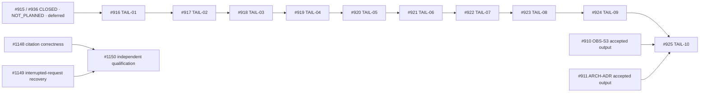

# Sprint 11 Execution Packet

Current closeout: [the final coordination disposition](SPRINT_CLOSEOUT.md) supersedes execution-state/owner observations below. This retained opening packet and its frozen SPP values are historical planning evidence.

## Metadata

- Sprint issue: `#937`
- Sprint title: `Canonical release tail`
- Milestone: `v0.92.2`
- Execution mode: `hybrid`
- Owner: `Planning #5` for umbrella coordination
- Last updated: `2026-09-22`

## Sprint Goal

Coordinate the canonical release tail through truthful quality, documentation,
publication, review, remediation, successor-planning, and release decisions.
Preserve incomplete or deferred results as such. Nothing in this packet
authorizes product repair, provider execution, deployment, publication, merge,
release, or public launch.

## Sprint Boundary

In scope:

- Preserve the exact `#916` through `#925` roster and numeric dependency chain.
- Record active owners, preparation lanes, successor routing, and acceptance gates.

Out of scope:

- Product repairs, provider calls, paid execution, deployment, or publication.
- Treating Sprint 10's incomplete qualification as a pass or bypassing any child prerequisite.

## Child Issue Wave

| Issue | Role | Status | Primary surface | Estimated seconds | Token budget | Watcher | Notes |
|---|---|---|---|---|---|---|---|
| #916 | TAIL-01 quality decision | active audit | quality decision and producer ledger | unknown | unknown | Planning #11; Worker #9 read-only audit | Overall decision remains `not_proven`; operator-approved Sprint 10 deferral is an explicit disposition, not qualification acceptance. |
| #917 | TAIL-02 docs handoff | preparation active | documentation handoff inventory | unknown | unknown | Planning #4.5 | Preparation may continue; final acceptance remains blocked on accepted #916 output. |
| #918 | TAIL-03 publication finalization | preparation active | publication-package inventory | unknown | unknown | Worker #10 | `122/122` inventory match is preparation evidence; final identity and accepted #917 output remain required. |
| #919 | TAIL-04 internal review | blocked | combined milestone review | unknown | unknown | unassigned | Requires accepted #918 output. |
| #920 | TAIL-05 external review | blocked | third-party review packet | unknown | unknown | unassigned | Requires accepted #919 output. |
| #921 | TAIL-06 finding disposition | blocked | remediation or explicit deferral ledger | unknown | unknown | unassigned | Requires accepted #920 output. |
| #922 | TAIL-07 successor planning | preparation active | v0.93 mapping | unknown | unknown | Planning #11 | May map #1148-#1150 now; final TAIL-07 acceptance remains blocked on accepted #921 output. |
| #923 | TAIL-08 successor closeout planning | blocked | next-milestone closeout plan | unknown | unknown | unassigned | Requires accepted #922 output. |
| #924 | TAIL-09 planning review | blocked | independent successor-plan review | unknown | unknown | unassigned | Requires accepted #923 output. |
| #925 | TAIL-10 release ceremony | blocked | release decision and milestone close | unknown | unknown | unassigned | Requires accepted #924, #910, #911, exact human release authority, and all release gates. |

## Dependency Graph

## Recommended Execution Order

1. #915 and #936 are closed as `NOT_PLANNED`, with incomplete qualification work routed to #1148-#1150 and no PASS claim.
2. Planning #11 completes #916 as a truthful quality decision, preserving `not_proven` wherever evidence remains missing or deferred.
3. Accept #917 through #925 only in canonical numeric order. Preparation may overlap only in the lanes declared below.

## Issue Lifecycle Policy

- Each child ends as `closed_after_merge`, `closed_no_merge`, `deferred_with_route`, or `failed_with_route`.
- Closed issue state alone does not establish source-specific acceptance.
- Every child uses its own native lifecycle, bound worktree, goal, proof, and exact-head review.
- Umbrella coordination never edits another owner's issue worktree.

## Watcher Policy

- Named owners watch their active issue or preparation lane.
- Umbrella coordination records live state and routes blockers; it does not assume child implementation authority.
- Unassigned serial children remain blocked rather than becoming ambient work.

## Budget And Goal Accounting

- Aggregate sprint token budget: `unknown`
- Aggregate sprint elapsed-seconds estimate: `unknown`
- Sprint goal ref: `goal:v0.92.2:sprint:937`
- Goal metrics rollup ref: `.csdlc/evidence/937/goal-metrics.jsonl`
- Budget-source rule: record unavailable values as `unknown`, never zero.

## Watcher Plan

| Issue | Watcher | Current focus | Next terminal state |
|---|---|---|---|
| #915 | Planning #7.3 | closed `NOT_PLANNED` | unmet work routed to #1148-#1150 without PASS |
| #936 | Planning #11 | closed `NOT_PLANNED` | Sprint 10 accounting preserves the incomplete result |
| #916 | Planning #11; Worker #9 read-only support | producer acceptance and quality decision | reviewed `pass`, `fail`, or `not_proven` decision |
| #917 | Planning #4.5 | docs handoff preparation | waiting for accepted #916 |
| #918 | Worker #10 | publication-package preparation | waiting for accepted #917 and final identity |
| #922 | Planning #11 | map successor issues #1148-#1150 | waiting for accepted #921 before final acceptance |

## Safe Parallel Lanes

| Lane | Issues | Why parallel-safe | Required coordination |
|---|---|---|---|
| evidence-audit | #916 | Read-only producer acceptance audit is isolated in #916's bound worktree. | Planning #11 owns the decision; Worker #9 supplies read-only evidence only. |
| docs-prep | #917 | Handoff inventory is isolated and cannot accept TAIL-02 early. | Keep status preparation-only until #916 is accepted. |
| publication-prep | #918 | Package inventory is isolated and cannot finalize publication early. | Preserve Worker #10's main-checkout evidence and require accepted #917 plus final identity. |
| successor-map-prep | #922 | Mapping #1148-#1150 is planning-only and creates no v0.93 execution authority. | Keep final #922 acceptance blocked until #921 is accepted. |

## Candidate Parallel Lanes

| Lane | Classification | Issues | Expected write sets | Expected PVF lanes | Validation lanes | Dependency gates | Collision risks | Watcher | Subagent | Why safe or why not | Required coordination |
|---|---|---|---|---|---|---|---|---|---|---|---|
| active-quality | safe_parallel | #916 | #916 evidence only | deterministic evidence checks | hash and ledger checks | #915/#936 disposition truth | quality overstatement | Planning #11 | Worker #9 read-only | Audit can overlap disposition, but decision cannot invent acceptance. | Preserve `not_proven` and exact successor links. |
| downstream-prep | safe_parallel | #917, #918, #922 | separate bound issue worktrees and issue-local evidence | docs/inventory/planning checks | focused issue-local checks | canonical predecessor acceptance | shared milestone docs and final identity | named child owners | none | Preparation is useful and reversible; acceptance remains serial. | Serialize shared milestone-document writes and never publish early. |
| release-tail | blocked_until_dependency | #919-#925 | later review and release surfaces | issue-specific | issue-specific | prior child acceptance; #925 also #910/#911 and human authority | premature release claims | unassigned | none | These issues consume accepted upstream results. | Do not start acceptance work before gates clear. |

## Prep-Scout / Next-Issue Readiness

- Candidate issue queue: `#922 mapping prep`, then `#919` only after accepted #918.
- Current wait-state owner: `Planning #11`.
- Scout owner or watcher: `Planning #5 umbrella coordination`.
- Lane posture: `preparation-only`.
- Promotion rule: promote a child to executable acceptance only after authenticated predecessor acceptance and native readiness.
- Current tooling boundary: native C-SDLC v3; no raw lifecycle writes.
- Handoff contract: the safe independent work now is #922 mapping of #1148, #1149, and #1150 without opening v0.93 execution or claiming #921 acceptance.

## Serial Gates

| Gate | Blocks | Exit condition | Owner |
|---|---|---|---|
| sprint10-disposition | satisfied for #916 input | #915 and #936 are closed `NOT_PLANNED`; #1148-#1150 retain the unmet work | Planning #7.3 / Planning #11 |
| quality-decision | #917 acceptance | reviewed #916 output with missing proof preserved | Planning #11 |
| docs-handoff | #918 acceptance | reviewed and accepted #917 handoff | Planning #4.5 |
| publication-package | #919-#921 | reviewed and accepted #918 package at final identity | Worker #10 |
| findings-disposition | #922 acceptance | accepted #919, #920, and #921 outputs | later owners |
| successor-plan | #923-#924 | accepted #922 mapping | Planning #11 then later reviewers |
| release-authority | #925 effects | accepted #924, #910, #911, exact candidate/manifest, and explicit human authority | operator |

## PVF / Validation-Tail Notes

- Immediate issue-local proof: each active lane validates only its own declared artifacts.
- Parallel validation lanes: #916 ledger checks, #917 docs checks, #918 inventory checks, and #922 planning checks.
- Serial validation gates: final acceptance follows #916 to #925 exactly.
- Reusable proof criteria: exact identity, accessible retained evidence, matching digest, and scope-compatible acceptance.
- Fail-closed rule: missing, failed, unknown, deferred, stale, or unreviewed evidence never becomes a pass.

## Parallelism Outcome Plan

- Planned summary: four preparation lanes overlap while acceptance remains serial.
- Actual summary placeholder: update at sprint closeout from child evidence.
- Prediction-miss capture rule: record collisions, dependency surprises, and any lane that could not remain isolated.
- Closeout requirement: distinguish preparation completed from acceptance completed.

## Sprint Activity Log

- Log artifact path: `.csdlc/evidence/937/activity.jsonl`
- Required events: owner assignment, preparation start, gate change, PR/review/validation state, disposition, and closeout.
- Log policy: append factual observations; never rewrite failed or incomplete history.

## Sprint-Level Review

- Sprint review artifact: `.csdlc/evidence/937/SPRINT_REVIEW.md`
- Review scope: all ten children, Sprint 10 disposition, successor routing, proof, and residual risks.
- All actionable findings must be fixed, routed, or explicitly accepted before #937 closes.

## Subagent / Local Model Policy

- Subagent strategy: read-only state and document review only for umbrella coordination.
- Local model candidates: none declared.
- Child mutations remain with named issue owners.

## Template/AST Policy

- This packet uses the active `1.0.0` SEP template as the permitted bootstrap surface.
- Issue cards remain under native editor and schema authority.

## Shared Inputs And Artifacts

- Shared source docs: `docs/milestones/v0.92.2/` and `docs/milestones/v0.93/features/CODEFRIEND_LAUNCH_v0.93.md`.
- Shared code surfaces: none authorized by this coordination task.
- Shared review packets: issue-local evidence from #915-#918 and #922.
- Shared logs or observability surfaces: `.csdlc/evidence/937/activity.jsonl`.

## Cross-Sprint Dependencies

- Upstream dependencies: completed #915/#936 incomplete/deferred disposition; all other declared #916 producer prerequisites.
- Downstream consumers: #917-#925 and v0.93 mapping in #922.
- Collision risks: shared milestone docs, final candidate identity, and another owner's main-checkout evidence.
- Routing rule: preserve other owners' worktrees and serialize shared-file changes through the owning issue.

## Review Bar

- Review scope: coordination truth, ownership, dependency preservation, and non-claims.
- Required review skills: sprint-conductor plus independent bounded review.
- Code-facing review required: no.
- Docs-facing review required: yes.
- Security review required: no new trust boundary is introduced.

## Closeout Bar

- Every child is closed or explicitly deferred with rationale and retained routing.
- Every child PR is reconciled truthfully.
- Sprint review findings are fixed, routed, or retained as residual risk.
- Worktrees are pruned or retained with an explicit reason by their owners.

## Sprint Closeout Rollup Expectations

- Child status rollup: account for all ten children exactly once.
- Budget variance rollup: preserve unknown values.
- Watcher outcome rollup: include every named owner and wait state.
- Parallelism assumption review: separate useful preparation overlap from serial acceptance.

## Residual Routing Policy

- Must-fix-before-sprint-close: unresolved required child without an authorized disposition; unsupported PASS; unreviewed release-blocking finding.
- Post-sprint follow-ons: #1148, #1149, and #1150 under v0.93 mapping.
- Deferred work: citation correctness, interrupted-request recovery, and complete independent qualification.
- Explicit non-blockers: asynchronous native closeout mechanics that do not change acceptance truth.

## Non-Claims

- Sprint 10 qualification did not pass; its remaining work is explicitly deferred.
- This packet does not authorize v0.93 execution, Beta 1 launch, release, provider calls, product repair, deployment, publication, or merge.
