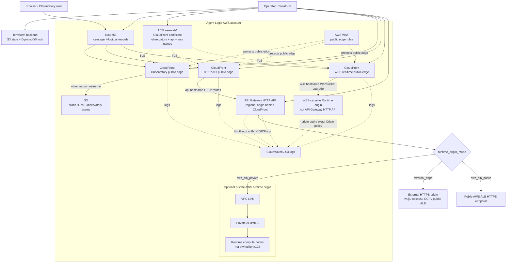

# Issue #122 Terraform Execution Plan: Permanent CSM Public Edge

## Decision

Issue #122 will use Terraform, not CloudFormation, for the permanent AWS public
edge that exposes one or more CSM instances. Actual compute nodes are outside
this Terraform stack and may be provided separately by AWS, GCP, wuji, nessus,
or another operator-approved runtime host.

The permanent edge must be cheap when idle, able to point at external HTTPS
origins immediately, and able to point at an AWS ALB later without redesign.
CloudFront is the public edge for static Observatory traffic, Runtime HTTP API
traffic, and Runtime WSS traffic, with AWS WAF attached at CloudFront. Use
separate CloudFront distributions for the Observatory hostname, HTTP API
hostname, and realtime WSS hostname so each surface has an unambiguous origin,
cache policy, rollback path, and validation contract. API Gateway sits behind
the API CloudFront distribution and terminates HTTP API routing to the selected
Runtime HTTP origin. WSS is first-class and routes through a dedicated realtime
CloudFront distribution directly to a WSS-capable Runtime origin; it is not
implemented through API Gateway HTTP API.

API Gateway WebSocket API is a valid future AWS-managed WSS option, but it is
not the first #122 implementation path. It is not a transparent socket tunnel:
it requires a Runtime adapter for `$connect`, `$disconnect`, `$default` or
custom routes, connection-id persistence, backend authorization, and outbound
`@connections` callbacks. Until that adapter is designed and reviewed, #122
uses native WSS origin routing.

All AWS-managed public certificates for this stack come from ACM. CloudFront
viewer certificates are ACM certificates in `us-east-1`. API Gateway, AWS ALB,
and other regional AWS-integrated TLS listeners use regional ACM certificates.
Non-exportable ACM certificates stay attached to AWS-integrated services; if a
non-AWS host such as wuji or nessus must terminate TLS directly, the plan must
use either an ACM exportable certificate or another operator-approved public
certificate source and record that as an explicit origin-cert exception.

## DNS Naming

Use a CSM namespace Route53 zone boundary:

```text
csm.agent-logic.ai
csm.agent-logic.com
```

Use this hostname pattern for non-production CSM instances:

```text
<function>.<csm_name>.<environment>.csm.agent-logic.ai
```

Use this hostname pattern for production CSM instances:

```text
<function>.<csm_name>.csm.agent-logic.com
```

Examples:

```text
observatory.wuji.dev.csm.agent-logic.ai
api.wuji.dev.csm.agent-logic.ai
wss.wuji.dev.csm.agent-logic.ai
wuji.dev.csm.agent-logic.ai
nessus.dev.csm.agent-logic.ai
gcp.dev.csm.agent-logic.ai
aws-alb.wuji.dev.csm.agent-logic.ai

observatory.wuji.csm.agent-logic.com
api.wuji.csm.agent-logic.com
wss.wuji.csm.agent-logic.com
wuji.csm.agent-logic.com
```

`api.<csm>.<env>.csm.agent-logic.ai` is the stable public Runtime API hostname
and aliases to the API CloudFront distribution. CloudFront forwards HTTP API
traffic to API Gateway, which routes to the currently selected runtime origin.
`wss.<csm>.<env>.csm.agent-logic.ai` is the stable public Runtime realtime
hostname and aliases to the WSS CloudFront distribution. CloudFront forwards
WebSocket upgrade traffic directly to the configured WSS-capable Runtime origin.
`observatory.<csm>.<env>` is the stable browser-facing Observatory hostname and
aliases to the Observatory CloudFront distribution.

`origin_cname_target` can publish the selected Runtime origin alias, such as
`wuji.dev.csm.agent-logic.ai -> wuji.agent-logic.ai`, while preserving DDNS.
`edge_acm_certificate_arn` can reuse a pre-issued `us-east-1` ACM wildcard such
as `*.wuji.dev.csm.agent-logic.ai`; otherwise Terraform requests exact
Observatory/API/WSS SANs.

## Standard AWS Shape



## Terraform Layout

Issue-owned implementation paths:

```text
infra/aws/csm-public-edge/
  README.md
  main.tf
  variables.tf
  outputs.tf
  versions.tf
  locals.tf
  terraform.tfvars.example
  modules/
    dns/
    certificates/
    observatory_static_site/
    cloudfront_edge/
    runtime_api_gateway/
    runtime_realtime_wss/
    waf/
    logging/
```

Validation and operator proof paths:

```text
adl/tools/validate_csm_public_edge_static.sh
adl/tools/validate_csm_public_edge_live.sh
docs/milestones/post-v0.92/features/CSM_PUBLIC_EDGE_TERRAFORM.md
.csdlc/evidence/122/
```

## Terraform Inputs

Required variables:

```hcl
variable "environment" {
  description = "Deployment environment, for example dev or prod."
  type        = string
}

variable "csm_name" {
  description = "CSM instance name, for example wuji."
  type        = string
}

variable "zone_name" {
  description = "Route53 zone name."
  type        = string
  default     = "csm.agent-logic.ai"
}

variable "runtime_origin_mode" {
  description = "How API Gateway reaches the Runtime origin."
  type        = string
  validation {
    condition = contains([
      "external_https",
      "aws_alb_public",
      "aws_alb_private"
    ], var.runtime_origin_mode)
    error_message = "runtime_origin_mode must be external_https, aws_alb_public, or aws_alb_private."
  }
}

variable "runtime_origin_url" {
  description = "HTTPS Runtime origin for external_https or aws_alb_public."
  type        = string
  default     = null
}

variable "private_alb_listener_arn" {
  description = "Private ALB/NLB listener for aws_alb_private mode."
  type        = string
  default     = null
}

variable "observatory_asset_source" {
  description = "Local build output directory for static Observatory assets."
  type        = string
}

variable "approved_aws_account_id" {
  description = "Approved Agent Logic AWS account id supplied out-of-band for fail-closed caller identity checks. No default; never commit real values."
  type        = string
  sensitive   = true
}
```

Derived hostnames:

```hcl
locals {
  observatory_fqdn = "observatory.${var.csm_name}.${var.environment}.${var.zone_name}"
  api_fqdn         = "api.${var.csm_name}.${var.environment}.${var.zone_name}"
  wss_fqdn         = "wss.${var.csm_name}.${var.environment}.${var.zone_name}"
  runtime_fqdn     = "runtime.${var.csm_name}.${var.environment}.${var.zone_name}"
  resource_prefix  = "csm-${var.csm_name}-${var.environment}"

  common_tags = {
    Project     = "agent-logic-csm"
    Issue       = "122"
    Environment = var.environment
    CsmName     = var.csm_name
    ManagedBy   = "terraform"
  }
}
```

Caller identity guard:

```hcl
data "aws_caller_identity" "current" {}

resource "terraform_data" "approved_account_guard" {
  input = "agent-logic-business-account"

  lifecycle {
    precondition {
      condition     = data.aws_caller_identity.current.account_id == var.approved_aws_account_id
      error_message = "Refusing to apply #122 public edge outside the approved Agent Logic AWS account."
    }
  }
}
```

The approved account id must be supplied by operator-local environment, secure
Terraform variables, or a non-committed `*.auto.tfvars` file. It must not appear
in committed source, public logs, PR text, or review evidence.

## HTTP API Origin Modes

### `external_https`

Default low-cost mode. CloudFront forwards HTTP API traffic to API Gateway, and
API Gateway HTTP proxy integration points at
`runtime_origin_url`, such as:

```text
https://wuji.dev.csm.agent-logic.ai
https://nessus.dev.csm.agent-logic.ai
https://gcp.dev.csm.agent-logic.ai
```

The runtime origin must present ordinary public TLS trust and must enforce its
own Runtime authorization. This mode avoids always-on ALB, VPC Link, and NAT
charges.

### `aws_alb_public`

API Gateway points at a public AWS ALB HTTPS URL. This keeps ALB support easy
without requiring a private VPC integration. The ALB and compute may be managed
by a separate runtime stack.

### `aws_alb_private`

API Gateway uses VPC Link to reach a private ALB/NLB. This is the production
AWS-private landing zone, but it should be disabled until the cost and runtime
topology are explicitly approved.

## Origin-Mode Validation

The Terraform module must fail closed on inconsistent origin inputs:

```hcl
locals {
  uses_public_origin  = contains(["external_https", "aws_alb_public"], var.runtime_origin_mode)
  uses_private_origin = var.runtime_origin_mode == "aws_alb_private"
}

resource "terraform_data" "origin_mode_guard" {
  input = var.runtime_origin_mode

  lifecycle {
    precondition {
      condition = (
        local.uses_public_origin
        ? var.runtime_origin_url != null && startswith(var.runtime_origin_url, "https://")
        : var.runtime_origin_url == null
      )
      error_message = "external_https/aws_alb_public require an HTTPS runtime_origin_url; aws_alb_private must not set runtime_origin_url."
    }

    precondition {
      condition = (
        local.uses_private_origin
        ? var.private_alb_listener_arn != null
        : var.private_alb_listener_arn == null
      )
      error_message = "aws_alb_private requires private_alb_listener_arn; public modes must not set it."
    }

    precondition {
      condition = var.runtime_origin_url == null || (
        !strcontains(var.runtime_origin_url, local.api_fqdn)
        && !strcontains(var.runtime_origin_url, local.observatory_fqdn)
      )
      error_message = "runtime_origin_url must not point back at this stack's public API or Observatory hostname."
    }
  }
}
```

Private-origin resources must be guarded with `count` or `for_each` so VPC Link,
private listeners, and related resources are not created unless
`runtime_origin_mode == "aws_alb_private"`.

## WSS Realtime Edge

WSS is a first-class #122 surface. It must not be treated as an optional
afterthought or inferred from HTTP API support.

Public hostname:

```text
wss.<csm_name>.<environment>.csm.agent-logic.ai
```

Default browser URL shape:

```text
wss://wss.<csm_name>.<environment>.csm.agent-logic.ai/v1/observatory/ws
```

Terraform inputs:

```hcl
variable "wss_origin_mode" {
  description = "How the WSS CloudFront distribution reaches the realtime Runtime origin."
  type        = string
  validation {
    condition = contains([
      "external_wss",
      "aws_alb_public_wss"
    ], var.wss_origin_mode)
    error_message = "wss_origin_mode must be external_wss or aws_alb_public_wss."
  }
}

variable "wss_origin_https_url" {
  description = "HTTPS custom-origin endpoint for external_wss or aws_alb_public_wss. The origin must accept WebSocket upgrade; the public viewer URL remains wss://."
  type        = string
}

variable "wss_origin_hostname" {
  description = "Origin hostname used by CloudFront for WSS Host/SNI/TLS validation. Must match the origin certificate."
  type        = string
}

variable "wss_forward_viewer_host" {
  description = "Whether to forward wss_fqdn as Host to the WSS origin. Default false preserves origin Host/SNI compatibility."
  type        = bool
  default     = false
}

variable "websocket_path_pattern" {
  description = "CloudFront path pattern for public WSS traffic."
  type        = string
  default     = "/v1/observatory/ws*"
}
```

The WSS CloudFront distribution must:

- use `wss_fqdn` as its public alternate name;
- use a us-east-1 ACM viewer certificate that covers `wss_fqdn`, either through
  one SAN certificate covering `observatory_fqdn`, `api_fqdn`, and `wss_fqdn`,
  or through per-distribution certificates;
- attach the same #122 WAF policy family as the Observatory and HTTP API
  distributions;
- disable caching on WSS behavior;
- forward `Origin`, `Authorization`, correlation headers, `Upgrade`,
  `Connection`, and `Sec-WebSocket-*` headers as required by the Runtime;
- by default, not forward the viewer `Host` header to the origin. CloudFront
  should use `wss_origin_hostname` for origin Host/SNI/TLS validation, and pass
  the public viewer host in a separate non-secret header such as
  `X-CSM-Public-Host: wss.<csm>.<env>.csm.agent-logic.ai` if the Runtime needs
  to know the public hostname;
- allow `wss_forward_viewer_host = true` only when the origin is explicitly
  configured to accept `wss_fqdn` as Host and presents a certificate valid for
  that hostname;
- forward only the query strings and cookies that the Runtime explicitly
  declares safe;
- enforce exact allowed browser origins at the Runtime and, where practical, at
  the edge;
- log enough handshake metadata to prove routing without logging message
  payloads or secrets;
- expose a health or handshake probe that fails closed when the Runtime origin
  does not support WebSocket upgrade.

WSS origin-mode validation must mirror HTTP origin validation:

```hcl
locals {
  uses_native_wss_origin = contains(["external_wss", "aws_alb_public_wss"], var.wss_origin_mode)
}

resource "terraform_data" "wss_origin_mode_guard" {
  input = var.wss_origin_mode

  lifecycle {
    precondition {
      condition = (
        local.uses_native_wss_origin
        ? startswith(var.wss_origin_https_url, "https://")
        : false
      )
      error_message = "external_wss/aws_alb_public_wss require an HTTPS origin endpoint that accepts WebSocket upgrade."
    }

    precondition {
      condition = (
        local.uses_native_wss_origin
        ? var.wss_origin_hostname != null
        : false
      )
      error_message = "external_wss/aws_alb_public_wss require wss_origin_hostname for CloudFront origin Host/SNI/TLS validation."
    }

    precondition {
      condition = (
        !strcontains(var.wss_origin_https_url, local.api_fqdn)
        && !strcontains(var.wss_origin_https_url, local.observatory_fqdn)
        && !strcontains(var.wss_origin_https_url, local.wss_fqdn)
      )
      error_message = "wss_origin_https_url must not point back at this stack's public hostnames."
    }

    precondition {
      condition = !var.wss_forward_viewer_host || (
        var.wss_origin_hostname == local.wss_fqdn
      )
      error_message = "wss_forward_viewer_host may be true only when the origin hostname and certificate are intentionally prepared for wss_fqdn."
    }
  }
}
```

`external_wss` supports wuji, nessus, and GCP when those origins expose a
publicly trusted HTTPS endpoint that accepts WebSocket upgrade and whose origin
certificate matches `wss_origin_hostname`. `aws_alb_public_wss` supports an AWS
public ALB origin when the target group supports WebSockets and the ALB listener
certificate matches the origin hostname.

Private WSS is not part of the first native-WSS implementation. If private WSS
is required later, the plan must add a reviewed CloudFront VPC Origin or another
AWS-supported private-origin design with exact cost and connectivity proof. Do
not model private WSS as a listener ARN on a CloudFront custom origin, and do
not route native WSS through API Gateway VPC Link.

API Gateway WebSocket API follow-on mode:

- may be added later as `wss_origin_mode = "apigw_websocket"` only after the
  Runtime adapter contract is designed and reviewed;
- must model `$connect`, `$disconnect`, `$default`/custom routes, connection-id
  persistence, backend authorization, and `@connections` callback authority;
- must not be described as a transparent socket tunnel to the Runtime;
- must include route-level throttling, CloudWatch logging/metrics, and
  connection lifetime/idle-time residual-risk notes.

## Public Edge Routing

CloudFront is the only public edge for both browser and API traffic. Implement
three distributions:

1. Observatory distribution: alternate name `observatory_fqdn`, default origin
   S3 static Observatory assets.
2. API distribution: alternate name `api_fqdn`, default HTTP origin API Gateway.
3. WSS distribution: alternate name `wss_fqdn`, default origin a WSS-capable
   Runtime origin.

All distributions attach the same #122 WAF policy module or equivalent
per-distribution WAF instances with identical rules. Route53 aliases all public
hostnames to CloudFront, not directly to API Gateway or Runtime origins. The API
Gateway regional/default hostname and WSS runtime host are origins, not the
public contract.

CloudFront API behavior must forward the headers required for Runtime auth,
correlation, and CORS preflight. API response caching must be disabled unless a
specific read-only route is later declared cache-safe.

## Multi-CSM State And Collision Policy

Each CSM/environment pair must have isolated Terraform state and resource names:

```text
s3://<terraform-state-bucket>/csm-public-edge/<environment>/<csm_name>/terraform.tfstate
```

The root module must use `local.resource_prefix` for resource names where AWS
requires explicit names, and `local.common_tags` for every taggable resource.
The static Observatory asset bucket, logs, WAF names, API Gateway name, and
CloudFront distribution comments must include the CSM name and environment.
Terraform plans for one CSM/environment must not replace records, buckets,
distributions, APIs, or logs for another CSM/environment.

## Cost Posture

Default #122 infrastructure should avoid permanent ALB, NAT Gateway, EC2, Spot,
GPU, CodeBuild, or managed Kubernetes spend. The low-cost baseline is:

- Route53 hosted zone and records
- ACM certificates for integrated AWS services
- S3 static assets
- CloudFront
- AWS WAF with a small explicit rule set for the CloudFront public edge
- API Gateway HTTP API with route/stage throttling, exact CORS, and Runtime
  authentication forwarding
- WSS CloudFront distribution pointing at a WSS-capable origin
- CloudWatch/S3 logs with bounded retention
- Terraform S3 backend and DynamoDB lock table

Expected idle/demo cost without ALB or NAT: approximately `$12-$25/month`,
mostly WAF plus low-volume logs. Enabling always-on ALB/VPC Link/private ingress
is a separate cost decision and should be visible in Terraform variables and
plan output.

## Security And Operational Requirements

- Use the Agent Logic business AWS profile only.
- Use ACM for all AWS-managed viewer and listener certificates. CloudFront
  public certificates must be in `us-east-1`; API Gateway/ALB listener
  certificates must be in the service region.
- Terraform must fail closed if the AWS caller identity is not approved, using
  `data.aws_caller_identity` plus a precondition guard fed by an out-of-band
  `approved_aws_account_id`.
- No credentials, account identifiers, private state, raw provider payloads, or
  unnecessary infrastructure identifiers may be committed or printed in public
  evidence.
- The Observatory is static and read-only.
- Public API exposure must not grant Runtime write authority.
- Runtime signed Layer 8 authorization remains enforced by the Runtime origin.
- CORS and WSS origins must be exact host allowlists, not wildcards.
- CSP must be explicit for the static Observatory.
- WAF starts with small known rules on the CloudFront public edge: rate limit,
  blocked methods if applicable, and optional AWS managed common rules if cost
  is accepted. It protects both static Observatory traffic and API traffic that
  enters through CloudFront.
- API Gateway HTTP API still uses route/stage throttling, exact CORS, and
  Runtime-origin authentication/authorization behind CloudFront.
- WSS support is direct and first-class through `wss_fqdn`; API Gateway HTTP API
  alone is not sufficient WebSocket support and is not used for WSS.
- Logs must have bounded retention and redaction posture.
- Rollback must be a normal Terraform apply to the previous origin/config and a
  CloudFront invalidation for static assets when needed.

## Validation Plan

Static validation:

```text
terraform fmt -check -recursive infra/aws/csm-public-edge
terraform -chdir=infra/aws/csm-public-edge init -backend=false
terraform -chdir=infra/aws/csm-public-edge validate
bash adl/tools/validate_csm_public_edge_static.sh
```

Live validation, only after operator-authorized AWS execution:

```text
bash adl/tools/validate_csm_public_edge_live.sh \
  --csm wuji \
  --environment dev \
  --observatory-url https://observatory.wuji.dev.csm.agent-logic.ai \
  --api-url https://api.wuji.dev.csm.agent-logic.ai \
  --wss-url wss://wss.wuji.dev.csm.agent-logic.ai/v1/observatory/ws \
  --wss-origin-hostname <origin-hostname>
```

Live validation must prove:

- DNS resolves to Agent Logic AWS-owned edge resources.
- TLS chain is ordinary browser/platform trusted.
- `GET /` for Observatory returns the deployed revision.
- `observatory.<csm>.<env>.csm.agent-logic.ai` aliases to the Observatory
  CloudFront distribution.
- `api.<csm>.<env>.csm.agent-logic.ai` aliases to the API CloudFront
  distribution and is covered by the WAF-associated public edge.
- `wss.<csm>.<env>.csm.agent-logic.ai` aliases to the WSS CloudFront
  distribution and is covered by the WAF-associated public edge.
- the WSS viewer certificate covers `wss_fqdn`.
- the WSS origin certificate is valid for `wss_origin_hostname`, and Host/SNI
  behavior matches the configured `wss_forward_viewer_host` setting.
- `GET /v1/openapi.json` or the configured Runtime schema route returns 200
  from the selected Runtime origin.
- CORS preflight is exact-origin and rejects unrelated origins.
- `wss://wss.<csm>.<env>.csm.agent-logic.ai/v1/observatory/ws` opens a real
  WebSocket, proves exact-origin policy, and fails closed for unrelated origins.
- static validation inspects the WSS CloudFront distribution behavior and origin
  request policy to prove the required WebSocket/auth/correlation headers are
  forwarded, caching is disabled, and only declared-safe query strings/cookies
  are forwarded.
- live validation uses a WSS handshake probe that includes `Sec-WebSocket-Protocol`
  when configured plus auth/correlation headers, then verifies those values
  arrive at the Runtime probe endpoint or echo fixture without logging secrets.
- Public read behavior does not expose private agent state.
- Rollback procedure is documented and dry-run or live-proven as authorized.

## Execution Gates

Before implementation:

1. #122 body/card truth is updated from old hostnames to the
   `<function>.<csm>.<env>.csm.agent-logic.ai` naming standard.
2. Dependencies are rechecked live. #84 is backlog and must not gate this
   Terraform/public HTML Observatory work unless the live issue body says so.
3. Operator confirms whether #122 may execute in v0.92.1 despite its existing
   deferred language.
4. A bound #122 FastWork worktree exists under `/Volumes/FastWork/adl-worktrees`.

Before live AWS apply:

1. Static Terraform review passes.
2. `terraform plan` is reviewed and shows no compute, NAT, CodeBuild, GPU, or
   unapproved expensive resources.
3. AWS caller identity resolves to the Agent Logic business account.
4. Runtime origin endpoint is selected and reachable by ordinary HTTPS.
5. Operator approves live apply.

Before publication/merge:

1. Focused validation passes.
2. Fresh exact-head review passes with no unresolved actionable findings.
3. PR body includes `Closes #122`.
4. Hosted CI uses standard runners only.

## Non-Goals

- No CloudFormation.
- No permanent compute nodes in this stack.
- No EC2, Spot, GPU, CodeBuild, NAT Gateway, or Kubernetes unless separately
  authorized.
- No Unity demo dependency.
- No hardcoded single CSM name, environment, origin, AWS account id, certificate
  ARN, or machine hostname.
- No wildcard Runtime CORS/WSS policy.
- No mutation of #83, #84, #110, #114, #115, #117, or runtime implementation
  issue state.
