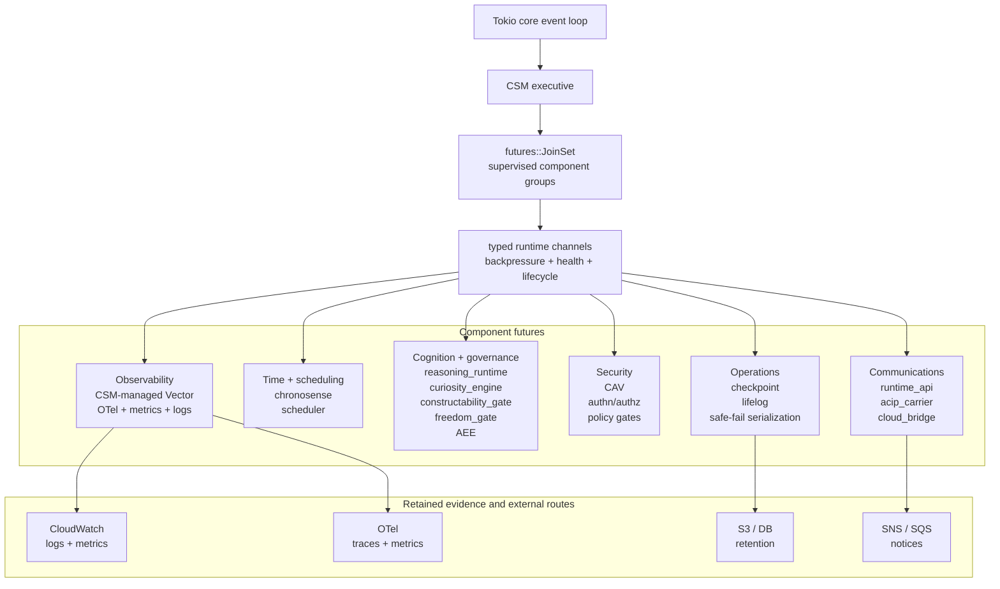

# CSM Runtime Rearchitecture Inventory for #5068

Issue: `#5068 [v0.91.7][WP-07][runtime] Rearchitect CSM runtime around proven Rust crates`

## Target Runtime Shape

CSM should look like a durable Vector-like Tokio component topology:

- one CSM-owned Tokio runtime for in-process services
- one CSM executive task
- supervised component sets for communications, time/scheduling, cognition/governance, security, operations/continuity, and observability
- CSM-managed runtime components for infrastructure-grade services such as the Vector observability pipeline
- explicit cancellation and governed stop, not hidden request/cycle budgets
- retained component health surfaced through `/status`, `/health`, `/ready`, `/metrics`, `/events`, `/chronosense`, and `/api-gateway-bridge`

This mirrors the proven component pipeline model used by Vector: a Tokio core event loop drives a main task, which coordinates component groups through typed channels. CSM should use that architecture for runtime internals, while keeping detailed runtime services inside reviewable thematic component sets rather than spreading every service across the top-level diagram. Vector should be a CSM-managed runtime observability component for high-volume pipeline mechanics.

## CSM Component Topology

Downloadable diagram artifacts:

- Mermaid source: `docs/milestones/v0.91.7/review/runtime/csm_runtime_topology_5068.mmd`
- Rendered SVG: `docs/milestones/v0.91.7/review/runtime/csm_runtime_topology_5068.svg`
- Rendered PNG: `docs/milestones/v0.91.7/review/runtime/csm_runtime_topology_5068.png`



| CSM component | Runtime role | Target mechanics |
| --- | --- | --- |
| `runtime_api` | local and bridged public polis API | Axum/Tower/Hyper service component on canonical port `19997` |
| `chronosense` | runtime clock and time-confidence service | in-process async rsntp sampler plus Chronosense status channel |
| `scheduler` | cadence, admission, and work readiness | supervised Tokio component with explicit health and backpressure |
| `reasoning_runtime` | native reasoning graph, loop, and adaptive DAG execution substrate | supervised component for governed reasoning objects before AEE execution |
| `curiosity_engine` | governed discovery-cycle substrate | supervised component that turns bounded curiosity prompts and context seeds into candidate hypotheses/proposals with retained evidence |
| `constructability_gate` | shared-reality admissibility boundary | supervised component that validates construction events, external anchors, and promotion from provisional/internal cognition to shared ADL reality |
| `freedom_gate` | commitment mediation, refusal, deferral, challenge, and escalation boundary before execution | supervised component that consumes candidate actions plus ACC/policy context and emits retained gate decisions before AEE |
| `aee` | governed execution stage | supervised component with resilience middleware and retained outcomes |
| `checkpoint` | partial snapshots and continuity artifacts | agent-owned schedule, request channel, atomic persistence, and backpressure |
| `acip_carrier` | governed ACIP/A2A runtime transport | runtime-owned JSON/protobuf/WebSocket carrier surface with explicit mode, authorization, projection, and failure behavior |
| `CAV` | continuous adversarial verification and security readiness | runtime component for red/blue probes, malformed-input checks, gate pressure, and readiness degradation |
| `cloud_bridge` | AWS API Gateway/EventBridge/CloudWatch/SNS/SQS integration | SDK-backed runtime/cloud component, not shell-driven scripts |
| `observability` | high-volume logs, metrics, OTel, redaction, routing | CSM-managed Vector component in the runtime topology |
| `lifelog` | lifecycle event journal | database-backed append-only component |

## Lessons From Vector Code

Vector code and docs show several design moves CSM should adopt by example:

- Topology is a first-class runtime object. Vector separates topology building, running, reloading, tasks, and controllers under `src/topology/`. CSM should grow an equivalent `csm_topology` layer instead of letting runtime orchestration accrete inside one large daemon module.
- Components have contracts. Vector's `docs/specs/component.md` defines naming, configuration, instrumentation, health checks, finalization, and acknowledgements. CSM needs a runtime component spec for API, Chronosense, scheduler, AEE, checkpoint, cloud bridge, observability, and lifelog components.
- Channels are the data plane. Vector topology nodes communicate through channels and buffers. CSM should replace ad hoc file polling between live runtime components with typed channels, then serialize retained evidence at component boundaries.
- Backpressure is explicit. Vector's buffering model treats memory buffers, disk buffers, blocking, dropping, and overflow as configured behavior. CSM should do the same for agent work queues, checkpoint pressure, observability output, and cloud notification paths.
- Shutdown is coordinated. Vector uses shutdown signals, completion tokens, force signals, and deadlines. CSM should use governed stop signals and component completion acknowledgements rather than hidden loop budgets or unmanaged exits.
- Health checks are part of component startup. Vector builds healthchecks into topology pieces. CSM components should expose health and readiness probes that feed `/health`, `/ready`, `/metrics`, and retained lifecycle events.
- Delivery and finalization are distinct. Vector sinks defer finalization until after delivery. CSM should apply the same principle to checkpoint persistence, cloud notices, EventBridge/SNS/SQS delivery, and lifecycle ledger writes.
- Component telemetry is standardized. Vector components emit received, sent, dropped, error, and byte-count events. CSM should standardize component events for every runtime component and route them through its managed Vector observability component.
- Reasoning objects need a native runtime home. Reasoning graphs, loop runtime work, and adaptive learning DAGs should not float above CSM as external orchestration; they should be supervised runtime components that communicate through typed channels and feed AEE as governed execution.

## Enforceable Rearchitecture Gates

The architecture is not considered real until these gates pass:

| Gate | Proof |
| --- | --- |
| Runtime crate separation | `adl-runtime` builds and passes focused tests when `adl-compiler` and `adl-csdlc` crates are absent from disk. Runtime dependencies may point outward only to shared protocol/schema crates, not back into compiler or C-SDLC tooling. |
| Component supervision matrix | Every runtime component records restart policy, backoff, degradation behavior, and escalation target. `JoinSet` observes component completion; policy decides what happens next. |
| Channel backpressure matrix | Every typed channel declares bounded capacity, block/drop/spool behavior, loss policy, and health signal. One global "backpressure" label is insufficient. |
| Determinism boundary | Deterministic core inputs are separated from nondeterministic shell components such as Chronosense, AWS, network, and wall-clock IO. Any shell value entering governed execution is captured as evidence. |
| Runtime API authorization | Loopback-only is treated as transport restriction, not authorization. `runtime_api` needs local auth such as a bearer token in a `0600` file before it is treated as safe on shared hosts. |
| Cloud bridge fail-closed | AWS/EventBridge/API Gateway publishability is checked before sequence reservation advances. Unreachable cloud routes degrade visibly and do not create false progress cursors. |
| Shutdown DAG | Governed shutdown quiesces admission, flushes checkpoints, closes lifelog, drains observability, sends final notices, and only then terminates component tasks. |
| Assembled-runtime soak | A loopback assembled CSM runtime runs with typed channels, mockable cloud bridge, retained evidence, and component restart/degrade observations before the architecture is called complete. |

## Cargo Crate Boundary Target

The runtime simplification must become a Cargo-level boundary, not only a module diagram:

```text
adl-protocol        shared schemas, ADL/CSDLC-neutral runtime contracts
adl-runtime         CSM kernel, runtime API, topology, channels, supervision
adl-compiler        ADL language compiler, DAG/package/authoring tools
adl-csdlc           issue execution, validation, review, release tooling
```

Allowed dependency direction:

```text
adl-runtime  -> adl-protocol
adl-compiler -> adl-protocol
adl-csdlc    -> adl-protocol, adl-compiler, runtime client APIs
```

Forbidden dependency direction:

```text
adl-runtime -> adl-compiler
adl-runtime -> adl-csdlc
```

Acceptance test: delete or temporarily hide compiler and C-SDLC crates, then build and test `adl-runtime`. If the runtime still compiles and its focused tests pass, the separation is real.

## Supervision Policy Matrix

| Component | Default policy | Escalation |
| --- | --- | --- |
| `runtime_api` | restart with bounded exponential backoff; fail readiness while unavailable | governed runtime degraded state if repeated bind/auth failure |
| `chronosense` | degrade-and-continue with stale-time confidence; keep deterministic core isolated | block readiness if time confidence is below configured floor |
| `scheduler` | restart with backoff; quiesce admission during outage | governed stop path if admission state cannot be recovered |
| `reasoning_runtime` | restart failed graph/loop workers independently; preserve graph input evidence | quarantine offending graph and surface recoverable agent state |
| `aee` | restart governed execution workers with retained outcomes | stop new execution if recovery middleware cannot load |
| `checkpoint` | block admission or throttle execution rather than silently losing continuity | emergency safe-fail serialization if checkpoint persistence remains unavailable |
| `cloud_bridge` | degrade-and-buffer when AWS is unreachable; do not advance publish cursors falsely | fail-closed cloud status and retained notice evidence |
| `lifelog` | block lifecycle completion when append fails; keep local queue durable | degrade runtime readiness if lifecycle journal cannot persist |
| `observability` | buffer or shed low-priority telemetry; never stall core execution on best-effort metrics | escalate if evidence/audit events cannot be retained locally |

## Channel Backpressure Matrix

| Channel | Policy |
| --- | --- |
| scheduler -> reasoning_runtime | bounded queue; block admission when full |
| reasoning_runtime -> AEE | bounded queue; block, do not drop governed execution requests |
| AEE -> checkpoint | bounded queue; block/throttle because continuity is higher priority than throughput |
| components -> lifelog | durable append queue; block lifecycle completion on critical event persistence failure |
| components -> observability | priority queue; retain audit/evidence events, shed low-priority metrics before blocking core execution |
| cloud_bridge -> external AWS routes | durable local spool; publish cursor advances only after transport is known publishable |
| runtime_api -> control plane | auth-gated bounded requests; backpressure returns explicit readiness/overload status |

## Determinism Boundary

CSM should state its determinism claim as deterministic core plus nondeterministic shell:

- Deterministic core: typed reasoning inputs, DAG/loop graph state, scheduler admission decisions after inputs are captured, AEE governed execution decisions, checkpoint version transitions, and lifelog ordering.
- Nondeterministic shell: Chronosense/NTP, AWS/API Gateway/EventBridge/CloudWatch/SNS/SQS, network IO, wall-clock timing, local process state, and external observability sinks.
- Boundary rule: every nondeterministic shell value that influences the deterministic core must be captured as an input event with source, observed time, confidence, and retention location before it affects execution.

## Shutdown DAG

Graceful CSM shutdown is ordered:

1. Quiesce `runtime_api` mutating admission and scheduler intake.
2. Drain scheduler queues into recoverable states.
3. Flush `reasoning_runtime` in-flight graph/loop state to checkpoint requests.
4. Complete AEE outcomes or classify them as recoverable partials.
5. Flush checkpoint and safe-fail serialization artifacts.
6. Append lifelog lifecycle close events.
7. Drain evidence/observability events through the CSM-managed Vector component or local spool.
8. Send cloud notices through EventBridge/SNS/SQS/API Gateway routes when publishable.
9. Join component tasks and emit final retained shutdown disposition.

## Vector Reference Evidence

Live reference: `https://vector.dev/docs/architecture/runtime-model/`

Local reference checkout: `/Users/daniel/git/vector`.

Vector's architecture is a useful CSM reference because it already documents and implements the runtime shape we need:

- `website/content/en/docs/architecture/runtime-model.md` describes a futures-based async runtime where DAG nodes map to async tasks scheduled by Tokio.
- `website/content/en/docs/introduction/concepts.md` defines components as sources, transforms, and sinks composed into topologies.
- `website/content/en/docs/architecture/buffering-model.md` treats backpressure and memory/disk buffers as first-class topology behavior.
- `lib/vector-common/src/shutdown.rs` shows component shutdown coordination through tripwires and explicit completion signals.
- `src/sources/opentelemetry`, `src/sinks/opentelemetry`, `src/sinks/aws_cloudwatch_logs`, and `src/sinks/aws_cloudwatch_metrics` prove that Vector can be the CSM observability pipeline substrate for OTel and AWS routing.

License note: Vector is MPL-2.0. #5068 uses Vector as an architecture/product reference and CSM-managed runtime component target. It does not copy Vector source into ADL.

## Crate And Product Replacement Map

| Runtime area | Current simplification decision | Replacement |
| --- | --- | --- |
| Embedded runtime API | Replace manual `TcpListener` accept loop, request-line parsing, and raw HTTP response writing. | `axum` on `tokio`, with `tower` service layering and `hyper` HTTP engine. |
| Runtime resource pooling | Keep the existing crate-backed pool and expose it as runtime proof. | `deadpool::unmanaged` for bounded runtime connection/resource slots. |
| Port ownership | Keep canonical CSM registry and fixed port policy. | `csm_networking` owns `19950-19999`, with main runtime API on `127.0.0.1:19997`. |
| Chronosense time sync | Use in-process async SNTP sampling; no shelling out and no missing observation socket as a runtime blocker. | `rsntp::AsyncSntpClient`. |
| Observability pipeline | CSM emits canonical lifecycle/runtime events and OTel-shaped summaries into a managed runtime component; it must not become a bespoke log router. | CSM-managed Vector component for collect, transform, redact, buffer, and route logs/metrics/OTel to CloudWatch, S3, SNS, SQS, and other sinks. |
| AWS notifications and routing | Runtime-owned integrations should use SDK-backed clients or generated/configured product routes, not command shells. | AWS SDK for direct runtime calls; EventBridge/CloudWatch/SNS/SQS as managed control-plane targets; Vector for observability fanout. |
| Checkpoint and continuity serialization | Keep typed CSM artifacts, then move from scattered JSON writes to durable typed storage and atomic persistence primitives. | `serde`, versioned schemas, atomic write helper, future protobuf/canonical archive lane. |
| Lifecycle lifelog | Move from loose JSONL files toward an append-only database-backed lifecycle ledger. | SQLite/libSQL or equivalent embedded durable DB, with later immutable-ledger migration. |
| Supervision | Replace bespoke nested loops and sleep-driven daemon behavior with supervised async component tasks. | Tokio tasks, cancellation tokens, join sets, watch/broadcast channels, and explicit component health records. |
| Backpressure and disk survival | Keep low-disk backpressure states, then wire storage pressure into component admission and Vector buffering policy. | Existing CSM backpressure model plus crate/product-backed disk and queue controls. |

## Work Completed In This Slice

- Added direct runtime API stack dependencies: `axum`, `tower`, and `hyper`.
- Replaced the embedded CSM runtime API server path with an Axum server on the existing validated listener.
- Removed the manual runtime API request parser, raw TCP stream handler, and raw HTTP response writer from the server path.
- Preserved existing endpoint body builders for `/status`, `/health`, `/ready`, `/metrics`, `/events`, `/chronosense`, and `/api-gateway-bridge`.
- Preserved loopback-only CORS policy and bounded test shutdown hooks without making them public runtime stop budgets.
- Added `/status.runtime_stack` so the running CSM reports the crate-backed API, Deadpool pooling, rsntp time sync, and CSM-managed Vector observability-pipeline decision.
- Captured the Vector-inspired target architecture: CSM components become async topology nodes connected by channels, with explicit backpressure, buffering, and shutdown semantics.

## Remaining Simplification Work

These are not optional cleanup items; they are the next simplification targets after the API/pooling proof lands.

- Convert CSM supervision into a single Tokio service graph with supervised component futures.
- Replace AWS CLI shellouts in cloud-control and API Gateway proof paths with AWS SDK clients where runtime code needs direct AWS behavior.
- Add a CSM-managed Vector configuration/proof path for CSM lifecycle events, OTel-shaped summaries, CloudWatch logs/metrics, S3 retention, SNS/SQS notice routing, and redaction transforms.
- Replace ad hoc inter-component file polling with explicit channels, component IDs, and topology edges where runtime components are live in-process services.
- Model backpressure using component queues and admission decisions, borrowing Vector's vocabulary of memory buffers, disk buffers, blocking, and shedding while preserving CSM continuity guarantees.
- Add CSM shutdown coordination with component-level begin/complete/force signals; governed stop remains exceptional and observable.
- Move lifecycle/lifelog capture into a database-backed append-only runtime ledger.
- Replace scattered direct JSON writes for critical runtime state with shared atomic persistence and schema-version helpers.
- Turn checkpoint scheduling into an agent-owned component service with bounded self-trigger policy, backpressure, and retention guarantees.
- Make EventBridge routing a first-class runtime/cloud object rather than a prose-only integration note.
- Keep CSM runtime code free of host-specific process managers; CSM owns its supervision model.

## Non-Claims

- This packet does not claim Vector source is copied into ADL or embedded inside the `csm` binary; it does claim Vector belongs in the CSM-managed runtime topology.
- This packet does not claim every AWS command shell has already been replaced with SDK calls.
- This packet does not claim lifecycle storage has already moved to a database.
- This packet does not claim the full Tokio service graph migration is complete.
