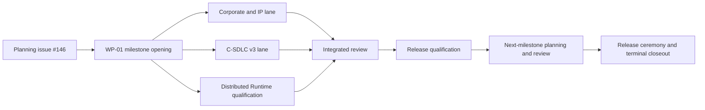

# v0.92.1 Design

## Parallel Program Structure

The milestone uses three independent execution lanes and one integration tail.

## Milestone Opening

Issue `#146` defines planning truth only. WP-01 creates the future live issues,
cards, exact mapping, readiness evidence, and start gate. No execution lane may
bind directly from this planning PR.

## Lane A

Lane A freezes a critical-asset schedule, obtains counsel-reviewed assignment and corporate acceptance evidence, audits provenance and licensing, establishes company account custody, migrates infrastructure, and produces a redacted due-diligence index. Private agreements and secrets remain outside the repository.

## Lane B

Lane B implements the reviewed C-SDLC v3 Rust architecture without changing its accepted contract. Its hard gates include the construction spike, all eleven operator decisions, Decision 11 before V3-08, deterministic state and recovery, exact review, remote idempotency, parity, canary operation, and single-writer cutover. V3-R01 remains deferred beyond the rollback window.

## Lane C

Lane C consumes terminal `#142` and WP-04.16 production proof. It qualifies exactly three voters in one polis, three governed agents, one non-voting shepherd, and exactly one quorum-leased Observatory. It runs serial Wuji-only and Wuji-plus-private-AWS windows, then validates quorum, fencing, snapshots, restart, partition, replay, security, observability, resources, soak, and cleanup.

## Integration

Integrated review checks source ancestry, terminal issue evidence, unresolved
findings, residual risks, and release claims. It cannot substitute one lane's
evidence for another. The tail then performs release qualification, next-
milestone planning, independent handoff review, operator-authorized ceremony,
and terminal issue/umbrella/milestone closeout as separate gates.
