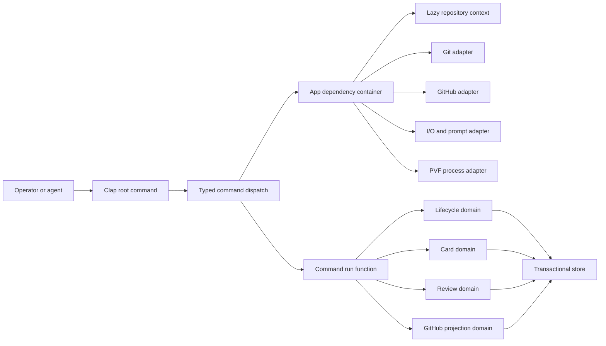
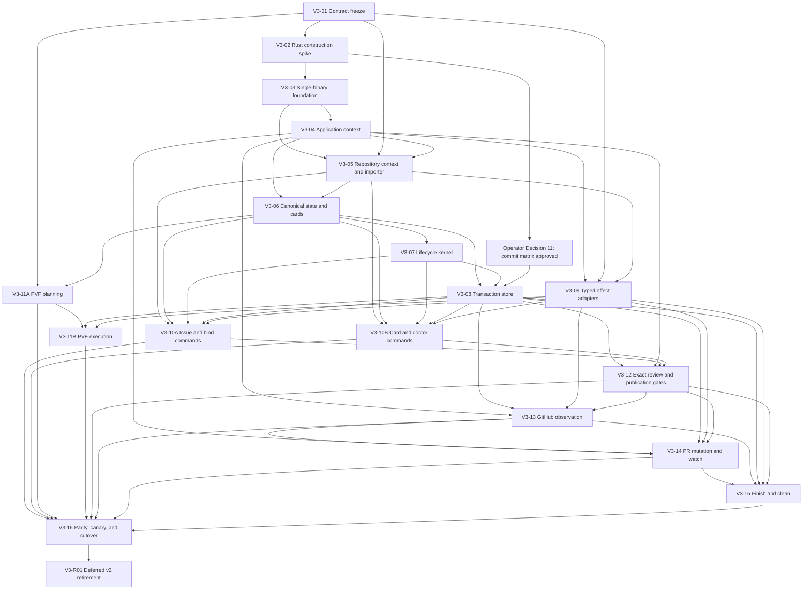

# C-SDLC v3: gh-Inspired Rust Architecture

Status: Issue #73 planning draft for independent architecture review

Decision boundary: This document proposes a Rust implementation of C-SDLC v3.
It does not authorize implementation, change the current v2 selector, migrate
records, create issues, or retire C-SDLC v2.

Comparative source:
the reviewed C-SDLC v3 architecture baseline retained in this source document
defines the equivalent Go architecture considered before the operator selected
Rust on 2026-08-08. Rust is now fixed for C-SDLC v3. The Go document remains a
control for identifying language-independent simplifications; it is not an
active implementation alternative.

## Executive Decision

C-SDLC v3 can retain Rust while adopting the operator architecture of the
official GitHub CLI. It should ship one executable named `csdlc`, with one
discoverable command tree and one shared application context:

```text
src/main.rs
  -> csdlc_v3::run()
  -> cli::Root::parse()
  -> App::production()
  -> commands::<noun>::<verb>::run(app, args)
  -> domain service
  -> typed result renderer
```

The important lesson from `gh` is not that C-SDLC must be written in Go. The
lesson is that a large command-line product can remain understandable when it
has:

- one executable and one command graph;
- command-local argument and option types;
- one dependency factory or application context;
- lazy resolution of repository and network context;
- a strict split between argument parsing and command execution;
- mockable I/O, Git, GitHub, clock, filesystem, and process boundaries;
- consistent errors, exit codes, and output formatting;
- generated documentation from the actual command tree.

Rust can express that shape with Clap, Serde, explicit traits, and one Tokio
runtime while preserving the strong enums, schemas, and fail-closed state
transitions already proven by C-SDLC v2.

## Source Baseline

### Official GitHub CLI

The external architecture model is the official `cli/cli` repository:

```text
repository: https://github.com/cli/cli
revision:   9fc0f70e0ef97446de9166febce546e955675bc3
date:       2026-08-07
```

The most relevant source surfaces are:

| Source | Rust translation |
| --- | --- |
| [`cmd/gh/main.go`](https://github.com/cli/cli/blob/9fc0f70e0ef97446de9166febce546e955675bc3/cmd/gh/main.go) | Keep `main.rs` trivial and return one typed exit code. |
| [`internal/ghcmd/cmd.go`](https://github.com/cli/cli/blob/9fc0f70e0ef97446de9166febce546e955675bc3/internal/ghcmd/cmd.go) | Centralize runtime setup, root execution, diagnostics, and exit mapping. |
| [`pkg/cmd/root/root.go`](https://github.com/cli/cli/blob/9fc0f70e0ef97446de9166febce546e955675bc3/pkg/cmd/root/root.go) | Define one root command and shared policy. |
| [`pkg/cmdutil/factory.go`](https://github.com/cli/cli/blob/9fc0f70e0ef97446de9166febce546e955675bc3/pkg/cmdutil/factory.go) | Use one `App` container with explicit capabilities. |
| [`pkg/cmd/factory/default.go`](https://github.com/cli/cli/blob/9fc0f70e0ef97446de9166febce546e955675bc3/pkg/cmd/factory/default.go) | Construct real adapters once and resolve expensive context lazily. |
| [`pkg/cmd/issue/list/list.go`](https://github.com/cli/cli/blob/9fc0f70e0ef97446de9166febce546e955675bc3/pkg/cmd/issue/list/list.go) | Separate Clap argument types from command run functions. |
| [`pkg/iostreams/iostreams.go`](https://github.com/cli/cli/blob/9fc0f70e0ef97446de9166febce546e955675bc3/pkg/iostreams/iostreams.go) | Inject streams, TTY posture, color, and prompting. |
| [`pkg/cmdutil/errors.go`](https://github.com/cli/cli/blob/9fc0f70e0ef97446de9166febce546e955675bc3/pkg/cmdutil/errors.go) | Map typed domain outcomes to stable exit behavior. |
| [`pkg/httpmock/registry.go`](https://github.com/cli/cli/blob/9fc0f70e0ef97446de9166febce546e955675bc3/pkg/httpmock/registry.go) | Reject unexpected HTTP and unconsumed expectations in tests. |
| [`cmd/gen-docs/main.go`](https://github.com/cli/cli/blob/9fc0f70e0ef97446de9166febce546e955675bc3/cmd/gen-docs/main.go) | Generate reference documentation from Clap's command graph. |

The upstream source is an MIT-licensed design reference. V3 should not vendor or
copy `gh` command implementations. C-SDLC domain code remains independently
authored.

The repository-relative retained manifest at
`.csdlc/evidence/73/official-cli-source-baseline.json` records the pinned
revision and Git object identity for every cited path. Validation consumes that
declared input and does not depend on an operator-specific checkout location.
Its `adl.external_source_baseline.v1` schema is pinned at
`csdlc-v3/contracts/external-source-baseline.v1.schema.json` and contains
`repository`, `default_branch`, `revision`, the typed `capture_command`, and one
`{path, kind, oid}` row per cited blob.
Portable verification runs the declared `git ls-tree <revision> --
<declared-paths>` operation in any clone of the named repository and requires
exact equality with every 40-hex SHA-1 manifest object ID; no absolute checkout
path or host-local digest is part of the contract. A verifier that lacks the
commit fetches the manifest-declared default branch with
`git fetch --filter=blob:none --no-tags origin <default-branch>`, deepening that
named ref until the revision is present. It then requires the revision to be an
ancestor of the fetched ref before reading its tree. It never relies on a
server accepting an arbitrary SHA want; an unreachable revision fails as a
stale baseline requiring reviewed manifest refresh.
The portable CI entrypoint is
`cargo test -p csdlc-v3 external_source_baseline --locked`; its fixture
distinguishes network/fetch failure, revision-not-reachable, missing object,
path/OID mismatch, and schema failure rather than collapsing them into stale.
After `ls-tree` path/OID equality, it runs `git cat-file -e <oid>` for every
promised blob so a partial-clone omission is distinct from a path absent from
the pinned tree.

### Current C-SDLC v2

The ADL comparison baseline is canonical `main` at:

```text
revision: f1c01499cb377336d808059af017d63d6b9849bd
```

At that revision, `csdlc-v2` has 21 Rust binary entry points, 11 operator
skills, 48 Rust source files, approximately 22,258 source lines, and 8,872 test
lines. V2 established the behavioral and safety baseline. V3 should simplify
the operator surface and internal composition without pretending those safety
properties are unnecessary.

Canonical issue `agent-logic/agent-design-language#75` records one known v2
contract defect that V3 must not preserve: publication cannot currently express
a truthful non-closing checkpoint PR. V3 treats that issue as product-contract
input, not as authorization to implement or modify v2 in this planning issue.

## Recorded Language Decision

The Go and Rust alternatives share these decisions:

- one `csdlc` executable;
- one public command tree;
- one thin operator skill;
- direct flags for normal use and `--input` for typed automation;
- one canonical issue state aggregate;
- six generated Markdown cards;
- branch/worktree topology as issue ownership authority;
- exact-revision review before publication;
- explicit foreground PR watching;
- separate finish and cleanup commands;
- restricted non-authoritative extensions;
- read-only v2 import and no dual writes.

The operator selected Rust so v3 can retain exhaustive enums, schema-derived
typed contracts, and continuity with proven v2 domain concepts without carrying
over v2's entry-point structure. The construction spike remains required, but
it validates Rust boundaries, dependencies, compile profile, binary size,
startup behavior, test ergonomics, and implementation-size targets rather than
selecting a language.

## Goals

1. Preserve Rust's closed enums, exhaustive matching, and schema-derived
   request and result contracts.
2. Replace 21 installed executables with one `csdlc` executable.
3. Replace binary-routing skills with one operator skill.
4. Make the complete workflow discoverable from `csdlc --help`.
5. Remove routine request-file ceremony without removing typed requests.
6. Keep local commands fast and independent of network initialization.
7. Keep command modules thin and domain behavior testable without Clap.
8. Preserve exact state, card, evidence, Git, and GitHub safety boundaries.
9. Avoid depending on ADL runtime or product crates.
10. Support deterministic Linux, macOS, and Windows builds.

## Non-Goals

- Preserving v2's many-binary layout.
- Reusing v2 entry-point code unchanged.
- Embedding product-specific test commands in the binary.
- Allowing direct Markdown or JSON state edits.
- Using macros to hide lifecycle transitions or side effects.
- Adding a daemon, resident watcher, or background update checker.
- Supporting authority-bearing plugins or shell aliases.
- Making async execution mandatory for purely local domain logic.
- Switching authority before independent parity proof.

## Core Architecture



The architecture has four layers:

1. `cli`: Clap types and root dispatch.
2. `commands`: command-specific orchestration and presentation selection.
3. `domain`: lifecycle rules and pure typed transformations.
4. `adapters`: filesystem, Git, GitHub, clock, process, and terminal effects.

Dependencies point inward. Domain modules cannot import Clap, Reqwest,
Octocrab, Tokio process types, or terminal formatting.

## Proposed Crate Layout

```text
csdlc-v3/
  Cargo.toml
  Cargo.lock
  src/
    main.rs
    lib.rs
    app.rs
    cli/
      mod.rs
      root.rs
      output.rs
    commands/
      mod.rs
      issue/
        mod.rs
        init.rs
        show.rs
        status.rs
      card/
        mod.rs
        show.rs
        edit.rs
        render.rs
      doctor.rs
      bind.rs
      validate/
        mod.rs
        plan.rs
        run.rs
        status.rs
      review/
        mod.rs
        assign.rs
        record.rs
        recover.rs
        status.rs
      pr/
        mod.rs
        publish.rs
        status.rs
        watch.rs
      finish.rs
      clean.rs
      schema.rs
      completion.rs
      version.rs
    domain/
      mod.rs
      lifecycle.rs
      issue.rs
      cards.rs
      evidence.rs
      pvf.rs
      review.rs
      publication.rs
      terminal.rs
      projection.rs
    store/
      mod.rs
      transaction.rs
      recovery.rs
    adapters/
      mod.rs
      fs.rs
      git.rs
      github.rs
      http.rs
      process.rs
      clock.rs
      prompt.rs
    error.rs
  tests/
    cli.rs
    lifecycle.rs
    transactions.rs
    github.rs
    journeys.rs
    fixtures/
  benches/
    doctor.rs
```

There is one Cargo package with immutable `[package] name = "csdlc-v3"`, one
`[[bin]]` target with immutable `name = "csdlc"`, and one library target. A
future workspace may contain the package but cannot rename either identity
without a versioned contract/CI change.
Integration tests call the library directly or use `assert_cmd` against the one
executable.

## Root Command Model

The public command tree is identical to the Go proposal:

```text
csdlc
  issue
    init
    show
    status
  card
    show
    edit
    render
  doctor
  bind
  validate
    plan
    run
    status
  review
    assign
    record
    recover
    status
  pr
    publish
    status
    watch
  finish
  clean
  schema
  completion
  version
```

Clap derives the static command graph:

```rust
#[derive(Debug, clap::Parser)]
#[command(name = "csdlc", version, disable_help_subcommand = true)]
pub struct Root {
    #[command(subcommand)]
    pub command: Command,

    #[arg(long, global = true)]
    pub repo: Option<String>,

    #[arg(long, global = true)]
    pub issue: Option<u64>,

    #[arg(long, global = true)]
    pub json: bool,

    #[arg(long, global = true, requires = "json", conflicts_with = "template")]
    pub jq: Option<String>,

    #[arg(long, global = true, requires = "json", conflicts_with = "jq")]
    pub template: Option<String>,
}

#[derive(Debug, clap::Subcommand)]
pub enum Command {
    Issue(issue::Args),
    Card(card::Args),
    Doctor(doctor::Args),
    Bind(bind::Args),
    Validate(validate::Args),
    Review(review::Args),
    Pr(pr::Args),
    Finish(finish::Args),
    Clean(clean::Args),
    Schema(schema::Args),
    Completion(completion::Args),
    Version,
}
```

The root parser defines syntax only. It does not open the repository, read
credentials, initialize Tokio tasks, or contact GitHub.

## Dispatch And Run Functions

The Rust equivalent of `gh`'s constructor/run pattern is a typed argument type
plus a separately callable run function:

```rust
#[derive(Debug, clap::Args, serde::Deserialize, schemars::JsonSchema)]
pub struct StatusArgs {
    #[arg(long)]
    pub remote: bool,
}

pub async fn run(app: &App, args: StatusArgs) -> Result<StatusResult> {
    let issue = app.issue_context().await?;
    let local = app.store().load(issue.number)?;
    let remote = if args.remote {
        Some(app.github().await?.observe_issue(&issue).await?)
    } else {
        None
    };
    Ok(StatusResult::from_observations(local, remote)?)
}
```

Tests construct `StatusArgs` directly and call `run`. Separate parser tests use
`Root::try_parse_from` to prove flags, defaults, conflicts, and help. Domain
tests never construct Clap commands.

## Application Context

`App` is the Rust translation of the `gh` factory:

```rust
type SyncInit<T> = std::sync::OnceLock<Result<T, Arc<AppError>>>;
type AsyncInitializer<T: ?Sized> = dyn Fn() -> std::pin::Pin<Box<
    dyn std::future::Future<Output = Result<Arc<T>, Arc<AppError>>> + Send
>> + Send + Sync;

struct AsyncInit<T: ?Sized> {
    state: std::sync::Mutex<AsyncInitState<T>>,
    notify: Arc<tokio::sync::Notify>,
    clock: Arc<dyn Clock>,
    root_cancel: tokio_util::sync::CancellationToken,
    initializer: Arc<AsyncInitializer<T>>,
}

pub struct App {
    pub io: Arc<dyn Io>,
    pub clock: Arc<dyn Clock>,
    pub fs: Arc<dyn FileSystem>,
    pub git: Arc<dyn Git>,
    pub process: Arc<dyn ProcessRunner>,
    pub prompt: Arc<dyn Prompter>,

    config: SyncInit<Arc<Config>>,
    repository: AsyncInit<RepositoryContext>,
    issue: AsyncInit<IssueContext>,
    github: AsyncInit<dyn GitHub>,
}
```

`AsyncInitializer<T>` is the object-safe boxed future factory returning
`Result<Arc<T>, Arc<AppError>>`; `AsyncInit<T>` itself supplies the one `Arc`
layer to every success accessor, including trait objects.

Production construction wires real adapters. Test construction injects fakes.
Lazy accessors initialize fallible or expensive dependencies only when a command
asks for them.

Narrow adapter traits that perform asynchronous I/O use `async-trait` so they
remain object-safe behind `Arc<dyn Trait>`. Domain traits remain synchronous
wherever possible. This choice is confined to adapter boundaries; async is not
allowed to spread through the lifecycle kernel merely for interface uniformity.

`App` is not mutable global state. One instance belongs to one invocation. A
command receives `&App` and cannot replace dependencies. Domain functions
receive narrow trait references or plain values, not the whole application
container.

| Field | Cell | Initialization boundary |
| --- | --- | --- |
| `config` | `SyncInit` | Repository/user configuration reads and parsing |
| `repository` | `AsyncInit` | Local Git subprocess and filesystem observation without blocking the runtime |
| `issue` | `AsyncInit` | Derivation from the asynchronously resolved repository and arguments |
| `github` | `AsyncInit` | Credential resolution and hosted client initialization |

`SyncInit<T>` is exactly `OnceLock<Result<T, Arc<AppError>>>` for owned
`T: Send + Sync + 'static`. Its accessor
calls `get_or_init` with a closure whose complete cell value is
`Result<T, Arc<AppError>>`, then pattern-matches the stored result to return
`Result<&T, Arc<AppError>>`, cloning only the error `Arc`. It is lazy, never
pre-warmed by `App` construction, and contains no `unwrap` or `expect` path.
`get_or_try_init` is not used because its failed initializer is retryable;
`SyncInit` intentionally caches a terminal typed error for the invocation.
The initial Cargo `rust-version`/MSRV floor is `1.80`; V3-01 pins the exact
stable toolchain at or above that floor whose `OnceLock::get_or_init` contract
blocks concurrent callers until the one initializer completes. The contract
requires blocking rather than `None` or spin-visible behavior, and concurrent
success/error tests run on every supported target.

`AsyncInit<T>` returns `Arc<T>` and owns a short-held
`std::sync::Mutex<AsyncInitState<T>>` plus an `Arc<tokio::sync::Notify>`.
`AsyncInitState` is a closed enum of `Uninitialized`, `Initializing`,
`Ready(Result<Arc<T>, Arc<AppError>>)`, and `Cancelled(Arc<AppError>)`, with
attempt count, generation, and cooldown deadline carried in the first two
states. No mutex guard crosses an
`.await`. The first accessor atomically changes `Uninitialized` to
`Initializing`, drops the guard, and owns the initializer future. Other
accessors observe `Initializing`, drop the guard, await the notification, and
loop. The leader commits `Ready` and notifies all waiters. A synchronous RAII
leader guard uses the same injected monotonic clock to restore
`Uninitialized` with the cooldown deadline and notify waiters if the leader
future is dropped. A later accessor may make the one invocation-local retry
only after the fixed 250 millisecond cooldown; root cancellation prevents any
retry. There is no spawned or detached initialization task. Concurrent-access,
completed-error, cancelled-init, retry-cooldown, and single-flight behavior are
contract tests. Remote GitHub observation never belongs in `repository` or
`issue` initialization; commands request it explicitly from `github`.
`App::test()` creates fresh cells per test and may pre-populate explicit
success or error values; one injected terminal error cannot poison a later
assertion through a reused application instance.

The accessor signature is exactly
`async fn get(&self) -> Result<Arc<T>, Arc<AppError>>`; `Ready(Ok)` stores the
one `Arc<T>` and every caller receives an `Arc::clone`. `attempts_started`
begins at zero and increments atomically when a caller becomes leader, before
the initializer is first polled. Attempt 1 is the initial attempt and attempt 2
is the sole retry. During cooldown, every accessor performs an injected-clock
`sleep_until(retry_after)` selected against root cancellation, then races to
lock state; exactly one observes eligibility and becomes the attempt-2 leader,
while the rest observe `Initializing` and await `Notify`.

The transition table is normative:

| State and event | Next state | Caller result |
| --- | --- | --- |
| `Uninitialized`, root live, `attempts_started < 2`, deadline met | `Initializing`, increment attempts | caller becomes leader |
| `Uninitialized`, cooldown active | unchanged | cancellation-aware wait until deadline |
| `Initializing`, another accessor | unchanged | wait on `Notify`, then re-read state |
| `Initializing`, leader success | `Ready(Ok)` | cached success; notify all |
| `Initializing`, terminal error | `Ready(Err)` | cached error; notify all |
| `Initializing`, localized cancellation/drop during attempt 1 | `Uninitialized` with `attempts_started = 1` and deadline | typed retryable result; notify all |
| `Initializing`, localized cancellation/drop during attempt 2 | `Ready(Err(RetryExhausted))` | terminal error; notify all |
| Any non-ready state, root cancellation | `Cancelled(Interrupted)` | exit 130; notify all; never retry |
| `Ready` or `Cancelled`, any accessor | unchanged | clone cached result |

The RAII guard distinguishes root cancellation from localized leader loss using
the shared root token at drop. A waiter cancelled while another leader remains
returns interrupted without mutating leader state; root-token cancellation
moves the shared state to `Cancelled`. All state/event pairs are exhaustively
tested with an injected monotonic clock.

## Async Boundary

The executable creates one Tokio runtime because GitHub calls, bounded watches,
and concurrent PVF lanes are asynchronous. The root run function is async:

```rust
#[tokio::main(flavor = "multi_thread")]
async fn main() -> std::process::ExitCode {
    csdlc_v3::run(std::env::args_os()).await.into()
}
```

Pure lifecycle, card, state, schema, and planning functions remain synchronous.
They do not accept a Tokio handle and can run in ordinary unit tests. Blocking
Git and filesystem operations use narrow adapters and move to `spawn_blocking`
only when their duration warrants it.

No task is detached. Every spawned task belongs to an invocation-scoped
`JoinSet` or cancellation token and is joined or cancelled before exit.
The root invocation installs explicit `SIGINT` and `SIGTERM` handling where the
platform supports them and maps console interruption to the same cancellation
token. PVF children, foreground watches, and blocking adapter work must observe
that token, terminate boundedly, and join before the process returns.

`tokio_util::sync::CancellationToken` is created once at invocation start and
cloned only into structured child scopes. On interruption, root cancels the
token, requests termination of every registered OS child, continues polling all
network and sleep operations through `tokio::select!`, drains bounded output,
and awaits every `JoinSet` entry before returning 130. Dropping a `JoinSet` is
not accepted as join proof. Unix children receive `SIGTERM` followed by bounded
kill escalation; Windows children use the reviewed job/process termination
primitive and are awaited before exit.

## Repository And Issue Context

Context resolution is deterministic:

1. Explicit `--repo`, `--issue`, or command argument.
2. Bound v3 state in the current worktree.
3. Current branch naming contract.
4. Effective Git remote and repository configuration.
5. Live GitHub observation only when required.

Conflicting identities return `ErrorCode::ContextConflict`. Rust types retain
both issue repository and code repository. Interactive prompting can select
among already validated candidates but cannot change the precedence rules or
silently produce a different answer than `--no-prompt` mode.

The resolved value is independent of Git implementation details:

```rust
pub struct RepositoryContext {
    pub root: PathBuf,
    pub git_common_dir: PathBuf,
    pub branch: String,
    pub worktree: PathBuf,
    pub code_repository: RepositoryId,
    pub issue_repository: RepositoryId,
    pub issue_number: Option<u64>,
    pub remote_name: String,
}
```

## Canonical State And Cards

The persisted layout matches the Go proposal:

```text
.csdlc/v3/issues/<issue>/
  state.json
  audit.jsonl          generated audit projection
  cards/
    sip.md
    stp.md
    spp.md
    vpp.md
    srp.md
    sor.md
  evidence/
  intents/
```

`state.json` is the sole lifecycle and card-state authority. It contains
identity, lifecycle, typed values for all cards, branch/worktree binding, design
and diagram references, validation, exact review, publication linkage mode and
target, terminal state, audit events, and digests.

Intent files are authoritative operation journals only for pending external
effects. They carry the expected state generation/digest, operation key,
request digest, and recovery posture, but no independent lifecycle phase or card
values. A committed unresolved intent takes precedence over a new mutation by
blocking it until exact remote readback reconciles or explicitly disposes that
intent into `state.json`. Once reconciliation commits, state records the
outcome and the consumed intent is removable. An intent can prove that an
effect may have occurred; it can never advance lifecycle truth by itself.

Serde enums define every closed vocabulary. `#[serde(deny_unknown_fields)]` is
used on authoritative request, state, intent, evidence, and result types.
Schemars derives versioned public schemas from those same types.

Typed audit events are embedded in `state.json` as part of the canonical
aggregate. `audit.jsonl` is a deterministic projection of those events, not a
co-primary append target. V3 initially performs no audit pruning or compaction;
the V3-01 contract deterministically measures the largest canonical v2 issue
bundle at baseline `f1c01499` as the byte sum of its index, audit, and six card
value files, then sets the initial blocking threshold to at least ten times
that size and the warning threshold to 80 percent of the block. Crossing the
warning threshold produces a typed doctor finding;
crossing the blocking threshold fails mutation and requires a separately
reviewed retention revision. V3-16 can raise but cannot lower these thresholds
from canary evidence without a new reviewed contract. Neither threshold
silently prunes evidence.

The six Markdown cards and `audit.jsonl` are deterministic projections. Every
card has a V3-01 per-phase required/optional field table. A missing required
field is a typed render error; an optional unset field uses the one declared
placeholder and cannot be confused with an operator-authored value. The card
renderer uses `markdown.rs` AST parsing and validation. Direct projection edits
cause digest mismatch and never change lifecycle truth.

V3-01 also freezes one machine-readable capability matrix for every semantic
field and operation. Each row names the owning card or aggregate field, normal
authoring phases, correction phases, required recovery provenance, invalidated
downstream truth, audit payload, and the command that performs the mutation.
The matrix is the source for command availability, kernel authorization,
doctor recommendations, generated help, and exhaustive tests. Implementations
must not duplicate phase allowlists in command handlers or store code. Adding a
field or phase without a reviewed matrix row is a schema error, not an implicit
unsupported case.

The authoritative artifact is
`csdlc-v3/contracts/capabilities.v1.json`, validated by a derived
`csdlc.capabilities.v1` schema. It is a closed tagged union:

- `kind: field` rows contain `field_id`, `owner_card` or `owner_aggregate`,
  `authoring_phases`, `correction_phases`,
  `required_recovery_provenance`, `invalidates`, `audit_payload_schema`,
  `command`, `owner_issue`, and `test_ids`.
- `kind: outcome` rows contain `outcome_code`, `producing_phases`,
  `authorization_schema`, `command`, `target_phase` or
  `no_transition_exit_class`, `invalidates`, `audit_payload_schema`,
  `owner_issue`, and `test_ids`.

Duplicate field IDs or outcome codes, unknown phases, a row that supplies both
target and no-transition exit, missing commands/owners/tests, or a command not
present in generated Clap help fail V3-01 and every downstream
matrix-consistency lane.
`audit_payload_schema` is a repository-relative JSON Pointer or `$ref` into the
V3-01 versioned audit schema; inline unversioned schemas are rejected.
`test_ids` are stable contract-case identifiers assigned in V3-01 before test
implementation and later consumed verbatim by generated parameterized tests.
They are immutable after V3-01 approval; additions require a reviewed matrix
row and removals or renames are versioned contract breaks, not inline test
maintenance. IDs are globally unique lowercase dotted strings matching
`^[a-z][a-z0-9_]*(\.[a-z][a-z0-9_]*){2,}$` with the namespace
`<domain>.<operation>.<case>`, for example
`review.recover.from_published`; the matrix schema and CI lane enforce format
and uniqueness across all rows.
The required CI entrypoint is
`cargo test -p csdlc-v3 capability_matrix --locked`; it validates the
matrix schema, resolves every audit reference, matches every command to
generated Clap help, and fails on missing or unconsumed contract test IDs.

The state-size baseline is retained at
`csdlc-v3/contracts/state-size-baseline.v1.json`. It records baseline revision,
selected issue identity, each index/audit/card-values path, Git blob OID, byte
length, total bytes, warning bytes, and blocking bytes. The deterministic total
is the sum of `git cat-file -s <blob-oid>` for the manifest rows after
`git ls-tree` proves each path/OID pair at `f1c01499`; warning is exactly 80
percent of the block. The artifact also records the V3-16 worst-case canary
operation count, maximum canonical bytes for each versioned audit-event type,
and `projected_worst_case_journey_bytes`. The block is at least the greater of
ten times the v2 total or twice that projected complete-journey size. The required
`state_size_baseline` case in the same locked contract-test package recomputes
and verifies the artifact.
In a shallow ADL clone, that case fetches canonical `origin/main` with
`--filter=blob:none --no-tags`, deepens the named ref until `f1c01499` is a
verified ancestor, compares every `ls-tree` path/OID row, and runs
`git cat-file -e <oid>` before byte measurement. Network failure,
revision-not-reachable, path absence, promised-but-missing blob, and byte
mismatch are distinct typed failures.

## Lifecycle Kernel

The phase sequence remains:

```text
initialized
  -> ready
  -> bound
  -> implemented
  -> reviewed
  -> published
  -> merge_ready
  -> merged
  -> closed_out

published | merge_ready
  -- checkpoint_completed --> implemented
```

The transition function is pure:

```rust
pub fn transition(
    state: &IssueState,
    operation: Operation,
    context: &TransitionContext,
) -> Result<IssueState>;
```

It performs no filesystem, Git, GitHub, clock, prompt, or process work. The
command gathers observations, builds `TransitionContext`, asks the kernel for a
new state, and commits it through the store.

Waiting, blocked, failed, deferred, and operator-required are operation
outcomes, not phases. Branch and worktree topology provide issue ownership.
File locks protect transaction integrity only; they are not claims, leases, or
heartbeats.

Recovery is modeled as a typed path, not a special-case rollback. For every
state that can be invalidated by review, publication, remote drift, or failed
reconciliation, the capability matrix identifies at least one executable typed
next operation. An operator-required outcome is not a graph sink: its matrix
row must name the public command, authorization input, target state,
provenance, downstream invalidations, audit payload, and owning implementation
issue that execute the disposition. The kernel must prove that no supported
recovery operation can strand a record in a state where an acceptance-bearing
field is known wrong but has no authorized typed correction.
The foundational recovery predicate is fixed here and implemented by V3-07:
`review recover` is accepted only from `reviewed`, `published`, or
`merge_ready`, returns to `implemented`, and is rejected from `merged` and
`closed_out`. It requires actor, reason, and stale-truth provenance and clears
all matrix-declared dependent review, publication, readiness, and terminal
fields atomically. V3-12 supplies the review-domain command and fixtures but
cannot broaden this kernel predicate. Capability rows may narrow field-level
authoring inside `implemented`, but no row may choose a different target phase
for `review recover`.

V3-01 freezes the exhaustive operator-disposition rows. The minimum known rows
are:

| Outcome code | Producing phases | Required next command | Target |
| --- | --- | --- | --- |
| `stale_review_truth` | `reviewed`, `published`, `merge_ready` | `review recover --reason <text> --provenance <ref>` | `implemented` |
| `policy_only_reviewer` | `implemented`, `reviewed` | `review record --override-policy-only <authorization-ref>` | `reviewed` or rejected |
| `unsupported_import_fields` | `initialized`, `ready` | `issue init --from-v2 --dispositions <input>` | `ready` or blocked |
| `ambiguous_remote_intent` | any pre-terminal mutation phase | `doctor --resolve-operation <id> --disposition <input>` | matrix-declared prior/current phase |
| `external_parent_close` | `published`, `merge_ready` | `finish --disposition external-parent-close --reason <text>` | `closed_out` or rejected |
| `explicit_no_pr_terminal` | `implemented`, `reviewed` | `finish --disposition no-pr --reason <text>` | `closed_out` or rejected |

An operation is forbidden from returning `operator_required` unless exactly one
capability row supplies its code, producing phases, authorization schema,
public command, target, invalidations, and audit schema. The V3-01 matrix test
enumerates every `Operation`/phase outcome, rejects missing or duplicate rows,
and proves each named command exists in generated Clap help. A later issue may
add an outcome only through reviewed matrix and graph revision.

Outcome/exit mapping is closed as well. `operator_required` is exit 7 and must
carry one table code. `reconciliation_required` is the stable public code
`remote_reconciliation`, maps to conflict exit 5, leaves phase unchanged, and
suggests `pr status` or `doctor`; it is not operator authority. A rejected
disposition means blocked exit 3 with no transition. `RetryExhausted` maps to
failure exit 1. `Interrupted` from any application service always maps to exit
130 and cannot be reclassified by a command handler.

## Transaction Store

The store owns the only canonical write path:

1. Open the issue directory without following symlinks.
2. Acquire a bounded issue-local advisory lock.
3. Load and validate state plus projection digests.
4. Compare expected generation, phase, branch, and worktree.
5. Apply the pure transition and append its typed audit event to the in-memory
   canonical aggregate.
6. Render and validate cards and audit projection.
7. Write and sync state and projection staging files.
8. Atomically replace and sync `state.json` as the sole commit point.
9. Replace generated projections; failure here reports
   `projection_repair_required` without rolling back committed state.
10. Sync the issue directory, remove obsolete staging files, and release the
    lock.

A crash before the state replacement leaves the old state authoritative. A
crash after replacement leaves the new state authoritative even if projections
are stale or absent. Readers validate projection digests against state and fail
with a specific repair requirement; `doctor` regenerates them from the committed
aggregate. No user-visible projection is allowed to override that result.

That statement is platform-qualified. `V3-08` must approve and prove a commit
primitive matrix before mutation support ships: same-filesystem rename plus the
required directory/data synchronization on Linux; the reviewed full-sync and
rename sequence on macOS; and a specifically proven replacement/recovery
protocol on supported Windows filesystems. Windows builds and read-only
commands remain supported even if equivalent mutation durability is not yet
proven, but Windows state mutation must then fail closed as unsupported. The
plan must never silently downgrade crash consistency to preserve a platform
claim. Unsupported mutation returns the stable public error code
`unsupported_platform_mutation` in the blocked exit class before any staging
file or lock is created; read-only commands remain available and doctor names
the supported-host requirement.

Remote mutations use a typed operation journal committed before the network
mutation. Retries load that intent, block any competing mutation, perform
exhaustive readback, and reconcile one result into lifecycle state. Operation
keys and exact markers prevent duplicate issues, PRs, comments, and closure
actions. Publication intents bind the selected linkage mode and exact issue
identity; readback must prove that same mode and relation before reconciliation.

Remote work has two distinct durable phases. Before the network call, the store
locks the issue, validates expected state, writes and syncs a typed intent, syncs
its parent directory, and releases the lock. Only then may the adapter perform
the remote mutation. After exact readback, the store reacquires the lock and
runs the ten-step state transaction above to reconcile the observed result and
retire the intent. A crash after intent commit but before reconciliation leaves
a resumable intent, never an unrecorded remote side effect.

## Card Editing

`csdlc card edit` accepts semantic operations, not file patches:

```text
csdlc card edit spp --set summary="Implement the bounded outcome"
csdlc card edit vpp --append-lane lane.json
csdlc card edit srp --record-finding finding.json
```

Flags and `--input` deserialize into the same `CardOperation` enum. The card
service validates phase, field ownership, expected generation, schema, AST
shape, and cross-card invariants before returning a new issue state.

The permanent route never imports arbitrary Markdown. A time-bounded v2
compatibility importer may parse retained cards during migration and must report
every unsupported node or field.

## Git And Process Adapters

Git remains a typed subprocess boundary. The adapter accepts executable and argv
arrays, uses no shell, captures bounded output, and classifies exit status.

The PVF process adapter uses the same rule. Repository policy declares lane
commands; Rust code does not contain product names or test commands. Each child
process receives:

- explicit argv;
- sanitized environment;
- declared working directory;
- timeout and cancellation token;
- output byte limits;
- redaction policy;
- proof-role metadata.

No command is launched through `sh -c`, `bash -c`, PowerShell command strings,
or platform-specific shell interpolation.

## GitHub Adapter

V3 should use one maintained Rust HTTP stack. The starting recommendation is:

- Octocrab for GitHub authentication and typed REST/GraphQL transport;
- Rustls for TLS;
- bounded middleware retry for explicitly retryable reads;
- URL types rather than string concatenation;
- a fake `GitHub` trait and transport-level HTTP fixtures for tests.

The adapter owns:

- token-source resolution without persisting token contents;
- issue create, read, update, comment, and close;
- PR create/update and exhaustive matching-PR reconciliation;
- exact publication-linkage observation for closing and non-closing PRs;
- check, review, mergeability, base, head, and exact-SHA observation;
- split issue/code repository validation;
- idempotency markers and remote readback;
- rate-limit and retry classification;
- redacted request diagnostics.

The external `gh` executable is never lifecycle authority. V3 models its
architecture, not its process boundary.

## Validation And PVF

`validate plan` remains a pure selection function over VPP, changed scope,
repository policy, resource posture, and prior evidence. It returns the smallest
required proof DAG.

`validate run` executes that DAG with structured concurrency. Independent lanes
use a bounded Tokio semaphore. A parent cancellation token reaches every child.
The command cannot exit until every started child is joined, cancelled, or
classified as an explicit cleanup failure.

Evidence records exact revision, argv, selected-test count, timing, runner and
platform identity, result, stdout/stderr digest, artifact digests, redaction,
and deferred CI posture.

## Review

Review remains exact and pre-publication:

- `review assign` records reviewer, scope, and revision;
- `review record` records findings, dispositions, residual risks, and result;
- `review recover` atomically returns stale pre-terminal review/publication
  truth to the fixed `implemented` phase, records the triggering reason
  and provenance, and invalidates every dependent review, publication,
  readiness, and terminal field named by the capability row;
- scoped content digests bind review even when lifecycle projections change;
- substantive scoped change invalidates review;
- lifecycle-only change needs typed non-substantive proof;
- `pr publish` fails without current passing review.

V3-01 defines reviewer principals. V3-04 owns the narrow
`ReviewerIdentityResolver` interface; V3-12 implements independence and
publication guards against typed principal observations and fakes, without a
concrete GitHub dependency. A model review binds the provider,
provider-asserted model identity, request digest, and retained result digest.
V3-13 later supplies the concrete authenticated GitHub human-principal observer,
and the human-review publication path remains disabled until that adapter is
present. `review record` rejects a reviewer principal equal to the
implementation actor or publication actor. When an identity cannot be
structurally bound, the review is recorded as policy-only and cannot satisfy
publication without an explicit typed operator override that names the
limitation.

Review modules have no implementation, publication, merge, finish, or cleanup
authority.

## Publication, Watch, Finish, And Clean

`pr publish` verifies repository identity, effective remote URLs, base, branch,
head SHA, typed linkage, current review, and matching PR cardinality before push
or PR mutation. Publication requires exactly one explicit linkage mode:

```rust
enum PublicationLinkage {
    Closing { issue: QualifiedIssue },
    PartOf { issue: QualifiedIssue },
}
```

`Closing` requires one accepted GitHub closing-keyword relation to the exact
issue. `PartOf` requires the exact literal relation `Part of owner/repo#number`
and rejects any closing keyword for that issue. Same-repository input may use an
unqualified issue selector at the command boundary, but state, intents,
evidence, and remote readback always normalize it to `owner/repo#number`.
Split issue/code repositories require qualified linkage input in either mode.
Missing, mixed, duplicated, ambiguous, or wrong-repository linkage fails before
mutation. Publication evidence records the enum variant, normalized issue,
matched body relation, PR identity, and exact head SHA. Reconciliation compares
all of those fields and cannot reinterpret `PartOf` as closing.

For `PartOf`, the normalized issue observation comes from
`GET /repos/{owner}/{repo}/issues/{number}` after the PR publication or merge
observation. The adapter retains the qualified issue identity, `state`,
`state_reason`, `updated_at`, and observation time. `state == open` is required
for checkpoint-ready reconciliation. A closed, missing, stale, contradictory,
or otherwise ambiguous issue observation returns reconciliation-required and
cannot be reported as checkpoint-ready. PR head/base/check truth remains bound
separately to the exact reviewed SHA; issue state is never described as a
commit-SHA observation.

Watch and finish use a bounded stability sandwich, not a TTL: read issue A,
read the exact PR merge/head/linkage state, then read issue B. The two issue
observations must match in identity, state, state reason, and `updated_at`.
Drift retries the complete sandwich within the command budget. A stable closed
parent makes `pr watch` exit immediately with operator code
`external_parent_close`; it never continues polling toward checkpoint-ready.
`finish` always performs a fresh
sandwich and routes the same stable condition to the typed
`external-parent-close` disposition. Exhausted or contradictory observations
remain reconciliation-required.

`finish` has a fixed observation budget of three complete sandwiches with a
100 millisecond cancellation-aware pause after drift. One sandwich whose A/B
issue observations match is stable; no second sandwich is required. A typed
disposition always performs and consumes one new stable sandwich after
authorization, never the suggestion-producing observation. For terminal
selection, canonical state names one current mode-bound publication PR ID,
normalized issue, reviewed head, and linkage. `finish` queries all matching
PRs, requires exact equality with that recorded `Closing` publication, rejects
zero or multiple closing candidates, and never treats retained `PartOf`
checkpoint PR IDs as terminal authority.

`pr status` performs one observation and exits.

`pr watch` is an explicit foreground async loop. It creates no queue job,
automation, daemon, or persistent watcher record. Its default timeout is 30
minutes; `--timeout` may raise it only to the V3-01 maximum of 24 hours. The
minimum timeout is 1 second. The default poll interval is 15 seconds; an
override must be between 1 second and 5 minutes and cannot exceed the selected
timeout. Clap range parsers reject out-of-contract timeout or poll values before
context resolution, with parser-boundary positive and negative tests.
Adapter-provided `Retry-After` or rate-limit reset observations may raise the
next effective interval within the remaining command timeout; each override is
emitted to stderr, and a delay beyond the deadline exits waiting/timeout rather
than silently extending the command. Each poll or state change emits concise
progress to stderr. It exits
on ready, failed, conflicted, operator-required, timeout, or cancellation. Every
sleep is cancellation-aware and bounded.

`finish` is the sole terminal authority. It derives terminal state from exact
local and GitHub predicates. A merged `Closing` PR may satisfy the issue-closing
path only when GitHub closing truth matches the recorded normalized issue. A
merged `PartOf` PR records a completed checkpoint but leaves the parent issue
open and cannot advance that issue to `closed_out`; a later closing publication
or explicit no-PR terminal outcome is required. Merge is not implicit. Whether
`finish --merge` may become an explicitly authorized operation remains an
operator decision.

A successful merged `PartOf` checkpoint does not enter lifecycle phase
`merged`. `finish` applies the non-terminal `checkpoint_completed` operation
from `published` or `merge_ready` back to `implemented`, clears the current
review/publication/readiness authorization, and retains the bound topology,
append-only checkpoint receipt, normalized PR/linkage evidence, and audit event.
That executable edge permits the next implementation slice to receive fresh
review and publication. The capability matrix carries an outcome row with
`authorization_schema: null`, target `implemented`, exact invalidations, and
tests proving repeated checkpoint cycles remain reachable. Phase `merged` is
reserved for a terminal `Closing` publication accepted by finish.

If exact finish readback finds that a `PartOf` parent closed after checkpoint
merge, plain `finish` returns `operator_required` with the suggested typed
command `finish --disposition external-parent-close --reason <text>`. That
disposition requires operator authority and fresh exact PR/issue readback,
records the checkpoint and external closure as distinct causal facts, and may
commit the terminal `ExternalParentClose` outcome without attributing closure
to the checkpoint PR. Missing authority or contradictory readback remains
reconciliation-required; the record is not stranded and no remote reopen is
part of correctness.

`clean` is separate. Its default output is a preview of the exact eligible
worktree and artifacts. It rejects dirty, open, live, mismatched, or
unregistered worktrees. Eligibility canonicalizes the candidate path and
requires exact equality with the worktree root observed from Git; prefix or
relative-path matching is insufficient. It also requires a locally committed
terminal `closed_out` state and retained terminal receipt; a remotely merged PR
without that local terminal commit remains live for cleanup. Deletion requires
explicit confirmation and never includes build or cache directories from
other worktrees.

## Output And Error Model

Every command returns a typed result implementing:

```rust
pub trait CommandResult: serde::Serialize + schemars::JsonSchema {
    const SCHEMA: &'static str;
    fn render_human(&self, io: &dyn Io) -> Result<()>;
}
```

Human output is default. `--json` writes one envelope with `schema`, `command`,
`result`, and `warnings`; `schema` is a stable `csdlc.<command>.result.vN`
discriminant. Within one major schema version, evolution is additive only;
removal or semantic reinterpretation requires a new `vN`. `--jq` starts with
`jaq-core` as the V3-02 candidate and never claims complete jq compatibility.
The normative grammar is retained at
`csdlc-v3/contracts/jq-subset.v1.ebnf`; the prose summary is not grammar
authority. V3-01 freezes exact lexical rules and this minimum production set:

```ebnf
expr       = pipe ;
pipe       = term, { "|", term } ;
term       = path | array | object | select | has | length ;
path       = ".", [identifier], {(".", identifier) | index | iterate | slice} ;
index      = "[", (integer | string), "]" ;
iterate    = "[]" ;
slice      = "[", [integer], ":", [integer], "]" ;
array      = "[", [expr, {",", expr}], "]" ;
object     = "{", [pair, {",", pair}], "}" ;
pair       = string, ":", expr ;
select     = "select", "(", predicate, ")" ;
predicate  = path, ("==" | "!=" | "<" | "<=" | ">" | ">="), literal ;
has        = "has", "(", (string | integer), ")" ;
length     = "length" ;
literal    = string | number | "true" | "false" | "null" ;
identifier = ident_start, {ident_continue} ;
ident_start = letter | "_" ;
ident_continue = ident_start | digit ;
integer    = ["-"], digit, {digit} ;
number     = RFC8259_NUMBER ;
string     = RFC8259_STRING ;
```

This covers identity, field/index access, array/object iteration and
construction, slicing, pipe, comparisons used by `select`, `has`, and `length`;
pipe and array-list repetition associate left to right, and comparison exists
only inside `select` predicates. RFC 8259 owns string escaping and number
lexing; keywords are not identifiers in function position.
V3-01 may remove a construct only before contract approval, and V3-02 may add
one only through reviewed contract revision. The engine never spawns `jq` or a
shell. The positive grammar is closed: every token, operator, function, and
arity absent from it is rejected during parsing, so the exclusion boundary is
exhaustive rather than a permissive list. The initial named negative corpus
explicitly covers `try/catch`, formatters, `limit`/`first`/`last`/`nth`, user
functions, recursion and path mutation, modules/imports, reductions,
sorting/grouping, regex, date/math extensions, streaming input,
file/environment/process access, diagnostics, and dynamic evaluation. Negative
conformance tests require typed usage errors for every named family plus
generated tokens outside the closed grammar.
`--template` uses a V3-02-approved restricted in-process engine with no
filesystem includes, process access, or environment access. Both operate on the
same serialized envelope and are mutually exclusive. Diagnostics and progress
use stderr. JSON stdout never contains human log lines.

Errors use one enum with stable codes:

| Exit | Error class | Meaning |
| --- | --- | --- |
| 0 | success | Operation or read-only query succeeded. |
| 1 | failure | Invariant, validation, or mutation failure. |
| 2 | usage | Invalid argument or incompatible input. |
| 3 | blocked | Declared prerequisite is not satisfied. |
| 4 | authentication | Credential is absent or rejected. |
| 5 | conflict | Generation, topology, or remote identity conflict. |
| 6 | waiting | External state is healthy but not terminal. |
| 7 | operator_required | Policy requires human authority. |
| 130 | interrupted | The operator or host cancelled the invocation. |

Stable public error codes refine these exit classes without creating new
process exits; for example, `unsupported_platform_mutation` maps to exit 3.

`thiserror` supplies implementation errors, but public JSON errors use a
separate stable envelope containing code, summary, details, retry posture,
operation ID, and suggested next command.

## Operator Skill

V3 exposes one thin `csdlc` skill. It explains the authority boundaries and
calls the single binary. It does not duplicate subcommands, schemas, or routing
logic.

Help, completions, JSON Schema, Markdown reference, and man pages are generated
from Clap's `CommandFactory`. CI fails on generated-doc drift. The executable is
the command authority; the skill is an agent-facing usage guide.

## Extensions

V3 initially has no executable extension system. Repository policy may declare
PVF lane executables because those are bounded evidence producers, not command
authorities.

A later extension interface may support read-only reports and output formatters.
It cannot register lifecycle phases, shadow core commands, edit state or cards,
publish, merge, finish, or clean.

## Observability

Each invocation has one operation ID and one bounded tracing span tree.
Machine-readable output stays on stdout; human diagnostics and tracing use
stderr by default. Durable evidence includes only declared redacted fields.

V3 does not start detached telemetry, automatic update checks, or background
network tasks. `pr watch` remains foreground. Any future telemetry is opt-in,
non-authoritative, bounded, and separately reviewed.

## Initial Dependency Policy

The initial dependency set should be smaller than v2's complete installed
binary surface and must not depend on ADL product crates.

| Concern | Proposed crate |
| --- | --- |
| Command graph | `clap` with derive |
| Completion | `clap_complete` |
| Serialization | `serde`, `serde_json` |
| YAML repository configuration | One maintained Serde-compatible YAML crate selected and pinned during dependency review; do not adopt the archived [`serde_yaml`](https://github.com/dtolnay/serde-yaml) crate |
| Public schemas | `schemars` plus one reviewed JSON Schema validator |
| Closed vocabularies | `strum` |
| Markdown AST | `markdown` (`markdown.rs`) |
| Errors | `thiserror` |
| Async runtime and cancellation | `tokio`; `tokio-util` for `CancellationToken` |
| Object-safe async adapter traits | `async-trait` |
| GitHub | `octocrab` with Rustls |
| HTTP middleware | One maintained bounded retry/middleware stack |
| Digests | `blake3`, `sha2` |
| Time | `time` |
| URL handling | `url` |
| File locking | A maintained cross-platform advisory-lock crate |
| Temporary test repositories | `tempfile` as a development dependency |

`adl-resilience`, `adl`, `adl-runtime`, and `adl-runtime-kernel` are not v3
dependencies. Product behavior enters only through repository-declared PVF
manifests.

Every dependency requires maintenance, advisory, license, feature, platform,
and replacement review. Default features are disabled when they add unused TLS,
native, or runtime stacks.

## Testing Architecture

### Parser tests

Use `Root::try_parse_from` for table-driven tests of:

- command and subcommand discovery;
- flags, defaults, and aliases;
- direct flags versus `--input` exclusion;
- invalid enum values;
- help and examples;
- proof that parsing performs no I/O.

### Command tests

Construct `App::test()` with fake traits and call command run functions directly.
Verify requested adapter calls, typed result, human output, JSON output, error
class, cancellation, and absence of undeclared mutations.

### Domain tests

Use exhaustive phase/operation tables and property tests where they improve
coverage without obscuring contracts. Prove:

- every valid and invalid transition;
- generation conflict handling;
- card and cross-card invariants;
- review invalidation;
- PVF DAG selection and convergence;
- finish derivation;
- cleanup eligibility.

### Transaction tests

Inject failure before and after each transaction step. Prove state commit-point
semantics, projection recovery, lock timeout, stale generation refusal, symlink
denial, and intent resume.

### HTTP tests

Use a transport registry or mock server that rejects unexpected requests and
fails on unconsumed expectations. Cover pagination, retries, rate limits,
ambiguous PRs, split repositories, exact head, malformed responses, and
redaction.

### Acceptance tests

Use temporary Git repositories for complete local journeys and a designated
GitHub canary for bounded live proof. The normal test suite has no network or
credential requirement.

### Compile-time boundary tests

CI checks package imports or feature graphs so domain modules cannot acquire
Clap, Octocrab, terminal, or Tokio process authority. A version-pinned
`cargo-deny` policy checks licenses, advisories, bans, and duplicate
dependency families. V3-02 applies the preliminary policy to the spike; V3-03
owns the production configuration and makes it a required CI gate from the
first production dependency commit.

## Security Boundaries

- No shell command evaluation.
- No symlink traversal for state, intents, evidence, or projections.
- No credential persistence in config, state, evidence, logs, or argv.
- No branch-name-only authorization.
- No local prose substituted for GitHub observation.
- No check accepted without exact head SHA and conclusion.
- No detached tasks at command exit.
- No extension mutation authority.
- No cleanup outside the exact registered worktree.
- No interactive-mode authority unavailable in non-interactive mode.
- No unsafe Rust without a separately reviewed and proven necessity.

## Expected Effect And Measurement

V3's primary benefit is control-plane simplification, not faster lifecycle
semantics. The following values are planning targets until the construction
spike and canary measure them.

| Surface | V2 baseline | V3 target | Expected effect | Confidence |
| --- | ---: | ---: | ---: | --- |
| Installed executables | 21 | 1 | 95 percent reduction | High |
| Operator skills | 11 | 1 | 91 percent reduction | High |
| Release binary artifacts | 21 | 1 | Approximately 95 percent reduction | High |
| Rust source lines | 22,258 | 12,000-16,000 | 28-46 percent reduction | Low; revise after spike |
| Routine request-file use | Common | Exceptional automation path | 60-80 percent reduction | Medium |
| Routine operator interactions | Current measured baseline required | 30-50 percent fewer | To be measured | Medium-low |
| Routing and stale-context incidents | Current measured baseline required | 40-60 percent fewer | To be measured | Low |

Test code is not expected to shrink proportionally. A planning range of
7,000-10,000 test lines is acceptable because parity, interruption recovery,
exact review, publication, and cleanup need retained proof. V3 fails its
simplification goal if source reduction comes from removing safety tests.

The construction spike records:

- clean and warm build time;
- binary size and dependency count;
- process startup for `version`, `schema`, and `completion`;
- local `issue show` and `doctor` latency;
- parser, run-function, fake-adapter, and HTTP-fixture ergonomics;
- source and test lines for the vertical slice;
- compiler and error clarity for a representative contributor task.

V3-01 freezes these stop/go thresholds before the spike runs, measured on the
declared reference macOS and Linux hosts with ten warm samples after one
discarded warm-up:

| Spike measure | Pass threshold |
| --- | ---: |
| Stripped release binary | at most 35 MiB |
| Direct dependencies | at most 30 |
| Locked transitive packages | at most 300 |
| Clean build | at most 300 seconds |
| Warm incremental build | at most 60 seconds |
| `version`, `schema`, `completion` startup p95 | at most 50 milliseconds |
| Local `issue show` p95 | at most 250 milliseconds |
| Local `doctor` p95 | at most 1 second |
| Deterministic spike test suite | at most 30 seconds |
| Authored production Rust for the slice | at most 2,500 lines |

Direct-dependency counting uses enabled normal/build dependencies in the
production package's resolved release feature set. Dev-only tools such as
`tempfile` and the separately installed `cargo-deny` executable are excluded;
optional crates count when the release feature set enables them. The narrow
remaining headroom is intentional pressure on the spike. Exceeding 30 is a
failed architecture target requiring reviewed revision, not an automatic
waiver.

Missing reference-host measurements, any exceeded threshold, or failure of the
recovered-correction journey is a stop. V3-02 may recommend a revised
architecture or threshold, but V3-03 cannot start until that revision receives
separate review and operator approval.

Source-line measurement uses one declared `tokei` or `scc` profile over authored
Rust only. Generated files and macro/derive expansion are excluded from both
baselines, as are `tests/fixtures/` and other declared non-Rust payload fixture
directories. The spike must define an explicit extrapolation method from the
vertical slice before the full-system line target becomes binding.

The shadow and canary phases record:

- commands and elapsed time per issue lifecycle;
- request files and manual context transfers per lifecycle;
- typed failures grouped by routing, stale state, validation, review, GitHub,
  finish, and cleanup;
- operator interventions and retries;
- normalized parity mismatches;
- time to diagnose and resolve failures.

The issue-level estimate currently totals approximately 20-37 engineer-weeks,
or 24-44 engineer-weeks with planning contingency, plus 2-4 weeks of shadow and
canary observation. Three carefully bounded parallel lanes may reduce calendar
delivery to approximately 10-16 weeks before observation, but they do not remove
dependency gates or independent review. All ranges are revised after V3-02.
The expected practical payback remains 6-12 months at ADL's issue volume,
driven mainly by reliability and maintenance reduction rather than saved
keystrokes.

## Migration From v2

Migration is one-way and does not dual write.

### Phase 0: Contract approval

- Record Rust as the selected implementation language and retain the Go proposal
  only as comparative architecture evidence.
- Review the Rust product contract and command tree without changing v2
  authority.
- Freeze retained v2 invariants and normalized parity fields.

### Phase 1: Single-binary shell

- Create the crate, root parser, `App`, streams, typed errors, version, schema,
  completion, and generated docs.
- Prove parser construction performs no repository or network work.

### Phase 2: Read-only core

- Implement context, state model, v2 importer, card renderer, issue show, and
  doctor.
- Compare normalized observations against v2 fixtures.

### Phase 3: Local mutation

- Implement lifecycle transitions, transaction store, card editing, bind, PVF
  planning, and PVF execution.
- Prove interruption recovery and deterministic projections.

### Phase 4: Remote operations

- Implement GitHub observation, publication, foreground watch, finish, and
  cleanup.
- Prove idempotency and readback in a canary repository.

### Phase 5: Shadow and canary

- Run v3 read-only normalization across representative v2 issues.
- Execute opt-in v3-only issues end to end.
- Compare exact safety outcomes, not byte-identical internal layouts.

### Phase 6: Cutover and later deletion

- Require independent review and operator approval.
- Stage and validate v3 state without granting it mutation authority.
- Freeze the issue, archive the exact v2 state, atomically remove the canonical
  v2 index, and durably publish a typed `migrated_to_v3` writer-fence record.
- Require v3 to observe both the writer fence and the absence of a writable v2
  index before its first mutation.
- Update the supported v2 binary and repository guards to reject every mutation
  for fenced issues. A stale binary may still edit a working copy, so CI and
  cutover audits reject any reintroduced v2 index or post-fence v2 mutation.
- Switch one command authority to the single v3 binary.
- Retain a time-bounded read-only v2 importer.
- Delete v2 authority only through a later reviewed issue after rollback expiry.

The writer fence is revocation metadata, not a dual-written lifecycle record.
A crash before v2 index removal leaves v2 authoritative. A crash after removal
but before the v3 authority switch leaves the issue blocked and recoverable from
the archived exact state; it never enables both writers. Rollback is a reviewed
forward reconciliation that restores one authority, not an attempt to erase
remote history.

## Implementation Issue Plan

This section defines future issue specifications. Issue #73 does not authorize
creating or executing them. Identifiers `V3-01` through `V3-09`, `V3-10A/B`,
`V3-11A/B`, `V3-12` through `V3-16`, and `V3-R01` are planning references, not
GitHub issue numbers. This is 18 implementation issues plus one deferred
retirement issue.

| Issue | Planning estimate in engineer-weeks |
| --- | ---: |
| V3-01 | 0.5-1.0 |
| V3-02 | 1.0-1.5 |
| V3-03 | 0.75-1.25 |
| V3-04 | 1.0-2.0 |
| V3-05 | 1.0-2.0 |
| V3-06 | 1.5-2.5 |
| V3-07 | 1.0-2.0 |
| V3-08 | 2.0-3.0 |
| V3-09 | 1.0-2.0 |
| V3-10A | 0.75-1.5 |
| V3-10B | 1.0-2.0 |
| V3-11A | 0.75-1.25 |
| V3-11B | 1.5-2.5 |
| V3-12 | 1.0-2.0 |
| V3-13 | 1.0-2.0 |
| V3-14 | 1.0-2.0 |
| V3-15 | 1.5-2.5 |
| V3-16 | 2.0-4.0 plus the observation window |
| V3-R01 | Deferred; estimate at V3-16 completion |

These ranges are decomposition estimates, not commitments. V3-02 revises them
using measured build, source, test, adapter, and command-slice evidence. The
20-37 week implementation total excludes deferred V3-R01 and its rollback
window.

### Dependency Graph



`V3-04` publishes its reviewed adapter-interface checkpoint before `V3-05`
starts against fakes. V3-04 and V3-05 may then overlap. `V3-09` begins only
after the V3-05 repository observation contract is stable. `V3-10A/B` and
`V3-11A` may proceed in parallel after their incoming gates. Every other edge
is a hard gate. Stacked PRs may express dependencies, but a child cannot claim
integrated proof from an unmerged parent.

### V3-01: Freeze Product Contract And Retained Invariants

**Objective:** Establish the immutable product, command, state, output, safety,
and parity contracts that every later issue implements.

**Scope:** The public command tree, versioned requests/results, exit taxonomy,
canonical state fields, card projections, topology ownership, review,
publication linkage, finish, cleanup, migration, and supported-platform matrix.

**Non-goals:** Rust implementation, dependency selection beyond constraints,
live state mutation, child command implementation, or v2 behavior changes.

**Dependencies:** Approved issue #73 architecture and independent review
dispositions.

**Deliverables:** A versioned contract manifest, retained-v2 invariant register,
versioned normalized parity/import schema, importer retention policy,
command/help golden packet, explicit unsupported behavior register, the
retained `.csdlc/evidence/73/official-cli-source-baseline.json` manifest and
portable `git ls-tree` verification contract, the measured
`csdlc-v3/contracts/state-size-baseline.v1.json` artifact and locked
recomputation lane, versioned
JSON envelope and schema-evolution policy, reviewer-principal and independence
mechanism, per-card/per-phase field optionality table and optional-value
placeholder, `PublicationLinkage::{Closing, PartOf}` contract with normalized
qualified issue identity and relation grammar, state-size guard, PVF subprocess
command-allowance policy, `pr watch` timeout/poll policy, and a versioned
field/operation capability matrix covering normal authoring, post-review
correction, invalidation, recovery provenance, audit evidence, and next valid
operations. The state-size guard includes measured warning/block thresholds and
headroom evidence. Output filtering includes a versioned supported-`jq` subset
manifest with explicit unsupported syntax and diagnostics. The contract also
pins the exact candidate `cargo-deny` release used from the construction spike
onward. V3-02 may recommend changing that candidate only through the same
reviewed stop/go architecture-revision path used for any failed spike
threshold; it cannot silently substitute a release.
V3-01 also freezes a candidate dependency manifest naming every previously
open YAML, JSON Schema, middleware, template, and file-locking crate with exact
version/features and a pre-spike direct-dependency count. V3-02 cannot begin
while a production dependency slot remains unnamed or the candidate set already
exceeds 30.

**Acceptance criteria:**

- Every public command and output mode has a versioned contract.
- Every retained v2 invariant maps to one owner issue and proof lane.
- Exact review, GitHub truth, topology ownership, atomic state, and cleanup
  boundaries cannot be weakened by later implementation choices.
- Unknown or intentionally changed v2 behavior is explicit and reviewed.
- The importer remains available until the later of all v2-origin issues
  reaching terminal state or the operator-approved rollback window expiring.
- Output filtering and templating have one approved in-process implementation
  boundary and cannot invoke a shell or external formatter.
- Reviewer independence is structurally checked where identity is bindable;
  policy-only identity cannot silently satisfy publication.
- Closing and non-closing publication are disjoint typed modes; `PartOf` cannot
  close or terminally complete its parent issue, and split-repository linkage is
  qualified in both modes.
- Every mutable authoritative field has exactly one matrix owner and at least
  one typed authoring path; every supported invalidation/recovery state has a
  valid typed next operation. Operator authority may gate that operation but
  cannot replace its command, transition, target state, or audit contract.
- Command help, kernel authorization, doctor findings, and tests are generated
  from or mechanically checked against the same capability matrix so scattered
  phase allowlists cannot silently diverge.
- The state-size warning precedes the mutation block, initial block capacity is
  at least ten times the largest deterministic v2 baseline bundle, warning is
  fixed at 80 percent of that block, and neither path silently drops audit
  evidence.
- V3-01 approval is blocked until the state-size artifact identifies the actual
  largest v2 bundle at `f1c01499`, records every measured blob and total, and
  passes the locked recomputation case; no unmeasured adequacy claim is allowed.
- If that measurement makes the 10x block impractical for atomic state or
  operator latency, V3-01 stops and returns to architecture review for a
  versioned retention/compaction decision; it may neither lower the factor nor
  proceed with an unbounded aggregate.
- The same gate proves the complete V3-16 review/recover/card-family canary fits
  below 50 percent of the block using maximum schema-valid event sizes, so
  embedded audit growth is represented rather than inferred from typical v2
  history.
- `--jq` accepts only the frozen supported subset; unsupported syntax fails
  with a typed usage error rather than partial or external execution.
- The retained `adl.external_source_baseline.v1` manifest passes the VPP's
  repository-relative `upstream-source-baseline` lane before V3-02 can start;
  every cited blob must match the pinned `cli/cli` tree object exactly.

**Validation proof:** Schema validation, golden command-tree comparison,
invariant-to-issue coverage, publication-linkage truth tables for same-repository
and split-repository inputs, capability-matrix completeness and uniqueness,
recovery-path reachability, duplicate/omission checks, and independent contract
review.

**Stop conditions:** An invariant lacks an owner, a command requires unresolved
product policy, or contract approval would silently change v2 authority.

### V3-02: Prove The Rust Construction Slice

**Objective:** Validate the Rust architecture and quantitative targets before
the main build wave.

**Scope:** One throwaway or explicitly promoted vertical slice containing
`version`, `schema`, repository discovery, read-only `issue show`, fake GitHub
observation, one card field authored before review and corrected after typed
review recovery, human/JSON output, parser tests, and run-function tests.

**Non-goals:** Production mutation, live issue writes, complete lifecycle logic,
language selection, or undeclared reuse of v2 entry points.

**Dependencies:** `V3-01`.

**Deliverables:** Spike source, dependency inventory, preliminary report from
the exact `cargo-deny` release pinned by V3-01, build/startup/test measurements,
implementation-size report, trait/object-safety decision, a reviewed decision
to pin one maintained YAML parser or remove YAML input entirely,
in-process jq-compatible engine decision and supported-subset conformance
manifest, restricted-template engine decision, Octocrab capability-gap
inventory for every required GitHub operation, per-platform commit-primitive
prototype and Decision 11 recommendation, and
promote-or-discard disposition. The disposition is a real stop/go decision and
must state whether the capability-matrix approach prevented a stranded
post-review correction path. The governing stop conditions are the ten exact
threshold rows under `Expected Effect And Measurement`: binary size, direct and
transitive dependency counts, clean and warm build time, startup p95, local
`issue show` p95, local `doctor` p95, test-suite duration, and authored slice
lines. The spike report reproduces each threshold beside its observation.
The recommendation does not issue Decision 11: V3-08 remains blocked until a
separate retained operator decision record explicitly approves the measured
per-platform commit matrix.

**Acceptance criteria:**

- The slice uses one binary and one library with the proposed four layers.
- Parsing initializes no repository, credentials, network, or child task.
- Fake adapters reject unexpected operations and support deterministic tests.
- Every required GitHub operation is classified as native typed Octocrab,
  reviewed raw request, or unsupported. More than three required raw-request
  operations trigger GitHub client dependency re-evaluation before V3-13.
- The slice completes one end-to-end recovery journey: exact review, typed
  recovery, capability-derived field correction, projection regeneration,
  audit readback, and fresh exact review, with no direct state or Markdown edit.
- Measurements either satisfy approved thresholds or trigger architecture
  revision before `V3-03`; a missing measurement or any threshold miss is a
  binding stop, not a discretionary finding.
- The spike identifies the exact Decision 11 record required next and proves
  that its recommendation alone cannot satisfy the V3-08 dependency gate.

**Validation proof:** Clean and warm builds, binary inspection, startup timing,
offline tests, retained recovered-correction transcript and negative bypass
test, dependency policy scan, layer-boundary check, and review of all
unsafe/default-feature use.

**Stop conditions:** The slice requires ADL product crates, cannot isolate the
domain from async/adapters, exceeds approved thresholds without disposition,
mutates real C-SDLC state, or cannot complete the recovered-correction journey
from the frozen capability matrix. Any stop condition blocks V3-03 rather than
being accepted as construction-spike paperwork.

### V3-03: Build The Single-Binary Foundation

**Objective:** Establish the production crate, root parser, dispatch, schemas,
completion, generated help, and release artifact.

**Scope:** `main`, library `run`, Clap root/subcommands, global flags, output
mode selection, typed top-level errors, version provenance, schema export,
completion generation, and documentation generation.

**Non-goals:** Repository discovery, lifecycle semantics, GitHub access, state
mutation, validation execution, or v2 installation changes.

**Dependencies:** `V3-02` passes with a promote-or-reimplement decision.

**Deliverables:** One crate, one binary target, one library target, complete
placeholder command graph, versioned output envelope and selected in-process
filter/template engines, generated help/docs, completion artifacts, production
configuration for the V3-01-pinned `cargo-deny`, and reproducible release
metadata.

**Acceptance criteria:**

- Every approved command is discoverable from `csdlc --help`.
- Cargo package `csdlc-v3` builds and installs exactly one binary named
  `csdlc`; generated docs, completions, provenance, and installer checks bind
  both immutable identities.
- Constructor and parser tests invoke no repository, network, or process
  adapter.
- Human and JSON output never mix machine payloads with diagnostics.
- JSON carries the V3-01 schema discriminant; `--jq` and `--template` parse,
  conflict, and operate only through the V3-01/V3-02 approved in-process path.
- `--jq` implements exactly the approved subset manifest, has golden
  compatibility tests for every supported form, and returns a typed usage error
  for unsupported jq syntax.
- Every command that supports structured `--input` rejects combining it with
  any direct field flag at the Clap parser boundary; positive and conflict
  parser tests are required for each such command.
- Dependency-policy CI rejects unapproved licenses, advisories, bans, and
  duplicate dependency families from this issue onward.
- The release build emits one provenance-bound executable.

**Validation proof:** Parser golden tests, help/docs drift check, schema smoke
tests, completion tests, stdout/stderr tests, reproducible-build check, and
cross-platform compile matrix.

**Stop conditions:** A command requires hidden global state, generated docs
diverge from Clap, or more than one operational binary becomes necessary.

### V3-04: Implement Application Context And Shared Services

**Objective:** Implement the invocation-scoped dependency container and common
I/O, configuration, error, cancellation, and observability services.

**Scope:** `App`, lazy sync/async initialization, streams, TTY and prompting,
configuration precedence, credential references, cancellation token, tracing,
redaction, operation IDs, OS signal handling, error-to-exit mapping, and test
constructors.

**Non-goals:** Domain lifecycle behavior, concrete GitHub endpoints, state
transactions, detached telemetry, update checks, or background services.

**Dependencies:** `V3-03`.

**Deliverables:** Narrow traits including `ReviewerIdentityResolver`, an
independently reviewed adapter-interface checkpoint, production and fake
constructors, typed config schema, error taxonomy, cancellation policy, tracing
contract, and redaction fixtures.

**Acceptance criteria:**

- One `App` exists per invocation and no mutable global service locator exists.
- `Git`, `FileSystem`, and `ProcessRunner` signatures are reviewed and frozen at
  an explicit checkpoint before parallel V3-05 or V3-09 implementation begins.
- Expensive or credential-bearing services initialize only on demand.
- Sync lazy accessors initialize once without panic and propagate one cached
  typed result to concurrent callers.
- Async lazy accessors cache completed success/error results while cancelled
  initialization remains uninitialized and retryable.
- Cancelled async initialization remains single-flight on retry, applies the
  configured cooldown for localized cancellation/timeouts, and never retries
  after root cancellation.
- The selected Tokio release is exact-version pinned, and deterministic leader
  drop tests prove state reset, waiter notification, exactly one
  cooldown-governed retry, and absence of deadlock, leaked waiter, or retained
  initializer future.
- Sync initialization tests prove that one terminal error is cached for the
  invocation and is not changed by later filesystem mutation.
- Async adapter traits remain object-safe without infecting pure domain APIs.
- Supported OS and console interruption signals drive root cancellation and
  bounded child/task teardown before exit code 130.
- Machine output is stdout-only and diagnostics/tracing are stderr-only by
  default.
- Secrets and machine-local paths are absent from durable output.

**Validation proof:** Constructor call-count tests, config precedence tables,
TTY/non-TTY tests, cancellation tests, error/exit snapshots, tracing channel
tests, and redaction corpus tests.

**Stop conditions:** A service requires global mutation, credentials enter
state/config output, a detached task survives command completion, or local
commands initialize network clients.

### V3-05: Implement Repository Context And Read-Only V2 Import

**Objective:** Resolve repository and issue context deterministically and import
v2 records without granting v3 mutation authority.

**Scope:** Root discovery, canonical repository identity, remote resolution,
branch/worktree observation, issue selection precedence, symlink-safe paths,
v2 record/card parsing, unsupported-field reporting, and normalized read-only
projections.

**Non-goals:** V3 state writes, binding, lifecycle transitions, GitHub mutation,
or automatic conversion of v2 records.

**Dependencies:** `V3-01` normalized parity/import schema, `V3-03`, and the
reviewed adapter-interface checkpoint from `V3-04`. V3-04 and V3-05 may overlap
only after that checkpoint is committed.

**Deliverables:** Repository and issue context types, discovery adapter,
read-only importer, compatibility report, representative v2 fixture corpus,
and normalized parity output.

**Acceptance criteria:**

- Resolution precedence is explicit and produces one canonical identity.
- Symlink, path escape, ambiguous remote, and ambiguous issue cases fail closed.
- Every unsupported v2 field is reported with record and field identity.
- Unsupported fields produce `ImportStatus::BlockedUnsupportedFields`; the
  record cannot enter a v3 mutation path until every field has a reviewed
  preserve, map, or explicit operator disposition.
- Import never writes v2 or v3 state and does not infer missing authority.

**Validation proof:** Temporary-repository matrix, malicious path fixtures,
remote/branch/worktree ambiguity tests, full representative importer corpus,
and no-write filesystem assertions.

**Stop conditions:** Context depends on process-global current directory,
unsupported fields are dropped silently, or importer execution can mutate
either generation.

### V3-06: Implement Canonical State And Card Projections

**Objective:** Define the versioned v3 aggregate and deterministically render
all six lifecycle cards and declared evidence projections.

**Scope:** `state.json`, embedded typed audit events and state-size guard, schema
evolution, closed enums, canonical serialization, card AST values,
SIP-STP-SPP-VPP-SRP-SOR rendering, per-phase field optionality and placeholders,
digest rules, projection manifests, and drift detection.

**Non-goals:** Lifecycle transition authorization, transaction recovery,
GitHub observation, direct Markdown authority, or compatibility dual writes.

**Dependencies:** `V3-04` and `V3-05`.

**Deliverables:** State/schema module, embedded audit-event model and no-pruning
initial policy, projection engine, card templates or AST builders,
per-card/per-phase optionality table, digest profile, fixture corpus, and
state/card compatibility report.

**Acceptance criteria:**

- `state.json` is the sole machine authority and every projection is
  reproducible from it plus declared immutable inputs.
- Unknown schema versions and enum values fail explicitly.
- All six cards preserve their distinct lifecycle semantics.
- Missing required fields fail with a typed error; optional unset fields render
  only the declared placeholder at each lifecycle phase.
- `audit.jsonl` is reproducible from embedded state events and has no separate
  mutation or integrity authority.
- Projection drift is diagnosable and repair never treats Markdown as authority.

**Validation proof:** Schema round trips, canonical-byte golden tests,
all-card structure/schema validation, randomized closed-enum tests, drift and
repair fixtures, and v2 normalized parity comparisons.

**Stop conditions:** A card requires undeclared authority, rendering is
nondeterministic, or state evolution can silently discard unknown fields.

### V3-07: Implement The Pure Lifecycle Kernel

**Objective:** Encode lifecycle transitions and authorization predicates as a
pure, exhaustive, side-effect-free state machine.

**Scope:** Phases, transition commands, preconditions, topology ownership,
design/readiness/review/publication/terminal predicates, capability-derived
field authorization, recovery reachability, idempotent outcomes, and stable
domain errors.

**Non-goals:** File writes, Git commands, GitHub calls, clock reads, prompting,
process execution, or retry policy.

**Dependencies:** `V3-06`.

**Deliverables:** Pure transition API, transition-and-correction table generated
from the V3-01 capability matrix, recovery graph, invariant/property tests,
negative transition corpus, idempotency model, and v2 behavior mapping.

**Acceptance criteria:**

- Every state/command pair has an explicit allowed or rejected outcome.
- The compiler enforces exhaustive closed-state handling.
- Branch/worktree topology is the only local ownership authority.
- Review staleness, publication gates, terminal truth, and cleanup eligibility
  remain fail-closed.
- Every accepted recovery transition preserves a reachable typed correction or
  typed terminal-disposition command; no supported state is a lifecycle dead
  end and no abstract operator-required sink satisfies reachability.
- The generated transition table accepts `review recover` only from `reviewed`,
  `published`, or `merge_ready`, returns to `implemented`, rejects `merged` and
  `closed_out`, and proves the matrix-declared atomic invalidations.
- Removing or changing any authorization predicate causes mutation/property
  tests to fail, including correction invalidation and stale-CAS predicates.
- Cleanup eligibility requires committed `closed_out` state and a retained
  terminal receipt; remote merge observation alone is insufficient.

**Validation proof:** Complete transition-and-correction table tests, graph
reachability for every supported recovery state, property tests for invariants
and idempotency, mutation testing of authorization and rejection predicates,
and normalized v2 parity cases including every retained v2 recovery defect.

**Stop conditions:** A transition needs ambient I/O, an unknown state falls
through, or claims, leases, heartbeats, or protected-path ledgers reappear as
authority.

### V3-08: Implement Transaction Storage And Recovery

**Objective:** Make state mutation crash-consistent with one explicit commit
point and recoverable projections.

**Scope:** Advisory locking, compare-and-swap generation/digest checks, intent
records, temporary writes, fsync policy, atomic `state.json` replacement,
projection regeneration, recovery classification, fault injection, and
concurrent writer behavior.

**Non-goals:** Distributed transactions, remote rollback, lock-as-ownership,
multi-file atomicity claims, GitHub mutation, or cleanup of unrelated paths.

**Dependencies:** `V3-06`, `V3-07`, and operator approval of the V3-02
per-platform commit matrix (Decision 11).

**Deliverables:** Transaction store, recovery engine, intent schema, explicit
pre-network intent commit and post-readback reconciliation protocols,
interruption matrix, per-platform sync/replacement safety matrix and harness,
filesystem capability policy, and concurrency fixtures.

`store/transaction.rs` owns lock/CAS/stage/sync/replace commit mechanics.
`store/recovery.rs` is a pure classifier plus recovery-plan builder over
observed canonical state, staging files, and durable intents; it cannot write
directly and executes any selected repair through the transaction API.

**Acceptance criteria:**

- Only atomic replacement of `state.json` commits authority.
- State commits before projection replacement; post-commit projection failure
  is a specific repair-required result, never rollback or ambiguous authority.
- Cards, evidence indexes, and audit views are repairable projections.
- Stale generation/digest writers fail before commit.
- Every injected interruption converges to the prior or new valid state.
- A remote operation cannot begin before its typed intent and parent directory
  are durably synced; recovery resumes committed intents through exact readback.
- An unresolved intent is authoritative only as a pending-operation journal: it
  blocks competing mutation, contains no lifecycle/card state, and is consumed
  only after exact readback commits its outcome into `state.json`.
- Linux, macOS, and every mutation-enabled Windows filesystem have a named,
  documented, fault-tested commit primitive; unproven Windows mutation fails
  closed while compile and read-only support remain available.
- An injected platform-capability fixture proves the Windows fail-closed path
  and stable `unsupported_platform_mutation` error on every CI host; native
  Windows CI separately proves any mutation-enabled primitive.
- Locks protect transaction integrity without becoming lifecycle authority.

**Validation proof:** Fault injection at every write/sync/rename boundary,
parallel writer stress, repeated recovery idempotency, disk-full/read-only
fixtures, and supported-filesystem tests.

**Stop conditions:** Recovery requires guessing, a partial projection becomes
authority, remote mutation enters a local transaction, or platform semantics
cannot satisfy the declared commit guarantee.

### V3-09: Implement Typed Git, Process, And Credential Adapters

**Objective:** Provide narrow, mockable effect boundaries without shell
evaluation or credential leakage.

**Scope:** Git repository/branch/worktree/status/diff operations, bounded process
execution for declared PVF commands, environment construction, credential
resolution, timeout/cancellation, output caps, and structured observations.

**Non-goals:** Shell scripts as internal control flow, arbitrary command
evaluation, GitHub API behavior, lifecycle decisions, or secret persistence.

**Dependencies:** `V3-01` command allowance policy, the stable adapter-interface
checkpoint from `V3-04`, and the repository observation contract from `V3-05`.

**Deliverables:** Git and process traits, production adapters, fakes,
V3-01 command-allowance enforcement, credential resolver, cancellation
integration, and redaction tests.

**Acceptance criteria:**

- Every Git/process invocation is argv-based and typed.
- Exit status, stdout, stderr, timeout, cancellation, and truncation remain
  distinguishable.
- Credentials exist only in the child/provider process scope that needs them.
- Branch-name observation alone never authorizes lifecycle work.

**Validation proof:** Temporary Git repository journeys, hostile argv/path
fixtures, timeout/cancellation tests, environment leakage tests, output-cap
tests, and fake-adapter unexpected-call rejection.

**Stop conditions:** Any adapter invokes a shell, logs secrets, accepts ambiguous
topology as authority, or cannot terminate and join a child process.

### V3-10A: Implement Local Issue And Bind Commands

**Objective:** Deliver issue initialization, observation, and topology-bound
execution context over the kernel and transaction store.

**Scope:** `issue init/show/status`, `bind`, repository and issue selection,
topology collision checks, typed request/result schemas, and human/JSON
presentation.

**Non-goals:** Card editing, doctor repair guidance, PVF execution, formal
review, GitHub mutation, finish, cleanup, or cutover.

**Dependencies:** `V3-05`, `V3-06`, `V3-07`, `V3-08`, and `V3-09`.

**Deliverables:** Issue and bind command modules, direct-flag and `--input`
contracts, topology proof, collision taxonomy, and end-to-end local fixtures.

**Acceptance criteria:**

- Common paths use direct flags while `--input` provides typed automation.
- Bind verifies actual canonical branch/worktree topology and rejects every
  same-issue, cross-issue, main-branch, missing, dirty-policy, and drift case.
- Issue commands remain idempotent and never infer ownership from branch names
  alone.
- Human and JSON results preserve the same typed outcome.

**Validation proof:** Parser/run tests, temporary-repository journeys, complete
topology collision matrix, idempotency tests, human/JSON snapshots, and v2
normalized parity.

**Stop conditions:** Binding trusts requested rather than observed topology,
repository identity is ambiguous, or common use still requires request files.

### V3-10B: Implement Card And Doctor Commands

**Objective:** Deliver semantic card operations and a specific read-only doctor
without making rendered Markdown authoritative.

**Scope:** `card show/edit/render`, `doctor`, capability-matrix-driven command
availability, schema-aware repair planning, projection drift, stranded-state
detection, finding taxonomy, next-valid-operation derivation, and human/JSON
presentation.

**Non-goals:** Binding, PVF execution, formal review, GitHub mutation, automatic
repair without typed edit authority, finish, cleanup, or cutover.

**Dependencies:** `V3-05`, `V3-06`, `V3-07`, `V3-08`, and `V3-09`.

**Deliverables:** Card command modules and semantic edit operations generated
from or mechanically checked against the V3-01 capability matrix, doctor
finding registry, read-only repair recommendations, stranded-state detector,
projection repair fixtures, and typed result schemas.

**Acceptance criteria:**

- Card edits mutate semantic values and regenerate all affected projections.
- Rendered Markdown and stale projections never become input authority.
- Doctor is read-only, specific, and identifies the next valid operation.
- Doctor reports a dedicated invariant failure when a wrong or stale
  acceptance-bearing field has no authorized correction path; ordinary healthy
  states always receive a capability-derived next operation.
- Projection drift, invalid schema, unsupported import fields, and topology
  blockers remain distinguishable.
- `card show`, `card edit`, and doctor enforce the V3-06 per-phase required and
  optional field table and its one declared placeholder.

**Validation proof:** Card schema/structure checks, semantic-edit round trips,
matrix-to-command parity, every-phase correction fixtures, stranded-state
injection, projection drift/repair fixtures, no-write doctor assertions,
finding snapshots, and v2 normalized parity.

**Stop conditions:** Commands hand-edit rendered files, doctor mutates state,
repair invents missing authority, or findings collapse distinct blockers.

### V3-11A: Implement PVF Planning Domain

**Objective:** Implement the pure governed model for validation manifests,
classification, resource profiles, dependencies, and lane selection.

**Scope:** `validate plan`, lane manifest schema, PVF classification, proof
roles, determinism and live/deferred posture, resource profiles, budgets,
parallel-group DAG rules, and planning results.

**Non-goals:** Process execution, scheduling runtime, timing behavior, evidence
writes, cloud runners, review, publication, or authority from planned tests.

**Dependencies:** `V3-01` validation contract and `V3-06` state/schema model.

**Deliverables:** Pure validation-planning domain, manifest schema, exhaustive
classification tables, DAG validator, typed errors, and representative plans.

**Acceptance criteria:**

- Every lane declares proof role, determinism, resource profile, gate posture,
  command, timeout, dependencies, and evidence destination.
- Pending, deferred, blocked, failed, skipped, and passed cannot be conflated.
- Cycles, duplicate ownership, missing acceptance coverage, and hidden routing
  policy fail before execution.
- Planning has no process, network, clock, or filesystem side effects beyond
  declared input loading.

**Validation proof:** Exhaustive classification tables, DAG property tests,
schema round trips, invalid-plan corpus, deterministic ordering tests, and v2
normalized parity.

**Stop conditions:** Ordinary test code acquires routing policy, classification
depends on ambient state, or a malformed plan can reach execution.

### V3-11B: Implement PVF Execution And Evidence

**Objective:** Execute approved PVF plans with bounded structured concurrency,
OS child control, cancellation, and tamper-evident evidence.

**Scope:** `validate run/status`, bounded scheduler, process adapter integration,
parallel groups, timeouts, root cancellation, child termination/drain, output
caps, evidence digests, result projection, and interruption recovery.

**Non-goals:** Planning-policy invention, embedded product test logic, hidden CI
routing, implicit cloud runners, background queues, review, or publication.

**Dependencies:** `V3-11A`, `V3-08`, and `V3-09`.

**Deliverables:** Scheduler, process registry, cancellation wiring, evidence
model, result renderer, interruption fixtures, and representative local journeys.

**Acceptance criteria:**

- Parallel tasks are bounded and every Tokio task is awaited after cancellation.
- Every OS child is registered with root cancellation; Unix termination uses
  bounded `SIGTERM`/kill escalation and Windows uses the reviewed termination
  primitive, followed by handle wait and output drain.
- Every sleep and network/process await participates in `tokio::select!` with
  cancellation.
- Incomplete, cancelled, timed-out, or tampered evidence cannot appear passed.
- Each captured stream records `truncated`, `captured_bytes`, and
  `original_bytes_if_known`; human and JSON output distinguish an enforced cap
  from naturally short process output.
- Passing validation cannot authorize review, publication, or merge.

**Validation proof:** Scheduler stress, signal/cancellation and child-process
fixtures on each platform, timeout/drain tests, output/redaction tests, evidence
tamper tests, interrupted-run recovery, and representative local PVF journeys.

**Stop conditions:** Detached work remains, child termination is unproven on a
supported platform, live/cloud work becomes implicit, or incomplete evidence
can appear passed.

### V3-12: Implement Exact Review And Publication Gates

**Objective:** Implement independent exact-revision review assignment, result
recording, staleness, finding disposition, and publication authorization.

**Scope:** `review assign/record/recover/status`, structurally bound reviewer principals,
independence enforcement and policy-only limitation handling, exact
scope/revision identity, findings and dispositions, non-substantive change
proof, typed recovery provenance and invalidation, mode-bound publication
intent, and fail-closed review guard.

**Non-goals:** Hosting model providers, merging PRs, watching checks, terminal
finish, cleanup, or treating review prose as state authority.

**Dependencies:** `V3-04` reviewer-identity interface, `V3-08`, `V3-10A`, and
`V3-10B`.

**Deliverables:** Review schemas, authenticated/provider-evidence reviewer
principal model, independence predicate and typed override boundary, staleness
classifier, finding model, `review recover` transition and command, publication
guard, typed intents, mode-bound publication authorization evidence, and review
fixture corpus.

**Acceptance criteria:**

- Review names exact revision, scope, reviewer, findings, and dispositions.
- Substantive head changes stale review; non-substantive exceptions require
  deterministic proof.
- `review recover` is accepted only from `reviewed`, `published`, or
  `merge_ready`; it is rejected from `merged` and `closed_out`. It requires
  actor/reason and stale-truth provenance, returns to `implemented`, and
  atomically clears every dependent review, publication, readiness, and
  terminal field declared by the capability row before a card correction can
  proceed.
- Recovery followed by a semantic card correction and fresh review is a
  complete executable path; direct state/card edits and abstract operator
  dispositions cannot satisfy it.
- Both linkage modes prove the full review journey: review, publish, recover,
  semantic correction, re-review, and republish preserve the exact normalized
  target and invalidate the superseded mode-bound authorization.
- Publication fails closed on missing, stale, blocked, or actionable review.
- Model/provider output is evidence input, never direct lifecycle authority.
- Same-principal implementation/review/publication is rejected; policy-only
  identity cannot pass the publication gate without a named typed override.
- Human-review publication remains fail-closed until a concrete authenticated
  principal observer implements the V3-04 interface; V3-12 proves this with a
  fake and does not depend on the V3-13 GitHub implementation.
- Authorization consumes the V3-01 `PublicationLinkage` value, binds it to the
  exact reviewed revision and target issue, and rejects absent, mixed,
  ambiguous, or wrong-repository linkage.
- `PartOf` rejects a closing keyword for its target and `Closing` rejects a
  non-closing-only relation.

**Validation proof:** Exact-head/staleness matrix, independence-policy tests,
finding lifecycle tests, recover/correct/re-review positive journeys, wrong
phase/provenance/invalidation negatives, non-substantive proof negatives,
same/split-repository positive and negative linkage matrices, publication guard
tests, and tampered-review fixtures.

**Stop conditions:** Review can approve an unknown revision, actionable findings
can be hidden, recovery can strand a record or leave dependent truth current,
publication can bypass review, linkage mode is implicit or ambiguous, or
provider identity is overstated.

### V3-13: Implement GitHub Adapter And Read-Only Observation

**Objective:** Establish one typed, mockable GitHub boundary and complete
read-only issue, PR, check, review, mergeability, and repository observation.

**Scope:** Octocrab client construction, Rustls, authentication, repository and
authenticated human-reviewer identity observation, REST/GraphQL endpoint
wrappers, pagination, rate-limit and retry classification, response
normalization, fake transport registry, and `pr status`.

**Non-goals:** GitHub mutation, publication, foreground watch, merge, finish,
cleanup, lifecycle transitions, or raw `gh`/shell fallback.

**Dependencies:** `V3-04`, `V3-08`, `V3-09`, and `V3-12`.

**Deliverables:** Narrow GitHub trait, Octocrab adapter, concrete V3-04
`ReviewerIdentityResolver` implementation, normalized observation types,
unexpected/unconsumed HTTP fixtures, pagination/retry policy, and read-only
status commands.

**Acceptance criteria:**

- Domain modules depend only on normalized GitHub observations.
- Pagination, rate limits, authentication, missing resources, and unknown
  mergeability remain distinct.
- Required checks bind to exact head SHA and terminal conclusions.
- `IssueObservation` is populated from the typed REST issue endpoint and
  preserves qualified identity, `state`, `state_reason`, `updated_at`, and
  observation time; missing or ambiguous fields cannot be normalized to open.
- REST fixtures separately prove `state: null`, HTTP 404, and
  `state: closed` with `state_reason: completed`; none can normalize to an open
  checkpoint target.
- Every raw-request endpoint names its GitHub API reference and has typed
  request/response structures plus transport-level fixtures.
- Read-only commands perform no remote or local lifecycle mutation.
- Authenticated human-principal observation is typed and activates no
  publication authority until V3-12 independently evaluates it.

**Validation proof:** Unexpected/unconsumed fixture checks, pagination matrices,
rate-limit and retry tests, exact-head check fixtures, authentication/redaction
tests, and bounded live read-only canary observation.

**Stop conditions:** An endpoint requires raw shell/`gh`, response ambiguity is
collapsed into success, credentials enter URLs/logs, or observation mutates
state implicitly.

### V3-14: Implement PR Mutation And Foreground Watch

**Objective:** Implement idempotent PR publication and bounded foreground
waiting over the reviewed GitHub adapter.

**Scope:** Mode-bound publication intents, issue/PR/comment mutation, operation
markers, exact linkage readback, `pr publish`, `pr watch`,
check/review/mergeability updates, signal cancellation, and optional explicitly
authorized merge policy.

**Non-goals:** Finish, cleanup, detached watchers, polling daemons, implicit
merge, remote rollback, or terminal issue closure reconciliation.

**Dependencies:** `V3-04`, `V3-08`, `V3-09`, `V3-12`, and `V3-13`.

**Deliverables:** Typed mutation operations, durable intent integration,
publication command with explicit `closing | part_of` linkage selection,
mode-bound publication evidence and reconciliation, foreground watch with
30-minute default, 24-hour maximum, 15-second default poll interval and stderr
progress, idempotency/readback fixtures, and bounded live publication canary.

**Acceptance criteria:**

- No remote mutation begins before its durable intent commit.
- Every mutation is idempotent and verified by exact remote readback.
- `closing` requires the exact closing relation; `part_of` requires the exact
  non-closing relation and proves the target issue remains open after PR
  publication and checkpoint merge observation.
- Same-repository shorthand normalizes to a qualified identity, while split
  repositories reject unqualified linkage in either mode.
- `pr watch` is foreground, cancellable by root signals, bounded, and leaves no
  persistent job or unjoined task.
- Fake-adapter tests prove that a `part_of` watch cannot report checkpoint-ready
  unless exact REST issue readback still observes the qualified target issue
  open; closed, missing, stale, or contradictory observations produce
  reconciliation-required.
- Every watch sleep and network await is selected against root cancellation;
  cancellation drains and joins the watch scope before exit 130.
- Default and overridden timeout/poll values remain within the V3-01 bounds and
  timeout exits without a persistent job or unjoined task.
- If `now + max(poll_interval, retry_after)` exceeds the fixed deadline, watch
  exits immediately without sleeping past the deadline.
- Merge occurs only when the approved explicit policy and operator authority
  are both present.

**Validation proof:** Intent crash matrix, duplicate-marker tests, same- and
split-repository `closing | part_of` positive/negative matrices, missing/mixed/
ambiguous/wrong-target linkage negatives, evidence/reconciliation fixtures,
watch cancellation and timeout tests, stale-head negatives, merge-policy tests,
and bounded live canaries for both linkage modes.

**Stop conditions:** Mutation lacks a resumable intent, linkage mode or target
is not durable, readback can conflate `part_of` with closing, watch detaches,
exact readback is unavailable, merge becomes implicit, or cancellation leaves
work running.

### V3-15: Implement Finish And Cleanup

**Objective:** Reconcile terminal GitHub truth and provide a separate,
path-exact, fail-closed cleanup operation.

**Scope:** `finish`, linkage-aware PR selection, merged/closed/checkpoint/no-PR
outcomes, terminal receipts, projection reconciliation, `clean`
classify/preview/remove, canonical worktree identity, dirty/live/drift
predicates, and retained evidence.

**Non-goals:** PR publication, foreground watch, merge, broad cache removal,
remote rollback, or deletion before terminal reconciliation.

V3-15 is scoped to the no-merge command surface. If operator Decision 10 later
authorizes `finish --merge`, that path requires a separately reviewed scope and
contract revision before implementation; it cannot enter this issue by
interpretation.

**Dependencies:** `V3-08`, `V3-09`, `V3-12`, `V3-13`, and `V3-14`.

**Deliverables:** Finish reconciler, exact linkage-aware terminal truth table,
checkpoint receipt schema that cannot imply parent closure, terminal receipt
schema, typed `ExternalParentClose` disposition, cleanup classifier and
remover, preview output, canonical path policy, and safety fixtures.

**Acceptance criteria:**

- Finish derives terminal truth from exact GitHub state and never creates or
  selects an ambiguous second PR.
- A merged `part_of` publication records checkpoint completion without closing
  or terminally completing the parent issue; only a matching `closing`
  publication or explicit no-PR outcome can do so.
- Successful checkpoint finish transitions `published | merge_ready` through
  `checkpoint_completed` to `implemented`, retains checkpoint evidence, and
  invalidates the prior review/publication authorization before another slice.
- A complete acceptance journey merges multiple `part_of` checkpoints for one
  issue, preserves the open parent after each, then processes a later
  independently reviewed `closing` publication through finish and closes that
  exact parent without selecting any checkpoint PR as terminal authority.
- A merged `part_of` checkpoint whose parent later closes returns
  `operator_required`; the separately authorized external-parent-close
  disposition records distinct causes and reaches terminal truth without
  crediting the checkpoint PR or requiring remote rollback.
- Cleanup is a separate command after finish and defaults to preview.
- Cleanup requires canonical candidate-path equality with the verified Git
  worktree root; prefix and relative matches are rejected.
- Live, dirty, mismatched, absent, unregistered, and already-removed worktrees
  have distinct outcomes.
- Build/cache directories from any other worktree are never deletion targets.
- Cleanup requires committed `closed_out` state and its terminal receipt; a
  GitHub merge without local terminal reconciliation remains ineligible.

**Validation proof:** Linkage-aware terminal outcome matrix, multiple checkpoint
then closing journeys, close-between-merge-and-finish race and disposition
tests, ambiguous/mixed-PR negatives, checkpoint/terminal receipt tamper tests,
canonical/symlink/path-escape fixtures, dirty/live/drift cleanup matrix, exact
deletion-list proof, and bounded end-to-end canary closeout.

**Stop conditions:** Finish trusts local prose over GitHub, PR selection is
ambiguous, a `part_of` PR can close or terminally complete its parent, cleanup
cannot prove exact path identity, or deletion scope includes another live/open
worktree.

### V3-16: Prove Parity, Run Canary Migration, And Cut Over Authority

**Objective:** Prove complete safety parity, execute bounded v3-only canaries,
migrate authority without dual writes, and perform the separately approved
selector cutover.

**Scope:** Representative v2 corpus, normalized parity runner, unsupported-field
register, read-only shadow, opt-in v3 issue canaries, performance/effect
measurement, migration tooling, operator runbook, rollback window, installation,
one operator skill, selector switch, and post-cutover audit.

**Non-goals:** Immediate v2 deletion, rewriting remote history, transactional
remote rollback, migration without freeze/delta reconciliation, or forcing all
open v2 issues to v3.

**Dependencies:** `V3-10A`, `V3-10B`, `V3-11A`, `V3-11B`, and `V3-12` through
`V3-15`; all prior findings closed or explicitly accepted by the operator.

**Deliverables:** Parity matrix, shadow reports, canary receipts, measured effect
report, migration map, freeze/delta/cutover runbook, rollback criteria, stable
binary installation, operator skill, selector change, post-cutover audit, and a
retained regression corpus for every known v2 tooling failure and lifecycle
dead end discovered before cutover.

**Acceptance criteria:**

- Normalized parity covers cards, lifecycle, validation, review, both
  publication linkage modes, linkage-aware finish, and cleanup with no
  unexplained mismatch.
- Every imported record reports unsupported fields before mutation.
- At least the approved canary cohort completes end to end on v3-only authority.
- The canary cohort includes normal authoring and post-review correction for
  every card family, plus the issue #73 STP-denominator recovery journey; doctor
  must identify a valid next operation at each intermediate state.
- Every known v2 tooling defect in the retained register has a passing v3
  positive or negative regression, or a reviewed explicit non-parity decision.
- Each migrated issue receives an archived exact v2 snapshot and a durable
  writer fence; the canonical v2 index is absent before v3 mutation begins.
- Supported v2 tools and repository guards reject fenced issue mutation and any
  reintroduced v2 index or post-fence v2 state.
- No issue is writable by supported v2 and v3 authorities simultaneously.
- The final delta precedes authority switch; source archival follows cutover.
- Cutover requires exact independent review and explicit operator approval.
- V2 remains available only as the time-bounded read-only importer/rollback
  surface defined by policy.

**Validation proof:** Full offline suite, cross-platform release matrix,
representative shadow corpus, known-defect regression corpus, recovered-card
canary receipts, live canary receipts, exact-head CI, migration rehearsal,
second-run no-op, authority scan, and post-cutover reconciliation.

**Stop conditions:** Any unexplained parity mismatch, unsupported field, dual
writer, stale review, failed canary, missing rollback evidence, or unapproved
selector mutation.

### V3-R01: Retire V2 After The Rollback Window

**Objective:** Remove v2 operational authority only after v3 has satisfied the
approved stability window and every retained record has a terminal disposition.

**Scope:** Eligibility proof, retained importer decision, forbidden-path
inventory, binary/skill/selector removal, historical evidence preservation,
documentation cleanup, and final no-v2-authority verification.

**Non-goals:** V3 feature work, migration repair hidden inside deletion, removal
of immutable historical evidence, or waiver of unresolved stability findings.

**Dependencies:** `V3-16`, expired rollback window, approved stability metrics,
zero dual-writer findings, and separate explicit operator authorization.

**Deliverables:** Deletion manifest, eligibility decision, retained-evidence
inventory, reviewed removal diff, clean installation inventory, and final
authority audit.

**Acceptance criteria:**

- Every deletion target is classified before mutation.
- Historical Gate and migration evidence remains readable and immutable.
- No v2 executable, operator skill, selector route, or writable state authority
  remains after removal.
- V3 can install, validate, review, publish, finish, and clean from a fresh
  checkout without v2 artifacts.

**Validation proof:** Exact deletion list, pre/post authority inventories,
fresh-install journey, forbidden-path scan, full v3 regression, historical
evidence readability check, and independent deletion review.

**Stop conditions:** The rollback window is active, any issue still requires v2
writes, eligibility evidence is stale, deletion touches historical evidence, or
the operator has not explicitly approved removal.

## Acceptance Gates

### Operator simplicity

- One installed executable.
- One operator skill.
- No request file required for the common path.
- Every lifecycle operation is discoverable from root help.
- No ordinary command creates a watcher, sync job, or background task.

### Rust architecture

- One binary target and one library target.
- Domain modules do not import CLI or adapter crates.
- Every closed vocabulary is a Rust enum.
- Every public request and result has one derived versioned schema.
- Every spawned task is joined or cancelled.
- `SIGINT`, `SIGTERM`, and supported console interrupts drive root cancellation,
  bounded child termination, and exit code 130.
- No shell evaluation and no unsafe Rust.

### Safety

- All retained lifecycle transitions and failures have table proof.
- One capability matrix owns every mutable field, correction phase, recovery
  predicate, invalidation rule, and next valid command; no scattered phase
  allowlist is accepted as authority.
- Every supported recovery state is graph-proven to reach a valid typed repair
  or typed terminal-disposition command; operator approval is an input to that
  command, never a substitute for an executable edge.
- State is the sole atomic commit point.
- Six cards are deterministic generated projections.
- Review is exact and blocks publication when stale.
- Publication evidence and reconciliation preserve explicit `closing | part_of`
  mode and qualified target identity; non-closing checkpoints cannot close their
  parent issue.
- Finish derives terminal truth from exact GitHub state.
- Cleanup previews and rejects live or dirty worktrees.

### Performance

- `version`, `schema`, and `completion` initialize no repository, Tokio child
  task, or network client beyond process startup.
- Local doctor p95 is under one second.
- Warm focused validation is under two minutes.
- Complete deterministic non-live validation is under ten minutes.
- The release build produces one provenance-bound artifact.

### Migration

- Read-only import reports every unsupported v2 field.
- Normalized parity covers cards, lifecycle, validation, review, both
  publication linkage modes, linkage-aware finish, and cleanup.
- No issue is writable by v2 and v3 simultaneously.
- Cutover and deletion are separate operator decisions.

## Rust-Specific Risks And Mitigations

| Risk | Mitigation |
| --- | --- |
| The single binary becomes a Rust monolith | Enforce CLI, command, domain, store, and adapter import boundaries. |
| Trait-object injection becomes difficult | Keep traits narrow and effect-oriented; pass plain domain values wherever possible. |
| Async spreads into pure logic | Limit async to adapters and command orchestration. |
| Compile times remain expensive | One binary, controlled features, small dependency graph, focused package tests, and shared build cache. |
| Clap derive hides command behavior | Keep parsing-only types separate from explicit run functions and generated docs. |
| State types become one enormous struct | Split typed subrecords while retaining one serialized aggregate and one transaction generation. |
| Octocrab gaps lead to raw ad hoc requests | Centralize custom endpoints in the GitHub adapter with typed request/response tests. |
| File replacement is overstated as multi-file atomicity | Treat only `state.json` as the commit point and make every other file recoverable. |
| Reusing v2 code preserves accidental complexity | Reuse behavioral contracts and focused domain logic only after explicit review; do not carry entry-point topology forward. |

## Recorded Go Versus Rust Comparison

| Dimension | Go alternative | Rust alternative |
| --- | --- | --- |
| Similarity to official `gh` | Direct | Architectural translation |
| Reuse of v2 domain concepts | Requires port | High, if bounded carefully |
| Closed enum and exhaustive-match strength | Good with conventions | Native compiler support |
| Async and dependency injection simplicity | Simpler | More design discipline required |
| Build speed | Generally faster | Slower without controlled features/cache |
| Single static artifact | Straightforward | Straightforward |
| GitHub ecosystem fit | Official `go-gh` libraries | Octocrab and Reqwest ecosystem |
| Memory safety without GC | No | Yes |
| Risk of preserving v2 implementation complexity | Lower | Higher |
| Team continuity with current v2 | Lower | Higher |

The operator selected Rust after reviewing these tradeoffs. A Rust-only
construction spike must still build this thin vertical slice:

```text
version
schema
local repository context
read-only issue show
one fake GitHub observation
human and JSON output
constructor/parser and run tests
```

Compare implementation size, dependency count, clean and warm build time,
binary size, test speed, error clarity, and contributor comprehension. The
spike must not mutate real C-SDLC state or become an undeclared production path.

## Decisions Required Before Implementation

1. Approve the shared v3 product and command contract.
2. Approve the Rust construction-spike measurements and pass/fail thresholds.
3. Approve one binary and one operator skill.
4. Approve the `App` dependency-container boundary.
5. Approve `state.json` as the sole typed aggregate and commit point.
6. Approve direct flags plus optional typed `--input`.
7. Approve branch/worktree topology rather than claims and heartbeat authority.
8. Approve explicit foreground `pr watch` with structured cancellation.
9. Approve no initial extension system beyond repository-declared PVF runners.
10. Decide whether `finish` can ever own an explicitly authorized merge.
11. Approve the per-platform commit matrix and whether Windows mutation support
    ships initially or remains fail-closed read-only pending equivalent proof.
    V3-08 cannot begin before this decision is recorded.

## Recommendation

Review this Rust proposal against the retained Go comparison, then run the
bounded Rust construction spike before authorizing the main implementation
wave.

Rust is viable and can substantially simplify C-SDLC v2 if the team treats the
`gh` command architecture as the primary design constraint. Merely combining 21
Rust binaries behind a new dispatcher would not be v3. The required change is
one coherent command application, one state authority, one testable dependency
container, and one understandable operator journey.
