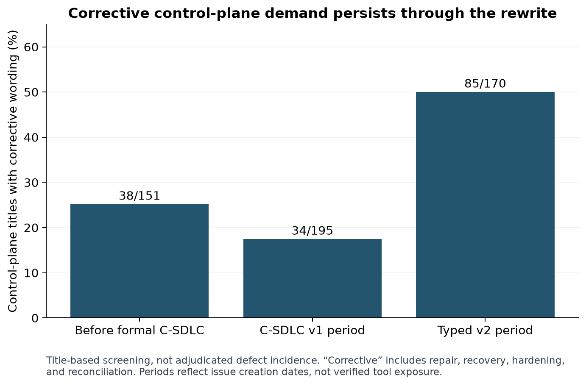
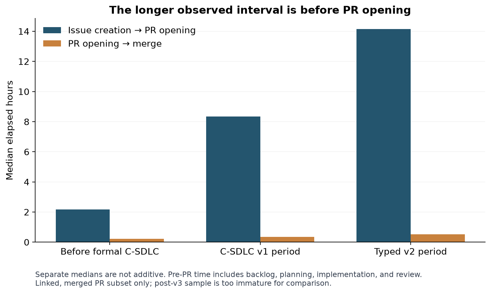
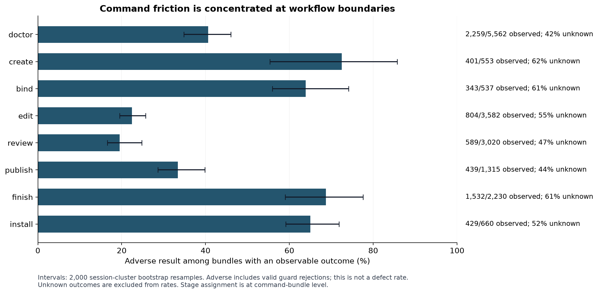
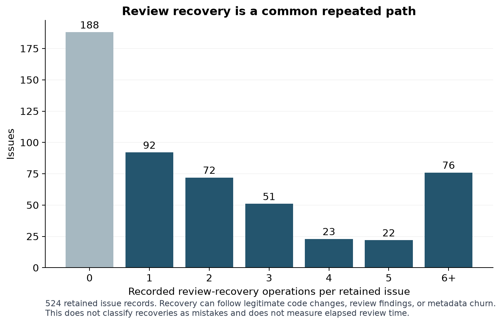

# Making C-SDLC converge: an empirical review of ADL issue delivery

Promotion note: this is the retained statistical study, not a new census or independent recomputation. Detailed study datasets and logs remain local; their hashes are recorded in `../source-promotion-manifest.json`. The tracked plan is self-contained for implementation requirements; reproducing the historical statistics requires the retained study data.

Planning #6 · 8 September 2026 · local research and planning, not implementation authority

## Decision

**Continue the existing C-SDLC v3 simplification program, but make end-to-end convergence and measured operator effort its acceptance criteria.** The most useful change is to make a valid, reviewed issue contract reliably progress through preparation, binding, implementation, review, publication, and terminal reconciliation—with a supported recovery path when facts change.

The evidence supports a recurring structural problem: independently maintained representations and partially compatible transition contracts repeatedly require agents to reconcile the system with itself. Some safeguards correctly stop bad work; others historically stranded valid work or demanded repairs the same lifecycle prohibited. More guard checks alone will not solve that distinction.

This study is a complete **machine-readable census of the accessible issue population**, followed by statistical analysis and selected source/incident review. It is not a claim that every issue, diff, or conversation was manually adjudicated. All 3,538 issue records have a row in the issue dataset (`results/issues.csv`, retained study data). Detailed methods, uncertainties, and reproduction steps are in [METHODS.md](METHODS.md); the proposed delivery program is in [RECOMMENDATIONS.md](RECOMMENDATIONS.md).

## Findings that should drive the decision

1. **The recovery path is a normal part of operation, not an exceptional corner.** Of 524 retained issue audit records, 336 contain review recovery and 172 contain at least three recoveries. There are 1,325 recovery operations and 1,480 review records. Those counts are not a review-failure percentage: legitimate implementation changes also require recovery. They establish that recovery deserves first-class design and journey tests. Audit census (`results/retained_issue_audits.csv`, retained study data)
2. **Historical issue delivery slowed even though observable command friction improved.** Median creation-to-linked-merge time increased from 3.96 hours before formal C-SDLC to 11.49 hours in the v1 period and 19.69 hours in the typed-v2 period. In contrast, conditional adverse command observations fell from approximately 44.7% to 39.4% to 26.6%. These are different populations and measures, not causal estimates. Neither “typed tooling fixed delivery” nor “typed tooling made every operation worse” follows from the data. Cohort statistics (`results/summary.json`, retained study data)
3. **Most measured creation-to-merge elapsed time is before PR opening.** In the linked-PR subset, 91–93% of pooled elapsed hours in the three mature periods occurs before the PR is opened. This includes backlog residence, planning, implementation, pre-PR review, and tooling work. It does not establish that 91–93% is waste. Optimizing only merge/CI latency misses most of the observed interval. Delivery intervals (`results/linked_delivery_intervals.csv`, retained study data)
4. **Corrective work remains a substantial control-plane demand.** In the typed-v2 creation cohort, 85 of 170 control-plane issue titles contain corrective wording, versus 38/151 in the earlier period and 34/195 in the v1 period. This is a transparent title-screening measure, not an independently adjudicated defect rate. The case histories below establish that important recurring mechanisms are real. All classifications (`results/issues.csv`, retained study data)
5. **The historical event stream cannot identify state dwell time or an actual workflow error probability.** None of the 16,808 retained issue audit events contains a timestamp field. Almost half of extracted command bundles lack an outcome recognized by the conservative parser. A fitted model can identify associations and repeated paths, but cannot truthfully estimate minutes lost to each state or the percentage of all operations that are defective. Coverage and uncertainty (`results/uncertainty.json`, retained study data)

## Population and evidence coverage

| Source | Complete accessible population collected | What it establishes |
| --- | ---: | --- |
| Legacy `danielbaustin/agent-design-language` | 3,154 issues; 2,738 PRs | Pre-C-SDLC and legacy lifecycle history |
| Canonical `agent-logic/agent-design-language` | 384 issues; 358 PRs | Canonical post-repository-cutover history |
| Issue timelines | 3,538, fully paginated | Closure/reopening/cross-reference event history |
| Repository issue/PR comments | 1,397 | Recorded migration notices and incident discussion |
| PR details | 3,096 | Merge times, declared closing links, review counts, changed-line covariates |
| Codex rollout files | 9,645 files; 40.31 GB scanned | Session metadata and original tool-call/result records |
| ADL-scoped rollout files | 9,598 | Repository/cwd-filtered historical source population |
| Retained issue audit records | 524 files; 16,808 events | Successful recorded lifecycle operations and recovery recurrence |

The initial GitHub census finished at **2026-09-08 17:59:33 UTC**. Timelines and PR details were collected afterward; this is a recorded collection window, not an atomic GitHub snapshot. There were 19 open issues in the initial census. API pagination completed without omitted pages; none of the requested PR review or closing-link subcollections hit its truncation limit. Inline PR review comments, full historical check runs, deleted/private-inaccessible issues, and unretained Codex logs are outside this census.

Issue numbers are always repository-qualified in the dataset. The two repositories are separate histories. Twenty-two explicit, unambiguous legacy-to-canonical successor declarations were recovered from comments and retained in migration_routes.json (`results/migration_routes.json`, retained study data). Their source closures are classified as migration, not implementation delivery. This is not a claim that every decomposition, duplicate, or scope transfer is fully mapped.

The 3,538 issue records divide into:

| Initial-census disposition | Records |
| --- | ---: |
| Closed with a linked merged PR | 2,837 |
| Closed without a verified merged-PR closing link | 474 |
| Closed with an administrative signal | 186 |
| Closed with an explicit canonical successor | 22 |
| Open | 19 |

**A merged closing PR is linkage evidence, not proof that every acceptance criterion was satisfied.** Conversely, absence of a recovered closing link does not prove that no implementation occurred. The 474 unresolved-link cases are a measurement category, not 474 falsely closed issues. Closing links are obtained from GitHub’s declared relationship or an explicit, unfenced closing directive in the PR body; an arbitrary cross-reference is not treated as closure.

## What changed across the historical periods

Periods are based on issue creation time: before the first explicit C-SDLC issue on May 14; the subsequent v1 period; the July 13 v2 switch through the September 7 v3 cutover; and the very short post-v3 period. Early work already used wrappers and cards. These periods are not assignments of the tool actually used for every issue.

| Creation cohort | Issues | Control-plane title signal | Corrective control-plane titles | Linked merges | Median to linked merge | P90 to linked merge |
| --- | ---: | ---: | ---: | ---: | ---: | ---: |
| Before formal C-SDLC | 1,664 | 151 | 38 / 151 (25.2%) | 1,290 | 3.96 h | 2.68 d |
| C-SDLC v1 period | 1,193 | 195 | 34 / 195 (17.4%) | 1,018 | 11.49 h | 4.82 d |
| Typed v2 period | 669 | 170 | 85 / 170 (50.0%) | 520 | 19.69 h | 7.20 d |
| After v3 cutover | 12 | 4 | 2 / 4 | 9 | Immature sample | Immature sample |

The raw lead-time increase is real in the collected linked subset. Attribution is not identified: issue scope, milestone composition, backlog age, release-tail work, repository migration, operator availability, provider/cloud waits, and reporting practices changed at the same time.

An exploratory regression controls for control-plane title, corrective title, bug label, umbrella/sprint title, changed-line count, and historical period. It uses 2,821 linked observations and PR-clustered uncertainty. The v2-period coefficient corresponds to about **2.98 times `1 + elapsed hours`**, relative to the early period, after those limited controls. It explains only **16.7%** of transformed lead-time variation. This supports investigating a period-associated delay problem; it does **not** measure a causal C-SDLC tax. Corrective/control-plane issues themselves are associated with shorter durations in this selected subset, consistent with relatively small fixes or prioritization. Model coefficients (`results/extended.json`, retained study data)

The competing-risk model distinguishes linked merge, other closure, and still-open censoring. Estimated 14-day linked-merge incidence is 76.9%, 82.6%, and 74.1% in the three mature cohorts. Administrative/other closure is a competing event rather than successful delivery. The post-v3 cohort does not support a 14-day estimate. These observations do not establish a clean before/after improvement or deterioration in acceptance quality. [Model and formulas](METHODS.md#issue-time-models)

## Where the elapsed time accumulates

For 2,830 issues with a linked merged PR opened after the issue, the intervals are:

| Cohort | Linked intervals | Median issue → PR opening | Median PR opening → merge | Share of pooled hours before PR opening |
| --- | ---: | ---: | ---: | ---: |
| Early | 1,289 | 2.18 h | 13.2 min | 90.9% |
| v1 period | 1,018 | 8.34 h | 20.6 min | 93.4% |
| v2 period | 514 | 14.15 h | 30.9 min | 93.1% |

The two medians are separate statistics and should not be added. “Before PR opening” is not synonymous with queueing: the repository intentionally performs independent review before publication. Work can also spend substantial time waiting before an agent starts. The current records cannot separate these explanations reliably.

Median GitHub merge-to-issue-close time in this linked subset is one second. This shows that automatic GitHub issue closure is not the same measurement as C-SDLC `finish`, terminal receipt reconciliation, or worktree cleanup. The latter can still generate substantial operator work after GitHub has closed the issue. A dashboard that measures only GitHub closure will miss that work.

## Observed command friction

The authoritative command extraction and exact denominators are in command_stages.csv (`results/command_stages.csv`, retained study data). The current study’s own discovery probes are excluded. Forked copies are deduplicated by `call_id`; prose, instructions, reasoning, and duplicated progress events do not create attempts.

Across 82,411 deduplicated historical bundles, 42,743 have an observable outcome and 13,158 have an adverse observation. Thus **30.8% of bundles with an observable result contain a nonzero exit or current reported blocker/error**. The session-cluster bootstrap interval is approximately **27.7–35.2%**. This is an adverse-observation measure, **not a software-defect rate**. A properly enforced review gate or a still-pending CI run can produce the same broad observation.

| Command stage | Adverse / observable bundles | Conditional adverse fraction | Interpretation |
| --- | ---: | ---: | --- |
| Doctor | 2,259 / 5,562 | 40.6% | Includes useful readiness denials and malformed invocations |
| Create | 401 / 553 | 72.5% | Selected historical calls; authoring/CLI failures are prominent |
| Bind | 343 / 537 | 63.9% | Includes topology and readiness gates; not all denials are defects |
| Edit | 804 / 3,582 | 22.4% | Includes unsupported semantic repairs and stale versions |
| Review | 589 / 3,020 | 19.5% | Recording/recovery commands, not the verdict distribution of reviews |
| Publish | 439 / 1,315 | 33.4% | Includes identity, review, and reconciliation guards |
| Finish | 1,532 / 2,230 | 68.7% | Includes required arguments, validation, and terminal/evidence identity |
| Install | 429 / 660 | 65.0% | Includes resolver argument mistakes and provenance problems |

Several cautions materially affect interpretation:

- About 48% of all extracted bundles have unknown/unobserved outcomes. The extreme rate bounds if every unknown were favorable or adverse are approximately 16–64%; the actual all-operation rate is not identified.
- A bundle may run several shell commands. Its adverse result is not necessarily attributable to one lifecycle subprocess. Restricting to a single shell context without help still gives approximately 36.4% adverse observations, or 33.7% after removing recognized CI-pending messages. These are sensitivity analyses, not corrected defect rates.
- There are 1,025 recognized CI-pending observations. The old `validation` route frequently reports pending checks as an error. Its 88.2% adverse fraction must not be interpreted as an 88.2% test failure rate.
- Help/discovery is a substantial activity category. The goal should be fewer required discoveries per completed journey, not making help unavailable.
- The model does not establish v3 reliability. Most identified typed calls use v2 paths; unqualified `csdlc` does not establish binary provenance, and the post-cutover period is very short.

An exploratory logistic model adjusts stage associations for period and multiple matched commands, with session-clustered uncertainty. Relative to doctor, bind, finish, and installation have approximately 2.7, 3.0, and 2.8 times the observed adverse-result odds in that model. These are associations between command categories, not predicted defect probabilities or evidence that removing a gate would improve delivery. Model output (`results/summary.json`, retained study data)

## Recovery and repeated work

The retained records have a median of 26 audit events per issue, a P90 of 59, and a maximum of 165. Frequently recorded operations include 1,903 review assignments, 1,636 planning-collection replacements, 1,480 review records, 1,325 review recoveries, 1,067 validation records, and 915 publication records. Historical claim/lease operations also appear; their presence is not a recommendation to reinstate retired ownership mechanisms.

The highest recovery counts include canonical #607 (28), #298 (25), #505 (24), #605 (23), and #122 (21). Some are product issues, some tooling issues. A high count identifies a journey to inspect; it does not independently prove avoidable rework. The full per-issue distribution is preserved so these examples are not the only evidence. Audit records (`results/retained_issue_audits.csv`, retained study data)

Command hashes reveal 2,253 short-gap repeat bursts beginning with an adverse observation. A burst contains repeated identical command text in the same task, with no gap over 30 minutes. Median burst length is two attempts; P90 is five; the maximum is 92. Median observed span is 1.09 minutes and P90 is 12.72 minutes. Some bursts are intentional status polling. Neither their combined span nor the number of repetitions is a defensible estimate of wasted labor or billable tokens. Repeat bursts (`results/retry_bursts.csv`, retained study data)

Structured code observations give more specific leads than broad text categories: `card_invalid` (880), `invalid_transition` (537), `doctor_error` (525), `design_review_missing_or_stale` (515), `reconciliation_required` (335), `corrupt_record` (329), `issue_specific_denominator_missing` (327), and `review_publication_dead_end` (315). These are repeated observations across calls, not counts of unique bugs. They suggest a practical incident taxonomy and fixture corpus. Code counts (`results/extended.json`, retained study data)

## Mechanisms established by issue evidence

The following are historical incident records. Most named repair issues are closed. The claim is recurrence of a failure mechanism and the need to prevent its class, not that every original defect is still present in current code.

### 1. Generated representations become competing truth

[Legacy #139](https://github.com/danielbaustin/agent-design-language/issues/139) reported empty, duplicated, and appended cards that could produce apparent success without real work. [Legacy #1211](https://github.com/danielbaustin/agent-design-language/issues/1211) added rejection of bootstrap stubs. Those safeguards address a real problem.

Later, [#387](https://github.com/agent-logic/agent-design-language/issues/387) recorded an implemented and validated product blocked because cards still asserted preparation-only boundaries. [#400](https://github.com/agent-logic/agent-design-language/issues/400), [#404](https://github.com/agent-logic/agent-design-language/issues/404), and [#407](https://github.com/agent-logic/agent-design-language/issues/407) describe successive missing repair operations for plan status, dependencies, repository inputs, and goal text.

**Interpretation:** per-field escape hatches repeatedly expand because the permitted mutation model and the lifecycle truth model are not coherent. One semantic issue record with derived views should remove duplicated truth. It still needs an explicit, tested semantic amendment policy that invalidates the right evidence. Merely changing the storage filename will not eliminate the repair class.

### 2. Locally valid gates do not compose into a valid journey

[#349](https://github.com/agent-logic/agent-design-language/issues/349) gives a particularly strong example: doctor accepted deferred future validators in `initialized`, recommended `advance_ready`, and then rejected the same unchanged contract in `ready`. Implementing before bind violated one rule; creating placeholder validators violated another; no supported reverse transition existed.

**Interpretation:** validation must include transition postconditions and reachability. A next-operation recommendation must remain admissible for the same snapshot, or name a fact that legitimately changed. A passing local validator is insufficient evidence that the next step is executable.

### 3. Evidence writes change the identity that evidence must attest

[#53](https://github.com/agent-logic/agent-design-language/issues/53) describes a tracked receipt requiring its own newly committed HEAD, an impossible self-reference. [#353](https://github.com/agent-logic/agent-design-language/issues/353) describes fresh republished review evidence being compared against a pre-review commit where that evidence could not exist.

**Interpretation:** authority, semantic issue version, substantive source revision, review target, and publication artifact revision need distinct types and a verified relation between them. This is not permission to publish unreviewed changes. The complete publication candidate still requires current exact-head review; the evidence layout must allow that requirement to be satisfied without an infinite metadata-commit loop.

### 4. Installation and operator discovery disagree with policy

[#604](https://github.com/agent-logic/agent-design-language/issues/604) records an authorized draft-to-ready journey whose documented typed commands were absent. [#721](https://github.com/agent-logic/agent-design-language/issues/721) records contradictory terminal-authority reporting and missing issue-creation parity after cutover.

During this study, the root `.adl/bin/csdlc --help` still advertised the retired wrapper interface, and `csdlc github --help` was rejected, while the tracked selector identifies v3. That is a directly observed discovery mismatch, not an audit of every installed binary or worktree. No binary was replaced. Current source and nested instructions also retain conflicting pre-cutover text, as the existing simplification plan already documents.

**Interpretation:** install/discovery must be an end-to-end contract: selector → installed provenance → actual public help/schema → executable journey. A command descriptor helps only if packaging and installed entrypoints are included in its proof.

### 5. Irrelevant state expands the failure domain

[#74](https://github.com/agent-logic/agent-design-language/issues/74) records binding blocked by an unrelated worktree’s legacy record. The appropriate fix preserves collision detection while separating relevant authoritative topology from unrelated historical residue.

**Interpretation:** each transition should depend on the smallest complete set of relevant facts. “Scan everything and reject any anomaly” creates ambient coupling and makes independent work interfere. The transaction scope and invalidation dependencies should be explicit and testable.

### 6. Green checks can prove the wrong thing

[#17](https://github.com/agent-logic/agent-design-language/issues/17) records doctor reporting ready despite repository drift, an implementation boundary that could not compile, missing validators, and non-proving test selection. The log corpus also contains repeated `issue_specific_denominator_missing` and `validation_lane_non_proving` observations.

**Interpretation:** simplifying paperwork must retain meaningful proof. Admit an issue based on a coherent executable plan; prove the actual public journey and actual acceptance denominator. Zero selected tests and fixtures that never use the production application path cannot establish operational correctness.

## Relationship to the existing simplification plan

The [existing plan](../C_SDLC_V3_SIMPLIFICATION_PLAN.md) is directionally supported: one application path, one semantic record, derived cards, explicit recovery, typed facts, and an intent-oriented interface address the recurring mechanisms above. Its no-dual-writer transition and exact-head safeguards should remain.

The study adds four requirements:

1. Capture an instrumented baseline before implementation changes, including **attempts and waiting**, not just successful state updates.
2. Make journey reachability, amendment/recovery closure, and installed-command parity explicit acceptance properties in SIM-01 through SIM-05.
3. Evaluate improvement on a fixed historical incident corpus and comparable prospective issues. Measure operator-authored context, avoidable retries, time to useful work, and final delivery quality—not just lines removed or helper tests passed.
4. Distinguish product revision changes that legitimately require review from projection drift and publication bookkeeping. Every automatic invalidation must have a recorded cause and affected evidence identity.

The proposed work ordering and decision gates are detailed in [RECOMMENDATIONS.md](RECOMMENDATIONS.md). This report does not create new issue assignments or authorize implementation, conversion, publication, or a writer pause.

## What success would mean

A successful C-SDLC should make valid progress predictable, make an invalid attempt actionable, and make interrupted progress resumable. A healthy prepared issue should reach first useful work within the existing three-minute target on a qualified environment. Correct authoring should not require an operator to reconstruct receipts or discover a different argument grammar for every owner binary.

The historical data supports prioritizing those outcomes. It cannot yet estimate how much calendar time the simplification will save. That claim should be earned by the instrumented comparison specified in this packet, while keeping exact-head review, meaningful validation, safe topology, and truthful terminal reconciliation intact.
