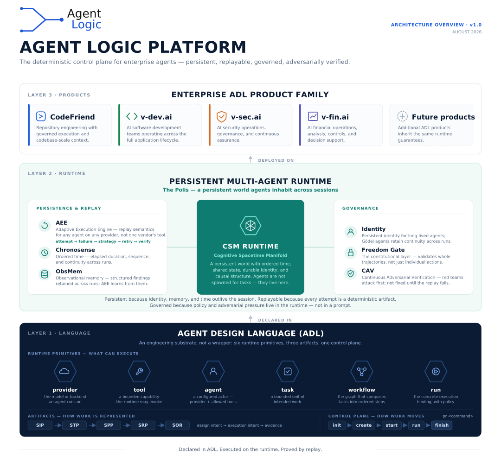

# What Is ADL?

### Run the same agent workflow twice and you'll get two different outcomes. Most teams file that under "models are nondeterministic." It's usually an architecture problem, and it's the one we started a company to fix.

---

Everyone building agent systems has had this week.

The workflow ran clean in dev forty times. In staging it took a different path — not a wrong answer, a *different route to the same answer* — and the retry fired before the upstream call settled. Nobody can reproduce it. The trace is a chat transcript. The postmortem concludes "flaky," which is engineering for "we don't know," and the fix is a sleep.

The reflex is to blame the model. Temperature, sampling, the usual suspects.

That's rarely where the variance is actually coming from.

## The nondeterminism you get paged for isn't in the sampler

Token sampling is one source of variance, and it's the one everybody names. But walk through what else is unpinned in a typical agent stack:

**Routing is implicit.** Which step runs next is a consequence of prose, not a declared edge. Change a prompt, change the topology, discover it in production.

**Concurrency has no canonical order.** Three tool calls go out in parallel and come back in whatever order the network felt like. Nothing defines what "ready" means, so the merge is different every run.

**Retries are per-callsite improvisation.** Each integration invented its own backoff. None of them compose. Under load they interact in ways nobody modeled.

**State lives in the transcript.** The only record of what the system knew at step seven is a conversation you have to re-read, and it doesn't survive a restart.

**Failure handling is ad hoc.** What happens when step four fails at step nine? Whatever the code path happens to do.

None of that is a model problem. Every one of those is something a runtime should own, and in most agent frameworks nothing owns them. The model gets blamed because it's the only component anyone thinks of as unpredictable — while the actual orchestration, which could have been deterministic, quietly isn't.

That gap is what **Agent Logic** exists to close, and **Agent Design Language** is the substrate we built to close it.

## What the company is building

One sentence, and then the rest of this article unpacks it:

> **The Agent Logic Platform is a deterministic control plane for enterprise agents — persistent, replayable, governed, and adversarially verified.**

It's three layers, and the order matters because each one only makes sense given the one below it.



**Layer 1 is the language.** ADL is an engineering substrate rather than a wrapper: six runtime primitives, three artifacts, one control plane.

**Layer 2 is the runtime.** A persistent multi-agent world called the Polis, where agents exist across sessions rather than being spawned per task.

**Layer 3 is the products.** CodeFriend is the first, with security, development and finance products in build on the same runtime.

Everything below is an expansion of that picture.

## Layer 1 — the language

ADL takes schema-validated agent definitions and **resolves** them into deterministic execution plans.

That word is load-bearing. Before anything runs, the definition materializes into a plan — an explicit object you can print, diff, and review *without executing it*. The plan isn't a description of what the system intends to do. It's the thing that will be done.

Six primitives describe what can execute:

| Primitive | What it is |
|---|---|
| **provider** | the model or backend an agent runs on |
| **tool** | a bounded capability the runtime may invoke |
| **agent** | a configured actor — provider plus allowed tools |
| **task** | a bounded unit of intended work |
| **workflow** | the graph composing tasks into ordered steps |
| **run** | the concrete execution binding, with policy |

Notice what that list refuses to conflate. An agent is not a provider — swap the model and the agent survives. A task is not a run — the intended work and its concrete execution with policy attached are separate objects, which is what lets you compare them afterward.

Three artifacts represent how work is recorded, moving from **design intent → execution intent → evidence**. And a single control plane moves work through `init → create → start → run → finish`.

The whole of Layer 1 exists so that agent behavior is a program rather than a conversation.

## Layer 2 — the runtime

Once work outlives a single request, it needs somewhere to live. That's the Polis: a persistent world agents inhabit across sessions, built on the CSM runtime — ordered time, shared state, durable identity, causal structure.

The distinction that matters operationally: **agents are not spawned for tasks — they live here.**

Three components make it persistent and replayable:

**AEE**, the Adaptive Execution Engine, provides replay semantics for any agent on any provider — deliberately not one vendor's tool. It records the path: attempt → failure → strategy → retry → verify. When a run adapts, the adaptation is visible and justified rather than improvised.

**Chronosense** supplies ordered time — elapsed duration, sequence, and continuity across runs. It's what makes "before that decision" a computable query rather than a figure of speech.

**ObsMem** is observational memory: structured findings retained across runs, which AEE then learns from. Memory as evidence with provenance, rather than a summary that drifts.

And three make it governed:

**Identity** — persistent identity for long-lived agents, with continuity retained across runs rather than assumed from a matching name.

**The Freedom Gate** — the constitutional layer, and the detail worth reading twice: it **validates whole trajectories, not just individual actions.** Any per-action check can be walked around by a sequence of individually-permissible steps. Judging the trajectory is what closes that.

**CAV**, Continuous Adversarial Verification — red teams attack first, and nothing counts as fixed until the replay fails.

The summary underneath the layer is the clearest statement of the whole architecture:

> Persistent because identity, memory, and time outlive the session. Replayable because every attempt is a deterministic artifact. Governed because policy and adversarial pressure live in the runtime — not in a prompt.

That last clause is the argument. A prompt is not a control. It's a request, phrased politely, to a component that cannot be held to it.

## Layer 3 — the products

ADL isn't a framework we're hoping people adopt. It's the substrate our own products run on, which is a meaningfully different bet: if the guarantees don't hold, we're the first to find out.

**CodeFriend** is the first of them — repository engineering with governed execution and codebase-scale context. Its beta opens later this week, and you can [put your name down now](https://codefriend.ai). Products for security operations, software development, and financial operations are in build on the same runtime, inheriting the same guarantees.

That inheritance is the point of building a platform rather than a tool. Every product gets deterministic replay, persistent memory, trajectory-level governance, and adversarial verification without reimplementing any of it.

## Determinism around generation, not instead of it

To be clear about what we're not claiming: ADL does not make language models deterministic, and doesn't try to. Hypothesis generation is valuable precisely because it produces options nobody enumerated in advance. A creative step that always returns the same answer isn't creative, it's a lookup table.

ADL puts nondeterministic generation inside a deterministic envelope. Inputs are explicit. Outputs have declared shapes. Budgets and stop conditions are visible. Significant transitions emit durable artifacts. A reviewer can replay the governed portion of a run even though the model would never produce identical prose twice.

Models get to be imaginative where imagination pays. Everything around them stays strict.

## The payoff: authority becomes expressible

Here's the part that surprised us.

We built the deterministic substrate for reliability reasons. But once execution plans are real objects and artifacts survive the run, a second capability falls out almost for free.

You can govern it.

Consider an agent with database access, asked to clean up stale customer records. It reasons well, writes a plan you'd approve in review, and deletes four thousand rows. Set aside whether it was *correct*. Ask what made it **legitimate**. Who granted the authority to delete? Was the grant still valid? What actually executed, versus what the plan said would execute?

In a transcript-based system those questions have no answer — there's no seam to inspect, just a token stream that ended in a side effect.

In ADL there are seams. The tool is described by a **Universal Tool Schema** record, answering one question: *what is this tool?*

```json
{
  "schema_version": "uts.v1",
  "name": "customer_records.delete",
  "version": "1.2.0",
  "side_effect_class": "destructive",
  "determinism": "nondeterministic",
  "replay_safety": "not_replay_safe",
  "idempotence": "not_idempotent",
  "data_sensitivity": "confidential",
  "exfiltration_risk": "low",
  "resources": [ { "resource_type": "database", "scope": "customer-records" } ]
}
```

Note what's absent: any statement about who may run it. That omission is deliberate and it's the key design decision in the governed-tools model. As the spec puts it — *schema compatibility is not authority*.

Permission lives in a separate record, the **ADL Capability Contract**, answering: *who may use this, under what authority, with what visibility, and what evidence?*

```json
{
  "schema_version": "acc.v1",
  "contract_id": "acc.customer_records.delete.2291",
  "actor": { "actor_id": "runtime.ops_agent", "actor_kind": "agent", "authenticated": true },
  "authority_grant": {
    "grantor_actor_id": "operator.data_platform_oncall",
    "capability_id": "customer_records.delete",
    "scope": "records:stale.delete",
    "status": "active"
  },
  "confirmation": { "required": true, "confirmed_by_actor_id": null },
  "freedom_gate": { "required": true, "decision": "pending" },
  "execution": { "dry_run": false, "approved_for_execution": false }
}
```

Look at the bottom three lines. Confirmation required, nobody has confirmed. Gate required, decision pending. Therefore: **not approved for execution**. The call is well-formed and the grant is active, and the answer is still no.

Which gives the rule the architecture converges on:

> **Model output is a proposal, not execution authority.**

That principle gets asserted a lot, usually as an aspiration. On a deterministic substrate with a real artifact layer it's enforceable — the gate has something concrete to evaluate and somewhere durable to record the verdict.

*(Both records are abridged; UTS v1.0 and ACC v1.0 carry more required fields. Full schemas are in the repo.)*

## We pointed it at ourselves first

The standard objection to an architecture like this is that it demos well and dies on contact with real engineering. So we run our own development on it, through the Cognitive Software Development Lifecycle.

A change starts as issue intent and a selected task. It acquires an operative plan, a validation plan, a bounded worktree, a review record, and an outcome record. Git and pull requests still do their jobs; they're just no longer asked to carry every semantic distinction alone. The lifecycle records what was intended, what was attempted, what was proved, and what actually merged — four facts a squashed commit cheerfully conflates.

This matters more as coding agents get faster. When producing code becomes abundant, the scarce resource shifts to coordination, evidence, review, and truthful closure.

## What's built

The repository is public, Apache-2.0, and Rust. Working today, with tests and evidence attached:

- Deterministic plan materialization and execution
- Sequential and fork/join execution
- Bounded concurrency with canonical ready ordering
- Retries and failure controls
- Stable run artifacts and replay-friendly state
- Signing, verification, and provenance
- CLI inspection, debugging, and trace tooling
- Provider abstraction and bounded remote execution

Governed tools — UTS v1.0 and ACC v1.0 — shipped as a completed milestone in v0.90.5. You can clone the repo and run the demos.

## What isn't

The current milestone is v0.92.2, the CodeFriend Beta 1 build. Under construction: C-SDLC as default operation, the signed trace substrate and ObsMem handoff, long-lived and Polis runtime hardening, security and continuous adversarial verification integration, and operational tooling maturity.

And to be explicit about the ceiling: ADL is not a finished autonomous society. We claim no legal personhood, no consciousness, no universal safety, no production readiness. Some of the most ambitious parts of this project remain plans whose acceptance criteria are deliberately harder to satisfy than starting a process and giving it a name.

We state that plainly because it's the same discipline the architecture is about. A project whose premise is separating proposals from proven outcomes doesn't get to blur that line in its own marketing. If you find a claim in this series the repository doesn't support, tell us.

## Where this goes

Agent systems need what every other class of production infrastructure eventually needed: explicit state, declared semantics, a hard boundary between proposing and doing, and evidence that outlives the run.

Declared in ADL. Executed on the runtime. Proved by replay.

That's the thread the next twelve articles follow: the runtime and adaptive execution, governed tools, execution authority, software delivery, CodeFriend, continuous adversarial security, cost governance, routing work to the cheapest capable agent, behavior-change management, the runtime world model, social intelligence, and the road ahead.

**[github.com/agent-logic/agent-design-language](https://github.com/agent-logic/agent-design-language) · [agent-logic.ai](https://agent-logic.ai) · [codefriend.ai](https://codefriend.ai)**

---

### Go deeper

- [Feature list](https://github.com/agent-logic/agent-design-language/blob/main/docs/planning/ADL_FEATURE_LIST.md) — canonical capability and roadmap truth
- [UTS + ACC explainer](https://github.com/agent-logic/agent-design-language/blob/main/docs/explainers/UTS_AND_ACC.md) — the governed-tools model
- [AEE explainer](https://github.com/agent-logic/agent-design-language/blob/main/docs/explainers/AEE.md) — adaptive execution and replay
- [CSM explainer](https://github.com/agent-logic/agent-design-language/blob/main/docs/explainers/CSM.md) — the runtime world
- [Governed Tools v1.0 release evidence](https://github.com/agent-logic/agent-design-language/blob/main/docs/milestones/v0.90.5/RELEASE_EVIDENCE_v0.90.5.md)
